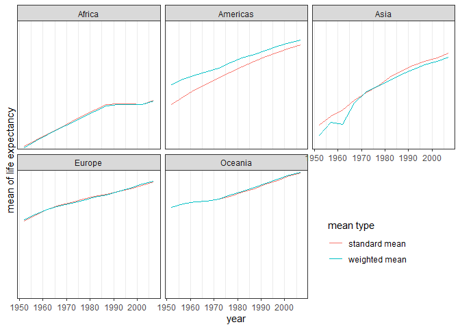

## Task Option 2

**Get the maximum and minimum of GDP per capita for all continents.**

The minimum and maximum of GDP per capita for all continents are drawn on the figure bellow. A drastic change for Asia can be observed which might be related to the increase of population. Maximum of GDP per capita between the countries in Asia around 1970s belong to Kuwait. The bump of GDP per capita in that period probably relates to  the oil crisis in 1973.


```r
gapminder %>% 
  group_by(year,continent) %>% 
  filter(gdpPercap %in% c(max(gdpPercap),min(gdpPercap))) %>% 
  mutate(type=ifelse(gdpPercap==min(gdpPercap),"minimum","maximum")) %>% 
  ggplot()+
  geom_line(aes(year,gdpPercap,color=continent,linetype=type))+
  scale_y_continuous(name="GDP per capita")+
  theme_bw()
```


## Task Option 3

**Look at the spread of GDP per capita within the continents.**

For the latest year in the dataset, 2007, the distribution of GDP per capita is drawn for each continent.


```r
#At first I tried to use geom_density_ridges(), However it was not a good choice cause it didn't plot anything for Oceania. Only two rows belong to Oceania in this dataset and it might not be a good idea to plot the density distribution for that. Therefore, Ichose histogram instead.
(plot1 <- gapminder %>% 
  group_by(continent) %>% 
  filter(year==max(year)) %>% 
  ggplot()+
  geom_histogram(aes(gdpPercap),position="stack")+
  facet_wrap(~continent)+
  scale_x_discrete(name="GDP per capita")+
  theme_bw())
```


## Task Option 4

**Compute a weighted mean of life expectancy for different years, weighting by population.**

As you can see from the graph bellow, the countries with higher population in Americas have higher life expectancy. Whereas in Asia the weight of populated countries is heavy enough to lower the weighted mean of life expectancy in comparison to the standard mean.

<!--https://stackoverflow.com/questions/20847371/two-column-layouts-in-rstudio-presentations-slidify-pandoc-->
<div style="float: left;width: 50%;">

```r
table1 <- gapminder %>% 
  group_by(continent,year) %>% 
  mutate(wt=pop/sum(pop)) %>%
  summarise(weightedmean=weighted.mean(lifeExp,wt),standardmean=mean(lifeExp)) %>% 
  pivot_longer(cols=c(weightedmean,standardmean),names_to = "mean_type",values_to = "lifeExpmean") 
DT::datatable(table1)
```

<!--html_preserve--><div id="htmlwidget-63cb8c04280578c7e436" style="width:100%;height:auto;" class="datatables html-widget"></div>
<script type="application/json" data-for="htmlwidget-63cb8c04280578c7e436">{"x":{"filter":"none","data":[["1","2","3","4","5","6","7","8","9","10","11","12","13","14","15","16","17","18","19","20","21","22","23","24","25","26","27","28","29","30","31","32","33","34","35","36","37","38","39","40","41","42","43","44","45","46","47","48","49","50","51","52","53","54","55","56","57","58","59","60","61","62","63","64","65","66","67","68","69","70","71","72","73","74","75","76","77","78","79","80","81","82","83","84","85","86","87","88","89","90","91","92","93","94","95","96","97","98","99","100","101","102","103","104","105","106","107","108","109","110","111","112","113","114","115","116","117","118","119","120"],["Africa","Africa","Africa","Africa","Africa","Africa","Africa","Africa","Africa","Africa","Africa","Africa","Africa","Africa","Africa","Africa","Africa","Africa","Africa","Africa","Africa","Africa","Africa","Africa","Americas","Americas","Americas","Americas","Americas","Americas","Americas","Americas","Americas","Americas","Americas","Americas","Americas","Americas","Americas","Americas","Americas","Americas","Americas","Americas","Americas","Americas","Americas","Americas","Asia","Asia","Asia","Asia","Asia","Asia","Asia","Asia","Asia","Asia","Asia","Asia","Asia","Asia","Asia","Asia","Asia","Asia","Asia","Asia","Asia","Asia","Asia","Asia","Europe","Europe","Europe","Europe","Europe","Europe","Europe","Europe","Europe","Europe","Europe","Europe","Europe","Europe","Europe","Europe","Europe","Europe","Europe","Europe","Europe","Europe","Europe","Europe","Oceania","Oceania","Oceania","Oceania","Oceania","Oceania","Oceania","Oceania","Oceania","Oceania","Oceania","Oceania","Oceania","Oceania","Oceania","Oceania","Oceania","Oceania","Oceania","Oceania","Oceania","Oceania","Oceania","Oceania"],[1952,1952,1957,1957,1962,1962,1967,1967,1972,1972,1977,1977,1982,1982,1987,1987,1992,1992,1997,1997,2002,2002,2007,2007,1952,1952,1957,1957,1962,1962,1967,1967,1972,1972,1977,1977,1982,1982,1987,1987,1992,1992,1997,1997,2002,2002,2007,2007,1952,1952,1957,1957,1962,1962,1967,1967,1972,1972,1977,1977,1982,1982,1987,1987,1992,1992,1997,1997,2002,2002,2007,2007,1952,1952,1957,1957,1962,1962,1967,1967,1972,1972,1977,1977,1982,1982,1987,1987,1992,1992,1997,1997,2002,2002,2007,2007,1952,1952,1957,1957,1962,1962,1967,1967,1972,1972,1977,1977,1982,1982,1987,1987,1992,1992,1997,1997,2002,2002,2007,2007],["weightedmean","standardmean","weightedmean","standardmean","weightedmean","standardmean","weightedmean","standardmean","weightedmean","standardmean","weightedmean","standardmean","weightedmean","standardmean","weightedmean","standardmean","weightedmean","standardmean","weightedmean","standardmean","weightedmean","standardmean","weightedmean","standardmean","weightedmean","standardmean","weightedmean","standardmean","weightedmean","standardmean","weightedmean","standardmean","weightedmean","standardmean","weightedmean","standardmean","weightedmean","standardmean","weightedmean","standardmean","weightedmean","standardmean","weightedmean","standardmean","weightedmean","standardmean","weightedmean","standardmean","weightedmean","standardmean","weightedmean","standardmean","weightedmean","standardmean","weightedmean","standardmean","weightedmean","standardmean","weightedmean","standardmean","weightedmean","standardmean","weightedmean","standardmean","weightedmean","standardmean","weightedmean","standardmean","weightedmean","standardmean","weightedmean","standardmean","weightedmean","standardmean","weightedmean","standardmean","weightedmean","standardmean","weightedmean","standardmean","weightedmean","standardmean","weightedmean","standardmean","weightedmean","standardmean","weightedmean","standardmean","weightedmean","standardmean","weightedmean","standardmean","weightedmean","standardmean","weightedmean","standardmean","weightedmean","standardmean","weightedmean","standardmean","weightedmean","standardmean","weightedmean","standardmean","weightedmean","standardmean","weightedmean","standardmean","weightedmean","standardmean","weightedmean","standardmean","weightedmean","standardmean","weightedmean","standardmean","weightedmean","standardmean","weightedmean","standardmean"],[38.7997279750475,39.1355,40.9403052180766,41.2663461538462,43.0992460329128,43.3194423076923,45.1772077062905,45.3345384615385,47.2122936521501,47.4509423076923,49.2088278705277,49.5804230769231,51.017435577706,51.5928653846154,52.8247902051933,53.3447884615385,53.3729182736405,53.6295769230769,53.2832668246949,53.5982692307692,53.3031425757613,53.3252307692308,54.564410575582,54.8060384615385,60.2359897329338,53.27984,62.0180618513162,55.96028,63.4370609609239,58.39876,64.5063011462444,60.41092,65.7049002213137,62.39492,67.6059124291115,64.39156,69.1926449461671,66.22884,70.3581433692225,68.09072,71.7217653328176,69.56836,73.1915383614986,71.15048,74.2473579779438,72.42204,75.3566822274303,73.60812,42.9411433815645,46.3143939393939,47.2883493522573,49.3185442424242,46.5736939433803,51.563223030303,53.8826096143001,54.66364,57.5215851305976,57.3192690909091,59.5564806946822,59.6105563636364,61.5747159471937,62.6179393939394,63.5371015638466,64.8511818181818,65.1487439322734,66.5372121212121,66.7709212276375,68.0205151515152,68.1373185404793,69.2338787878788,69.4438630420502,70.7284848484849,64.9053961792257,64.4085,66.8936447278967,66.7030666666667,68.4595697870354,68.5392333333333,69.5496344792575,69.7376,70.4688363824576,70.7750333333333,71.539885324365,71.9377666666667,72.5624715394946,72.8064,73.4471687527794,73.6421666666667,74.4427325214626,74.4401,75.7084874192255,75.5051666666667,77.0223200752147,76.7006,77.890570810699,77.6486,69.1704018414364,69.255,70.3169319373946,70.295,70.9880757672779,71.085,71.1784788020395,71.31,71.9227254891004,71.91,73.256841290098,72.855,74.5829133697747,74.29,75.9810712504052,75.32,77.3578771720427,76.945,78.6184344954439,78.19,80.1600591549825,79.74,81.0621540097011,80.7195]],"container":"<table class=\"display\">\n  <thead>\n    <tr>\n      <th> <\/th>\n      <th>continent<\/th>\n      <th>year<\/th>\n      <th>mean_type<\/th>\n      <th>lifeExpmean<\/th>\n    <\/tr>\n  <\/thead>\n<\/table>","options":{"columnDefs":[{"className":"dt-right","targets":[2,4]},{"orderable":false,"targets":0}],"order":[],"autoWidth":false,"orderClasses":false}},"evals":[],"jsHooks":[]}</script><!--/html_preserve-->

</div>

<div style="float: right;width: 50%;">

```r
table1 %>% 
  ggplot()+
  geom_line(aes(year,lifeExpmean,color=mean_type))+
  facet_wrap(~ continent)+
  scale_color_discrete(name="mean type",labels=c("standard mean","weighted mean"))+
  theme_bw()+
  theme(legend.position = c(0.8, 0.2))+
  scale_y_discrete((name="mean of life expectancy"))
```

<!-- -->
</div>
