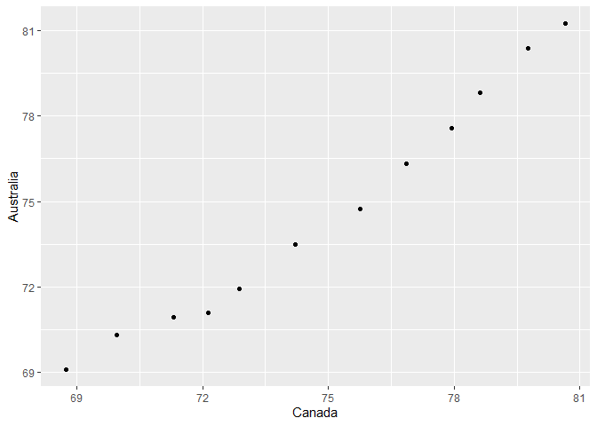

## Exercise 1: Univariate Data Reshaping


### Univariate Option 1


**1. Make a tibble with one row per year, and columns for life expectancy for two or more countries.**


```r
A1 <- gapminder %>% 
  pivot_wider(id_cols = year,
              names_from = country,
              values_from = lifeExp)
DT::datatable(A1)
```

<!--html_preserve--><div id="htmlwidget-c47b23a26e546df7588e" style="width:100%;height:auto;" class="datatables html-widget"></div>
<script type="application/json" data-for="htmlwidget-c47b23a26e546df7588e">{"x":{"filter":"none","data":[["1","2","3","4","5","6","7","8","9","10","11","12"],[1952,1957,1962,1967,1972,1977,1982,1987,1992,1997,2002,2007],[28.801,30.332,31.997,34.02,36.088,38.438,39.854,40.822,41.674,41.763,42.129,43.828],[55.23,59.28,64.82,66.22,67.69,68.93,70.42,72,71.581,72.95,75.651,76.423],[43.077,45.685,48.303,51.407,54.518,58.014,61.368,65.799,67.744,69.152,70.994,72.301],[30.015,31.999,34,35.985,37.928,39.483,39.942,39.906,40.647,40.963,41.003,42.731],[62.485,64.399,65.142,65.634,67.065,68.481,69.942,70.774,71.868,73.275,74.34,75.32],[69.12,70.33,70.93,71.1,71.93,73.49,74.74,76.32,77.56,78.83,80.37,81.235],[66.8,67.48,69.54,70.14,70.63,72.17,73.18,74.94,76.04,77.51,78.98,79.829],[50.939,53.832,56.923,59.923,63.3,65.593,69.052,70.75,72.601,73.925,74.795,75.635],[37.484,39.348,41.216,43.453,45.252,46.923,50.009,52.819,56.018,59.412,62.013,64.062],[68,69.24,70.25,70.94,71.44,72.8,73.93,75.35,76.46,77.53,78.32,79.441],[38.223,40.358,42.618,44.885,47.014,49.19,50.904,52.337,53.919,54.777,54.406,56.728],[40.414,41.89,43.428,45.032,46.714,50.023,53.859,57.251,59.957,62.05,63.883,65.554],[53.82,58.45,61.93,64.79,67.45,69.86,70.69,71.14,72.178,73.244,74.09,74.852],[47.622,49.618,51.52,53.298,56.024,59.319,61.484,63.622,62.745,52.556,46.634,50.728],[50.917,53.285,55.665,57.632,59.504,61.489,63.336,65.205,67.057,69.388,71.006,72.39],[59.6,66.61,69.51,70.42,70.9,70.81,71.08,71.34,71.19,70.32,72.14,73.005],[31.975,34.906,37.814,40.697,43.591,46.137,48.122,49.557,50.26,50.324,50.65,52.295],[39.031,40.533,42.045,43.548,44.057,45.91,47.471,48.211,44.736,45.326,47.36,49.58],[39.417,41.366,43.415,45.415,40.317,31.22,50.957,53.914,55.803,56.534,56.752,59.723],[38.523,40.428,42.643,44.799,47.049,49.355,52.961,54.985,54.314,52.199,49.856,50.43],[68.75,69.96,71.3,72.13,72.88,74.21,75.76,76.86,77.95,78.61,79.77,80.653],[35.463,37.464,39.475,41.478,43.457,46.775,48.295,50.485,49.396,46.066,43.308,44.741],[38.092,39.881,41.716,43.601,45.569,47.383,49.517,51.051,51.724,51.573,50.525,50.651],[54.745,56.074,57.924,60.523,63.441,67.052,70.565,72.492,74.126,75.816,77.86,78.553],[44,50.54896,44.50136,58.38112,63.11888,63.96736,65.525,67.274,68.69,70.426,72.028,72.961],[50.643,55.118,57.863,59.963,61.623,63.837,66.653,67.768,68.421,70.313,71.682,72.889],[40.715,42.46,44.467,46.472,48.944,50.939,52.933,54.926,57.939,60.66,62.974,65.152],[39.143,40.652,42.122,44.056,45.989,47.804,47.784,47.412,45.548,42.587,44.966,46.462],[42.111,45.053,48.435,52.04,54.907,55.625,56.695,57.47,56.433,52.962,52.97,55.322],[57.206,60.026,62.842,65.424,67.849,70.75,73.45,74.752,75.713,77.26,78.123,78.782],[40.477,42.469,44.93,47.35,49.801,52.374,53.983,54.655,52.044,47.991,46.832,48.328],[61.21,64.77,67.13,68.5,69.61,70.64,70.46,71.52,72.527,73.68,74.876,75.748],[59.421,62.325,65.246,68.29,70.723,72.649,73.717,74.174,74.414,76.151,77.158,78.273],[66.87,69.03,69.9,70.38,70.29,70.71,70.96,71.58,72.4,74.01,75.51,76.486],[70.78,71.81,72.35,72.96,73.47,74.69,74.63,74.8,75.33,76.11,77.18,78.332],[34.812,37.328,39.693,42.074,44.366,46.519,48.812,50.04,51.604,53.157,53.373,54.791],[45.928,49.828,53.459,56.751,59.631,61.788,63.727,66.046,68.457,69.957,70.847,72.235],[48.357,51.356,54.64,56.678,58.796,61.31,64.342,67.231,69.613,72.312,74.173,74.994],[41.893,44.444,46.992,49.293,51.137,53.319,56.006,59.797,63.674,67.217,69.806,71.338],[45.262,48.57,52.307,55.855,58.207,56.696,56.604,63.154,66.798,69.535,70.734,71.878],[34.482,35.983,37.485,38.987,40.516,42.024,43.662,45.664,47.545,48.245,49.348,51.579],[35.928,38.047,40.158,42.189,44.142,44.535,43.89,46.453,49.991,53.378,55.24,58.04],[34.078,36.667,40.059,42.115,43.515,44.51,44.916,46.684,48.091,49.402,50.725,52.947],[66.55,67.49,68.75,69.83,70.87,72.52,74.55,74.83,75.7,77.13,78.37,79.313],[67.41,68.93,70.51,71.55,72.38,73.83,74.89,76.34,77.46,78.64,79.59,80.657],[37.003,38.999,40.489,44.598,48.69,52.79,56.564,60.19,61.366,60.461,56.761,56.735],[30,32.065,33.896,35.857,38.308,41.842,45.58,49.265,52.644,55.861,58.041,59.448],[67.5,69.1,70.3,70.8,71,72.5,73.8,74.847,76.07,77.34,78.67,79.406],[43.149,44.779,46.452,48.072,49.875,51.756,53.744,55.729,57.501,58.556,58.453,60.022],[65.86,67.86,69.51,71,72.34,73.68,75.24,76.67,77.03,77.869,78.256,79.483],[42.023,44.142,46.954,50.016,53.738,56.029,58.137,60.782,63.373,66.322,68.978,70.259],[33.609,34.558,35.753,37.197,38.842,40.762,42.891,45.552,48.576,51.455,53.676,56.007],[32.5,33.489,34.488,35.492,36.486,37.465,39.327,41.245,43.266,44.873,45.504,46.388],[37.579,40.696,43.59,46.243,48.042,49.923,51.461,53.636,55.089,56.671,58.137,60.916],[41.912,44.665,48.041,50.924,53.884,57.402,60.909,64.492,66.399,67.659,68.565,70.198],[60.96,64.75,67.65,70,72,73.6,75.45,76.2,77.601,80,81.495,82.208],[64.03,66.41,67.96,69.5,69.76,69.95,69.39,69.58,69.17,71.04,72.59,73.338],[72.49,73.47,73.68,73.73,74.46,76.11,76.99,77.23,78.77,78.95,80.5,81.757],[37.373,40.249,43.605,47.193,50.651,54.208,56.596,58.553,60.223,61.765,62.879,64.698],[37.468,39.918,42.518,45.964,49.203,52.702,56.159,60.137,62.681,66.041,68.588,70.65],[44.869,47.181,49.325,52.469,55.234,57.702,59.62,63.04,65.742,68.042,69.451,70.964],[45.32,48.437,51.457,54.459,56.95,60.413,62.038,65.044,59.461,58.811,57.046,59.545],[66.91,68.9,70.29,71.08,71.28,72.03,73.1,74.36,75.467,76.122,77.783,78.885],[65.39,67.84,69.39,70.75,71.63,73.06,74.45,75.6,76.93,78.269,79.696,80.745],[65.94,67.81,69.24,71.06,72.19,73.48,74.98,76.42,77.44,78.82,80.24,80.546],[58.53,62.61,65.61,67.51,69,70.11,71.21,71.77,71.766,72.262,72.047,72.567],[63.03,65.5,68.73,71.43,73.42,75.38,77.11,78.67,79.36,80.69,82,82.603],[43.158,45.669,48.126,51.629,56.528,61.134,63.739,65.869,68.015,69.772,71.263,72.535],[42.27,44.686,47.949,50.654,53.559,56.155,58.766,59.339,59.285,54.407,50.992,54.11],[50.056,54.081,56.656,59.942,63.983,67.159,69.1,70.647,69.978,67.727,66.662,67.297],[47.453,52.681,55.292,57.716,62.612,64.766,67.123,69.81,72.244,74.647,77.045,78.623],[55.565,58.033,60.47,64.624,67.712,69.343,71.309,74.174,75.19,76.156,76.904,77.588],[55.928,59.489,62.094,63.87,65.421,66.099,66.983,67.926,69.292,70.265,71.028,71.993],[42.138,45.047,47.747,48.492,49.767,52.208,55.078,57.18,59.685,55.558,44.593,42.592],[38.48,39.486,40.502,41.536,42.614,43.764,44.852,46.027,40.802,42.221,43.753,45.678],[42.723,45.289,47.808,50.227,52.773,57.442,62.155,66.234,68.755,71.555,72.737,73.952],[36.681,38.865,40.848,42.881,44.851,46.881,48.969,49.35,52.214,54.978,57.286,59.443],[36.256,37.207,38.41,39.487,41.766,43.767,45.642,47.457,49.42,47.495,45.009,48.303],[48.463,52.102,55.737,59.371,63.01,65.256,68,69.5,70.693,71.938,73.044,74.241],[33.685,35.307,36.936,38.487,39.977,41.714,43.916,46.364,48.388,49.903,51.818,54.467],[40.543,42.338,44.248,46.289,48.437,50.852,53.599,56.145,58.333,60.43,62.247,64.164],[50.986,58.089,60.246,61.557,62.944,64.93,66.711,68.74,69.745,70.736,71.954,72.801],[50.789,55.19,58.299,60.11,62.361,65.032,67.405,69.498,71.455,73.67,74.902,76.195],[42.244,45.248,48.251,51.253,53.754,55.491,57.489,60.222,61.271,63.625,65.033,66.803],[59.164,61.448,63.728,67.178,70.636,73.066,74.101,74.865,75.435,75.445,73.981,74.543],[42.873,45.423,47.924,50.335,52.862,55.73,59.65,62.677,65.393,67.66,69.615,71.164],[31.286,33.779,36.161,38.113,40.328,42.495,42.795,42.861,44.284,46.344,44.026,42.082],[36.319,41.905,45.108,49.379,53.07,56.059,58.056,58.339,59.32,60.328,59.908,62.069],[41.725,45.226,48.386,51.159,53.867,56.437,58.968,60.835,61.999,58.909,51.479,52.906],[36.157,37.686,39.393,41.472,43.971,46.748,49.594,52.537,55.727,59.426,61.34,63.785],[72.13,72.99,73.23,73.82,73.75,75.24,76.05,76.83,77.42,78.03,78.53,79.762],[69.39,70.26,71.24,71.52,71.89,72.22,73.84,74.32,76.33,77.55,79.11,80.204],[42.314,45.432,48.632,51.884,55.151,57.47,59.298,62.008,65.843,68.426,70.836,72.899],[37.444,38.598,39.487,40.118,40.546,41.291,42.598,44.555,47.391,51.313,54.496,56.867],[36.324,37.802,39.36,41.04,42.821,44.514,45.826,46.886,47.472,47.464,46.608,46.859],[72.67,73.44,73.47,74.08,74.34,75.37,75.97,75.89,77.32,78.32,79.05,80.196],[37.578,40.08,43.165,46.988,52.143,57.367,62.728,67.734,71.197,72.499,74.193,75.64],[43.436,45.557,47.67,49.8,51.929,54.043,56.158,58.245,60.838,61.818,63.61,65.483],[55.191,59.201,61.817,64.071,66.216,68.681,70.472,71.523,72.462,73.738,74.712,75.537],[62.649,63.196,64.361,64.951,65.815,66.353,66.874,67.378,68.225,69.4,70.755,71.752],[43.902,46.263,49.096,51.445,55.448,58.447,61.406,64.134,66.458,68.386,69.906,71.421],[47.752,51.334,54.757,56.393,58.065,60.06,62.082,64.151,66.458,68.564,70.303,71.688],[61.31,65.77,67.64,69.61,70.85,70.67,71.32,70.98,70.99,72.75,74.67,75.563],[59.82,61.51,64.39,66.6,69.26,70.41,72.77,74.06,74.86,75.97,77.29,78.098],[64.28,68.54,69.62,71.1,72.16,73.44,73.75,74.63,73.911,74.917,77.778,78.746],[52.724,55.09,57.666,60.542,64.274,67.064,69.885,71.913,73.615,74.772,75.744,76.442],[61.05,64.1,66.8,66.8,69.21,69.46,69.66,69.53,69.36,69.72,71.322,72.476],[40,41.5,43,44.1,44.6,45,46.218,44.02,23.599,36.087,43.413,46.242],[46.471,48.945,51.893,54.425,56.48,58.55,60.351,61.728,62.742,63.306,64.337,65.528],[39.875,42.868,45.914,49.901,53.886,58.69,63.012,66.295,68.768,70.533,71.626,72.777],[37.278,39.329,41.454,43.563,45.815,48.879,52.379,55.769,58.196,60.187,61.6,63.062],[57.996,61.685,64.531,66.914,68.7,70.3,70.162,71.218,71.659,72.232,73.213,74.002],[30.331,31.57,32.767,34.113,35.4,36.788,38.445,40.006,38.333,39.897,41.012,42.568],[60.396,63.179,65.798,67.946,69.521,70.795,71.76,73.56,75.788,77.158,78.77,79.972],[64.36,67.45,70.33,70.98,70.35,70.45,70.8,71.08,71.38,72.71,73.8,74.663],[65.57,67.85,69.15,69.18,69.82,70.97,71.063,72.25,73.64,75.13,76.66,77.926],[32.978,34.977,36.981,38.977,40.973,41.974,42.955,44.501,39.658,43.795,45.936,48.159],[45.009,47.985,49.951,51.927,53.696,55.527,58.161,60.834,61.888,60.236,53.365,49.339],[64.94,66.66,69.69,71.44,73.06,74.39,76.3,76.9,77.57,78.77,79.78,80.941],[57.593,61.456,62.192,64.266,65.042,65.949,68.757,69.011,70.379,70.457,70.815,72.396],[38.635,39.624,40.87,42.858,45.083,47.8,50.338,51.744,53.556,55.373,56.369,58.556],[41.407,43.424,44.992,46.633,49.552,52.537,55.561,57.678,58.474,54.289,43.869,39.613],[71.86,72.49,73.37,74.16,74.72,75.44,76.42,77.19,78.16,79.39,80.04,80.884],[69.62,70.56,71.32,72.77,73.78,75.39,76.21,77.41,78.03,79.37,80.62,81.701],[45.883,48.284,50.305,53.655,57.296,61.195,64.59,66.974,69.249,71.527,73.053,74.143],[58.5,62.4,65.2,67.5,69.39,70.59,72.16,73.4,74.26,75.25,76.99,78.4],[41.215,42.974,44.246,45.757,47.62,49.919,50.608,51.535,50.44,48.466,49.651,52.517],[50.848,53.63,56.061,58.285,60.405,62.494,64.597,66.084,67.298,67.521,68.564,70.616],[38.596,41.208,43.922,46.769,49.759,52.887,55.471,56.941,58.061,58.39,57.561,58.42],[59.1,61.8,64.9,65.4,65.9,68.3,68.832,69.582,69.862,69.465,68.976,69.819],[44.6,47.1,49.579,52.053,55.602,59.837,64.048,66.894,70.001,71.973,73.042,73.923],[43.585,48.079,52.098,54.336,57.005,59.507,61.036,63.108,66.146,68.835,70.845,71.777],[39.978,42.571,45.344,48.051,51.016,50.35,49.849,51.509,48.825,44.578,47.813,51.542],[69.18,70.42,70.76,71.36,72.01,72.76,74.04,75.007,76.42,77.218,78.471,79.425],[68.44,69.49,70.21,70.76,71.34,73.38,74.65,75.02,76.09,76.81,77.31,78.242],[66.071,67.044,68.253,68.468,68.673,69.481,70.805,71.918,72.752,74.223,75.307,76.384],[55.088,57.907,60.77,63.479,65.712,67.456,68.557,70.19,71.15,72.146,72.766,73.747],[40.412,42.887,45.363,47.838,50.254,55.764,58.816,62.82,67.662,70.672,73.017,74.249],[43.16,45.671,48.127,51.631,56.532,60.765,64.406,67.046,69.718,71.096,72.37,73.422],[32.548,33.97,35.18,36.984,39.848,44.175,49.113,52.922,55.599,58.02,60.308,62.698],[42.038,44.077,46.023,47.768,50.107,51.386,51.821,50.821,46.1,40.238,39.193,42.384],[48.451,50.469,52.358,53.995,55.635,57.674,60.363,62.351,60.377,46.809,39.989,43.487]],"container":"<table class=\"display\">\n  <thead>\n    <tr>\n      <th> <\/th>\n      <th>year<\/th>\n      <th>Afghanistan<\/th>\n      <th>Albania<\/th>\n      <th>Algeria<\/th>\n      <th>Angola<\/th>\n      <th>Argentina<\/th>\n      <th>Australia<\/th>\n      <th>Austria<\/th>\n      <th>Bahrain<\/th>\n      <th>Bangladesh<\/th>\n      <th>Belgium<\/th>\n      <th>Benin<\/th>\n      <th>Bolivia<\/th>\n      <th>Bosnia and Herzegovina<\/th>\n      <th>Botswana<\/th>\n      <th>Brazil<\/th>\n      <th>Bulgaria<\/th>\n      <th>Burkina Faso<\/th>\n      <th>Burundi<\/th>\n      <th>Cambodia<\/th>\n      <th>Cameroon<\/th>\n      <th>Canada<\/th>\n      <th>Central African Republic<\/th>\n      <th>Chad<\/th>\n      <th>Chile<\/th>\n      <th>China<\/th>\n      <th>Colombia<\/th>\n      <th>Comoros<\/th>\n      <th>Congo, Dem. Rep.<\/th>\n      <th>Congo, Rep.<\/th>\n      <th>Costa Rica<\/th>\n      <th>Cote d'Ivoire<\/th>\n      <th>Croatia<\/th>\n      <th>Cuba<\/th>\n      <th>Czech Republic<\/th>\n      <th>Denmark<\/th>\n      <th>Djibouti<\/th>\n      <th>Dominican Republic<\/th>\n      <th>Ecuador<\/th>\n      <th>Egypt<\/th>\n      <th>El Salvador<\/th>\n      <th>Equatorial Guinea<\/th>\n      <th>Eritrea<\/th>\n      <th>Ethiopia<\/th>\n      <th>Finland<\/th>\n      <th>France<\/th>\n      <th>Gabon<\/th>\n      <th>Gambia<\/th>\n      <th>Germany<\/th>\n      <th>Ghana<\/th>\n      <th>Greece<\/th>\n      <th>Guatemala<\/th>\n      <th>Guinea<\/th>\n      <th>Guinea-Bissau<\/th>\n      <th>Haiti<\/th>\n      <th>Honduras<\/th>\n      <th>Hong Kong, China<\/th>\n      <th>Hungary<\/th>\n      <th>Iceland<\/th>\n      <th>India<\/th>\n      <th>Indonesia<\/th>\n      <th>Iran<\/th>\n      <th>Iraq<\/th>\n      <th>Ireland<\/th>\n      <th>Israel<\/th>\n      <th>Italy<\/th>\n      <th>Jamaica<\/th>\n      <th>Japan<\/th>\n      <th>Jordan<\/th>\n      <th>Kenya<\/th>\n      <th>Korea, Dem. Rep.<\/th>\n      <th>Korea, Rep.<\/th>\n      <th>Kuwait<\/th>\n      <th>Lebanon<\/th>\n      <th>Lesotho<\/th>\n      <th>Liberia<\/th>\n      <th>Libya<\/th>\n      <th>Madagascar<\/th>\n      <th>Malawi<\/th>\n      <th>Malaysia<\/th>\n      <th>Mali<\/th>\n      <th>Mauritania<\/th>\n      <th>Mauritius<\/th>\n      <th>Mexico<\/th>\n      <th>Mongolia<\/th>\n      <th>Montenegro<\/th>\n      <th>Morocco<\/th>\n      <th>Mozambique<\/th>\n      <th>Myanmar<\/th>\n      <th>Namibia<\/th>\n      <th>Nepal<\/th>\n      <th>Netherlands<\/th>\n      <th>New Zealand<\/th>\n      <th>Nicaragua<\/th>\n      <th>Niger<\/th>\n      <th>Nigeria<\/th>\n      <th>Norway<\/th>\n      <th>Oman<\/th>\n      <th>Pakistan<\/th>\n      <th>Panama<\/th>\n      <th>Paraguay<\/th>\n      <th>Peru<\/th>\n      <th>Philippines<\/th>\n      <th>Poland<\/th>\n      <th>Portugal<\/th>\n      <th>Puerto Rico<\/th>\n      <th>Reunion<\/th>\n      <th>Romania<\/th>\n      <th>Rwanda<\/th>\n      <th>Sao Tome and Principe<\/th>\n      <th>Saudi Arabia<\/th>\n      <th>Senegal<\/th>\n      <th>Serbia<\/th>\n      <th>Sierra Leone<\/th>\n      <th>Singapore<\/th>\n      <th>Slovak Republic<\/th>\n      <th>Slovenia<\/th>\n      <th>Somalia<\/th>\n      <th>South Africa<\/th>\n      <th>Spain<\/th>\n      <th>Sri Lanka<\/th>\n      <th>Sudan<\/th>\n      <th>Swaziland<\/th>\n      <th>Sweden<\/th>\n      <th>Switzerland<\/th>\n      <th>Syria<\/th>\n      <th>Taiwan<\/th>\n      <th>Tanzania<\/th>\n      <th>Thailand<\/th>\n      <th>Togo<\/th>\n      <th>Trinidad and Tobago<\/th>\n      <th>Tunisia<\/th>\n      <th>Turkey<\/th>\n      <th>Uganda<\/th>\n      <th>United Kingdom<\/th>\n      <th>United States<\/th>\n      <th>Uruguay<\/th>\n      <th>Venezuela<\/th>\n      <th>Vietnam<\/th>\n      <th>West Bank and Gaza<\/th>\n      <th>Yemen, Rep.<\/th>\n      <th>Zambia<\/th>\n      <th>Zimbabwe<\/th>\n    <\/tr>\n  <\/thead>\n<\/table>","options":{"columnDefs":[{"className":"dt-right","targets":[1,2,3,4,5,6,7,8,9,10,11,12,13,14,15,16,17,18,19,20,21,22,23,24,25,26,27,28,29,30,31,32,33,34,35,36,37,38,39,40,41,42,43,44,45,46,47,48,49,50,51,52,53,54,55,56,57,58,59,60,61,62,63,64,65,66,67,68,69,70,71,72,73,74,75,76,77,78,79,80,81,82,83,84,85,86,87,88,89,90,91,92,93,94,95,96,97,98,99,100,101,102,103,104,105,106,107,108,109,110,111,112,113,114,115,116,117,118,119,120,121,122,123,124,125,126,127,128,129,130,131,132,133,134,135,136,137,138,139,140,141,142,143]},{"orderable":false,"targets":0}],"order":[],"autoWidth":false,"orderClasses":false}},"evals":[],"jsHooks":[]}</script><!--/html_preserve-->


**2. Take advantage of this new data shape to scatterplot life expectancy for one country against that of another.**

Here the life expectancy of Canada is plotted against that of Australia.


```r
A1 %>% select(Canada,Australia) %>% 
  ggplot()+
  geom_point(aes(Canada,Australia))
```




**3. Re-lengthen the data.**


```r
A1 %>% pivot_longer(cols = c(-year),
                    names_to = "Country",
                    values_to = "lifeExp") %>% 
  DT::datatable()
```

<!--html_preserve--><div id="htmlwidget-a119b43e758fed3511ba" style="width:100%;height:auto;" class="datatables html-widget"></div>
<script type="application/json" data-for="htmlwidget-a119b43e758fed3511ba">{"x":{"filter":"none","data":[["1","2","3","4","5","6","7","8","9","10","11","12","13","14","15","16","17","18","19","20","21","22","23","24","25","26","27","28","29","30","31","32","33","34","35","36","37","38","39","40","41","42","43","44","45","46","47","48","49","50","51","52","53","54","55","56","57","58","59","60","61","62","63","64","65","66","67","68","69","70","71","72","73","74","75","76","77","78","79","80","81","82","83","84","85","86","87","88","89","90","91","92","93","94","95","96","97","98","99","100","101","102","103","104","105","106","107","108","109","110","111","112","113","114","115","116","117","118","119","120","121","122","123","124","125","126","127","128","129","130","131","132","133","134","135","136","137","138","139","140","141","142","143","144","145","146","147","148","149","150","151","152","153","154","155","156","157","158","159","160","161","162","163","164","165","166","167","168","169","170","171","172","173","174","175","176","177","178","179","180","181","182","183","184","185","186","187","188","189","190","191","192","193","194","195","196","197","198","199","200","201","202","203","204","205","206","207","208","209","210","211","212","213","214","215","216","217","218","219","220","221","222","223","224","225","226","227","228","229","230","231","232","233","234","235","236","237","238","239","240","241","242","243","244","245","246","247","248","249","250","251","252","253","254","255","256","257","258","259","260","261","262","263","264","265","266","267","268","269","270","271","272","273","274","275","276","277","278","279","280","281","282","283","284","285","286","287","288","289","290","291","292","293","294","295","296","297","298","299","300","301","302","303","304","305","306","307","308","309","310","311","312","313","314","315","316","317","318","319","320","321","322","323","324","325","326","327","328","329","330","331","332","333","334","335","336","337","338","339","340","341","342","343","344","345","346","347","348","349","350","351","352","353","354","355","356","357","358","359","360","361","362","363","364","365","366","367","368","369","370","371","372","373","374","375","376","377","378","379","380","381","382","383","384","385","386","387","388","389","390","391","392","393","394","395","396","397","398","399","400","401","402","403","404","405","406","407","408","409","410","411","412","413","414","415","416","417","418","419","420","421","422","423","424","425","426","427","428","429","430","431","432","433","434","435","436","437","438","439","440","441","442","443","444","445","446","447","448","449","450","451","452","453","454","455","456","457","458","459","460","461","462","463","464","465","466","467","468","469","470","471","472","473","474","475","476","477","478","479","480","481","482","483","484","485","486","487","488","489","490","491","492","493","494","495","496","497","498","499","500","501","502","503","504","505","506","507","508","509","510","511","512","513","514","515","516","517","518","519","520","521","522","523","524","525","526","527","528","529","530","531","532","533","534","535","536","537","538","539","540","541","542","543","544","545","546","547","548","549","550","551","552","553","554","555","556","557","558","559","560","561","562","563","564","565","566","567","568","569","570","571","572","573","574","575","576","577","578","579","580","581","582","583","584","585","586","587","588","589","590","591","592","593","594","595","596","597","598","599","600","601","602","603","604","605","606","607","608","609","610","611","612","613","614","615","616","617","618","619","620","621","622","623","624","625","626","627","628","629","630","631","632","633","634","635","636","637","638","639","640","641","642","643","644","645","646","647","648","649","650","651","652","653","654","655","656","657","658","659","660","661","662","663","664","665","666","667","668","669","670","671","672","673","674","675","676","677","678","679","680","681","682","683","684","685","686","687","688","689","690","691","692","693","694","695","696","697","698","699","700","701","702","703","704","705","706","707","708","709","710","711","712","713","714","715","716","717","718","719","720","721","722","723","724","725","726","727","728","729","730","731","732","733","734","735","736","737","738","739","740","741","742","743","744","745","746","747","748","749","750","751","752","753","754","755","756","757","758","759","760","761","762","763","764","765","766","767","768","769","770","771","772","773","774","775","776","777","778","779","780","781","782","783","784","785","786","787","788","789","790","791","792","793","794","795","796","797","798","799","800","801","802","803","804","805","806","807","808","809","810","811","812","813","814","815","816","817","818","819","820","821","822","823","824","825","826","827","828","829","830","831","832","833","834","835","836","837","838","839","840","841","842","843","844","845","846","847","848","849","850","851","852","853","854","855","856","857","858","859","860","861","862","863","864","865","866","867","868","869","870","871","872","873","874","875","876","877","878","879","880","881","882","883","884","885","886","887","888","889","890","891","892","893","894","895","896","897","898","899","900","901","902","903","904","905","906","907","908","909","910","911","912","913","914","915","916","917","918","919","920","921","922","923","924","925","926","927","928","929","930","931","932","933","934","935","936","937","938","939","940","941","942","943","944","945","946","947","948","949","950","951","952","953","954","955","956","957","958","959","960","961","962","963","964","965","966","967","968","969","970","971","972","973","974","975","976","977","978","979","980","981","982","983","984","985","986","987","988","989","990","991","992","993","994","995","996","997","998","999","1000","1001","1002","1003","1004","1005","1006","1007","1008","1009","1010","1011","1012","1013","1014","1015","1016","1017","1018","1019","1020","1021","1022","1023","1024","1025","1026","1027","1028","1029","1030","1031","1032","1033","1034","1035","1036","1037","1038","1039","1040","1041","1042","1043","1044","1045","1046","1047","1048","1049","1050","1051","1052","1053","1054","1055","1056","1057","1058","1059","1060","1061","1062","1063","1064","1065","1066","1067","1068","1069","1070","1071","1072","1073","1074","1075","1076","1077","1078","1079","1080","1081","1082","1083","1084","1085","1086","1087","1088","1089","1090","1091","1092","1093","1094","1095","1096","1097","1098","1099","1100","1101","1102","1103","1104","1105","1106","1107","1108","1109","1110","1111","1112","1113","1114","1115","1116","1117","1118","1119","1120","1121","1122","1123","1124","1125","1126","1127","1128","1129","1130","1131","1132","1133","1134","1135","1136","1137","1138","1139","1140","1141","1142","1143","1144","1145","1146","1147","1148","1149","1150","1151","1152","1153","1154","1155","1156","1157","1158","1159","1160","1161","1162","1163","1164","1165","1166","1167","1168","1169","1170","1171","1172","1173","1174","1175","1176","1177","1178","1179","1180","1181","1182","1183","1184","1185","1186","1187","1188","1189","1190","1191","1192","1193","1194","1195","1196","1197","1198","1199","1200","1201","1202","1203","1204","1205","1206","1207","1208","1209","1210","1211","1212","1213","1214","1215","1216","1217","1218","1219","1220","1221","1222","1223","1224","1225","1226","1227","1228","1229","1230","1231","1232","1233","1234","1235","1236","1237","1238","1239","1240","1241","1242","1243","1244","1245","1246","1247","1248","1249","1250","1251","1252","1253","1254","1255","1256","1257","1258","1259","1260","1261","1262","1263","1264","1265","1266","1267","1268","1269","1270","1271","1272","1273","1274","1275","1276","1277","1278","1279","1280","1281","1282","1283","1284","1285","1286","1287","1288","1289","1290","1291","1292","1293","1294","1295","1296","1297","1298","1299","1300","1301","1302","1303","1304","1305","1306","1307","1308","1309","1310","1311","1312","1313","1314","1315","1316","1317","1318","1319","1320","1321","1322","1323","1324","1325","1326","1327","1328","1329","1330","1331","1332","1333","1334","1335","1336","1337","1338","1339","1340","1341","1342","1343","1344","1345","1346","1347","1348","1349","1350","1351","1352","1353","1354","1355","1356","1357","1358","1359","1360","1361","1362","1363","1364","1365","1366","1367","1368","1369","1370","1371","1372","1373","1374","1375","1376","1377","1378","1379","1380","1381","1382","1383","1384","1385","1386","1387","1388","1389","1390","1391","1392","1393","1394","1395","1396","1397","1398","1399","1400","1401","1402","1403","1404","1405","1406","1407","1408","1409","1410","1411","1412","1413","1414","1415","1416","1417","1418","1419","1420","1421","1422","1423","1424","1425","1426","1427","1428","1429","1430","1431","1432","1433","1434","1435","1436","1437","1438","1439","1440","1441","1442","1443","1444","1445","1446","1447","1448","1449","1450","1451","1452","1453","1454","1455","1456","1457","1458","1459","1460","1461","1462","1463","1464","1465","1466","1467","1468","1469","1470","1471","1472","1473","1474","1475","1476","1477","1478","1479","1480","1481","1482","1483","1484","1485","1486","1487","1488","1489","1490","1491","1492","1493","1494","1495","1496","1497","1498","1499","1500","1501","1502","1503","1504","1505","1506","1507","1508","1509","1510","1511","1512","1513","1514","1515","1516","1517","1518","1519","1520","1521","1522","1523","1524","1525","1526","1527","1528","1529","1530","1531","1532","1533","1534","1535","1536","1537","1538","1539","1540","1541","1542","1543","1544","1545","1546","1547","1548","1549","1550","1551","1552","1553","1554","1555","1556","1557","1558","1559","1560","1561","1562","1563","1564","1565","1566","1567","1568","1569","1570","1571","1572","1573","1574","1575","1576","1577","1578","1579","1580","1581","1582","1583","1584","1585","1586","1587","1588","1589","1590","1591","1592","1593","1594","1595","1596","1597","1598","1599","1600","1601","1602","1603","1604","1605","1606","1607","1608","1609","1610","1611","1612","1613","1614","1615","1616","1617","1618","1619","1620","1621","1622","1623","1624","1625","1626","1627","1628","1629","1630","1631","1632","1633","1634","1635","1636","1637","1638","1639","1640","1641","1642","1643","1644","1645","1646","1647","1648","1649","1650","1651","1652","1653","1654","1655","1656","1657","1658","1659","1660","1661","1662","1663","1664","1665","1666","1667","1668","1669","1670","1671","1672","1673","1674","1675","1676","1677","1678","1679","1680","1681","1682","1683","1684","1685","1686","1687","1688","1689","1690","1691","1692","1693","1694","1695","1696","1697","1698","1699","1700","1701","1702","1703","1704"],[1952,1952,1952,1952,1952,1952,1952,1952,1952,1952,1952,1952,1952,1952,1952,1952,1952,1952,1952,1952,1952,1952,1952,1952,1952,1952,1952,1952,1952,1952,1952,1952,1952,1952,1952,1952,1952,1952,1952,1952,1952,1952,1952,1952,1952,1952,1952,1952,1952,1952,1952,1952,1952,1952,1952,1952,1952,1952,1952,1952,1952,1952,1952,1952,1952,1952,1952,1952,1952,1952,1952,1952,1952,1952,1952,1952,1952,1952,1952,1952,1952,1952,1952,1952,1952,1952,1952,1952,1952,1952,1952,1952,1952,1952,1952,1952,1952,1952,1952,1952,1952,1952,1952,1952,1952,1952,1952,1952,1952,1952,1952,1952,1952,1952,1952,1952,1952,1952,1952,1952,1952,1952,1952,1952,1952,1952,1952,1952,1952,1952,1952,1952,1952,1952,1952,1952,1952,1952,1952,1952,1952,1952,1957,1957,1957,1957,1957,1957,1957,1957,1957,1957,1957,1957,1957,1957,1957,1957,1957,1957,1957,1957,1957,1957,1957,1957,1957,1957,1957,1957,1957,1957,1957,1957,1957,1957,1957,1957,1957,1957,1957,1957,1957,1957,1957,1957,1957,1957,1957,1957,1957,1957,1957,1957,1957,1957,1957,1957,1957,1957,1957,1957,1957,1957,1957,1957,1957,1957,1957,1957,1957,1957,1957,1957,1957,1957,1957,1957,1957,1957,1957,1957,1957,1957,1957,1957,1957,1957,1957,1957,1957,1957,1957,1957,1957,1957,1957,1957,1957,1957,1957,1957,1957,1957,1957,1957,1957,1957,1957,1957,1957,1957,1957,1957,1957,1957,1957,1957,1957,1957,1957,1957,1957,1957,1957,1957,1957,1957,1957,1957,1957,1957,1957,1957,1957,1957,1957,1957,1957,1957,1957,1957,1957,1957,1962,1962,1962,1962,1962,1962,1962,1962,1962,1962,1962,1962,1962,1962,1962,1962,1962,1962,1962,1962,1962,1962,1962,1962,1962,1962,1962,1962,1962,1962,1962,1962,1962,1962,1962,1962,1962,1962,1962,1962,1962,1962,1962,1962,1962,1962,1962,1962,1962,1962,1962,1962,1962,1962,1962,1962,1962,1962,1962,1962,1962,1962,1962,1962,1962,1962,1962,1962,1962,1962,1962,1962,1962,1962,1962,1962,1962,1962,1962,1962,1962,1962,1962,1962,1962,1962,1962,1962,1962,1962,1962,1962,1962,1962,1962,1962,1962,1962,1962,1962,1962,1962,1962,1962,1962,1962,1962,1962,1962,1962,1962,1962,1962,1962,1962,1962,1962,1962,1962,1962,1962,1962,1962,1962,1962,1962,1962,1962,1962,1962,1962,1962,1962,1962,1962,1962,1962,1962,1962,1962,1962,1962,1967,1967,1967,1967,1967,1967,1967,1967,1967,1967,1967,1967,1967,1967,1967,1967,1967,1967,1967,1967,1967,1967,1967,1967,1967,1967,1967,1967,1967,1967,1967,1967,1967,1967,1967,1967,1967,1967,1967,1967,1967,1967,1967,1967,1967,1967,1967,1967,1967,1967,1967,1967,1967,1967,1967,1967,1967,1967,1967,1967,1967,1967,1967,1967,1967,1967,1967,1967,1967,1967,1967,1967,1967,1967,1967,1967,1967,1967,1967,1967,1967,1967,1967,1967,1967,1967,1967,1967,1967,1967,1967,1967,1967,1967,1967,1967,1967,1967,1967,1967,1967,1967,1967,1967,1967,1967,1967,1967,1967,1967,1967,1967,1967,1967,1967,1967,1967,1967,1967,1967,1967,1967,1967,1967,1967,1967,1967,1967,1967,1967,1967,1967,1967,1967,1967,1967,1967,1967,1967,1967,1967,1967,1972,1972,1972,1972,1972,1972,1972,1972,1972,1972,1972,1972,1972,1972,1972,1972,1972,1972,1972,1972,1972,1972,1972,1972,1972,1972,1972,1972,1972,1972,1972,1972,1972,1972,1972,1972,1972,1972,1972,1972,1972,1972,1972,1972,1972,1972,1972,1972,1972,1972,1972,1972,1972,1972,1972,1972,1972,1972,1972,1972,1972,1972,1972,1972,1972,1972,1972,1972,1972,1972,1972,1972,1972,1972,1972,1972,1972,1972,1972,1972,1972,1972,1972,1972,1972,1972,1972,1972,1972,1972,1972,1972,1972,1972,1972,1972,1972,1972,1972,1972,1972,1972,1972,1972,1972,1972,1972,1972,1972,1972,1972,1972,1972,1972,1972,1972,1972,1972,1972,1972,1972,1972,1972,1972,1972,1972,1972,1972,1972,1972,1972,1972,1972,1972,1972,1972,1972,1972,1972,1972,1972,1972,1977,1977,1977,1977,1977,1977,1977,1977,1977,1977,1977,1977,1977,1977,1977,1977,1977,1977,1977,1977,1977,1977,1977,1977,1977,1977,1977,1977,1977,1977,1977,1977,1977,1977,1977,1977,1977,1977,1977,1977,1977,1977,1977,1977,1977,1977,1977,1977,1977,1977,1977,1977,1977,1977,1977,1977,1977,1977,1977,1977,1977,1977,1977,1977,1977,1977,1977,1977,1977,1977,1977,1977,1977,1977,1977,1977,1977,1977,1977,1977,1977,1977,1977,1977,1977,1977,1977,1977,1977,1977,1977,1977,1977,1977,1977,1977,1977,1977,1977,1977,1977,1977,1977,1977,1977,1977,1977,1977,1977,1977,1977,1977,1977,1977,1977,1977,1977,1977,1977,1977,1977,1977,1977,1977,1977,1977,1977,1977,1977,1977,1977,1977,1977,1977,1977,1977,1977,1977,1977,1977,1977,1977,1982,1982,1982,1982,1982,1982,1982,1982,1982,1982,1982,1982,1982,1982,1982,1982,1982,1982,1982,1982,1982,1982,1982,1982,1982,1982,1982,1982,1982,1982,1982,1982,1982,1982,1982,1982,1982,1982,1982,1982,1982,1982,1982,1982,1982,1982,1982,1982,1982,1982,1982,1982,1982,1982,1982,1982,1982,1982,1982,1982,1982,1982,1982,1982,1982,1982,1982,1982,1982,1982,1982,1982,1982,1982,1982,1982,1982,1982,1982,1982,1982,1982,1982,1982,1982,1982,1982,1982,1982,1982,1982,1982,1982,1982,1982,1982,1982,1982,1982,1982,1982,1982,1982,1982,1982,1982,1982,1982,1982,1982,1982,1982,1982,1982,1982,1982,1982,1982,1982,1982,1982,1982,1982,1982,1982,1982,1982,1982,1982,1982,1982,1982,1982,1982,1982,1982,1982,1982,1982,1982,1982,1982,1987,1987,1987,1987,1987,1987,1987,1987,1987,1987,1987,1987,1987,1987,1987,1987,1987,1987,1987,1987,1987,1987,1987,1987,1987,1987,1987,1987,1987,1987,1987,1987,1987,1987,1987,1987,1987,1987,1987,1987,1987,1987,1987,1987,1987,1987,1987,1987,1987,1987,1987,1987,1987,1987,1987,1987,1987,1987,1987,1987,1987,1987,1987,1987,1987,1987,1987,1987,1987,1987,1987,1987,1987,1987,1987,1987,1987,1987,1987,1987,1987,1987,1987,1987,1987,1987,1987,1987,1987,1987,1987,1987,1987,1987,1987,1987,1987,1987,1987,1987,1987,1987,1987,1987,1987,1987,1987,1987,1987,1987,1987,1987,1987,1987,1987,1987,1987,1987,1987,1987,1987,1987,1987,1987,1987,1987,1987,1987,1987,1987,1987,1987,1987,1987,1987,1987,1987,1987,1987,1987,1987,1987,1992,1992,1992,1992,1992,1992,1992,1992,1992,1992,1992,1992,1992,1992,1992,1992,1992,1992,1992,1992,1992,1992,1992,1992,1992,1992,1992,1992,1992,1992,1992,1992,1992,1992,1992,1992,1992,1992,1992,1992,1992,1992,1992,1992,1992,1992,1992,1992,1992,1992,1992,1992,1992,1992,1992,1992,1992,1992,1992,1992,1992,1992,1992,1992,1992,1992,1992,1992,1992,1992,1992,1992,1992,1992,1992,1992,1992,1992,1992,1992,1992,1992,1992,1992,1992,1992,1992,1992,1992,1992,1992,1992,1992,1992,1992,1992,1992,1992,1992,1992,1992,1992,1992,1992,1992,1992,1992,1992,1992,1992,1992,1992,1992,1992,1992,1992,1992,1992,1992,1992,1992,1992,1992,1992,1992,1992,1992,1992,1992,1992,1992,1992,1992,1992,1992,1992,1992,1992,1992,1992,1992,1992,1997,1997,1997,1997,1997,1997,1997,1997,1997,1997,1997,1997,1997,1997,1997,1997,1997,1997,1997,1997,1997,1997,1997,1997,1997,1997,1997,1997,1997,1997,1997,1997,1997,1997,1997,1997,1997,1997,1997,1997,1997,1997,1997,1997,1997,1997,1997,1997,1997,1997,1997,1997,1997,1997,1997,1997,1997,1997,1997,1997,1997,1997,1997,1997,1997,1997,1997,1997,1997,1997,1997,1997,1997,1997,1997,1997,1997,1997,1997,1997,1997,1997,1997,1997,1997,1997,1997,1997,1997,1997,1997,1997,1997,1997,1997,1997,1997,1997,1997,1997,1997,1997,1997,1997,1997,1997,1997,1997,1997,1997,1997,1997,1997,1997,1997,1997,1997,1997,1997,1997,1997,1997,1997,1997,1997,1997,1997,1997,1997,1997,1997,1997,1997,1997,1997,1997,1997,1997,1997,1997,1997,1997,2002,2002,2002,2002,2002,2002,2002,2002,2002,2002,2002,2002,2002,2002,2002,2002,2002,2002,2002,2002,2002,2002,2002,2002,2002,2002,2002,2002,2002,2002,2002,2002,2002,2002,2002,2002,2002,2002,2002,2002,2002,2002,2002,2002,2002,2002,2002,2002,2002,2002,2002,2002,2002,2002,2002,2002,2002,2002,2002,2002,2002,2002,2002,2002,2002,2002,2002,2002,2002,2002,2002,2002,2002,2002,2002,2002,2002,2002,2002,2002,2002,2002,2002,2002,2002,2002,2002,2002,2002,2002,2002,2002,2002,2002,2002,2002,2002,2002,2002,2002,2002,2002,2002,2002,2002,2002,2002,2002,2002,2002,2002,2002,2002,2002,2002,2002,2002,2002,2002,2002,2002,2002,2002,2002,2002,2002,2002,2002,2002,2002,2002,2002,2002,2002,2002,2002,2002,2002,2002,2002,2002,2002,2007,2007,2007,2007,2007,2007,2007,2007,2007,2007,2007,2007,2007,2007,2007,2007,2007,2007,2007,2007,2007,2007,2007,2007,2007,2007,2007,2007,2007,2007,2007,2007,2007,2007,2007,2007,2007,2007,2007,2007,2007,2007,2007,2007,2007,2007,2007,2007,2007,2007,2007,2007,2007,2007,2007,2007,2007,2007,2007,2007,2007,2007,2007,2007,2007,2007,2007,2007,2007,2007,2007,2007,2007,2007,2007,2007,2007,2007,2007,2007,2007,2007,2007,2007,2007,2007,2007,2007,2007,2007,2007,2007,2007,2007,2007,2007,2007,2007,2007,2007,2007,2007,2007,2007,2007,2007,2007,2007,2007,2007,2007,2007,2007,2007,2007,2007,2007,2007,2007,2007,2007,2007,2007,2007,2007,2007,2007,2007,2007,2007,2007,2007,2007,2007,2007,2007,2007,2007,2007,2007,2007,2007],["Afghanistan","Albania","Algeria","Angola","Argentina","Australia","Austria","Bahrain","Bangladesh","Belgium","Benin","Bolivia","Bosnia and Herzegovina","Botswana","Brazil","Bulgaria","Burkina Faso","Burundi","Cambodia","Cameroon","Canada","Central African Republic","Chad","Chile","China","Colombia","Comoros","Congo, Dem. Rep.","Congo, Rep.","Costa Rica","Cote d'Ivoire","Croatia","Cuba","Czech Republic","Denmark","Djibouti","Dominican Republic","Ecuador","Egypt","El Salvador","Equatorial Guinea","Eritrea","Ethiopia","Finland","France","Gabon","Gambia","Germany","Ghana","Greece","Guatemala","Guinea","Guinea-Bissau","Haiti","Honduras","Hong Kong, China","Hungary","Iceland","India","Indonesia","Iran","Iraq","Ireland","Israel","Italy","Jamaica","Japan","Jordan","Kenya","Korea, Dem. Rep.","Korea, Rep.","Kuwait","Lebanon","Lesotho","Liberia","Libya","Madagascar","Malawi","Malaysia","Mali","Mauritania","Mauritius","Mexico","Mongolia","Montenegro","Morocco","Mozambique","Myanmar","Namibia","Nepal","Netherlands","New Zealand","Nicaragua","Niger","Nigeria","Norway","Oman","Pakistan","Panama","Paraguay","Peru","Philippines","Poland","Portugal","Puerto Rico","Reunion","Romania","Rwanda","Sao Tome and Principe","Saudi Arabia","Senegal","Serbia","Sierra Leone","Singapore","Slovak Republic","Slovenia","Somalia","South Africa","Spain","Sri Lanka","Sudan","Swaziland","Sweden","Switzerland","Syria","Taiwan","Tanzania","Thailand","Togo","Trinidad and Tobago","Tunisia","Turkey","Uganda","United Kingdom","United States","Uruguay","Venezuela","Vietnam","West Bank and Gaza","Yemen, Rep.","Zambia","Zimbabwe","Afghanistan","Albania","Algeria","Angola","Argentina","Australia","Austria","Bahrain","Bangladesh","Belgium","Benin","Bolivia","Bosnia and Herzegovina","Botswana","Brazil","Bulgaria","Burkina Faso","Burundi","Cambodia","Cameroon","Canada","Central African Republic","Chad","Chile","China","Colombia","Comoros","Congo, Dem. Rep.","Congo, Rep.","Costa Rica","Cote d'Ivoire","Croatia","Cuba","Czech Republic","Denmark","Djibouti","Dominican Republic","Ecuador","Egypt","El Salvador","Equatorial Guinea","Eritrea","Ethiopia","Finland","France","Gabon","Gambia","Germany","Ghana","Greece","Guatemala","Guinea","Guinea-Bissau","Haiti","Honduras","Hong Kong, China","Hungary","Iceland","India","Indonesia","Iran","Iraq","Ireland","Israel","Italy","Jamaica","Japan","Jordan","Kenya","Korea, Dem. Rep.","Korea, Rep.","Kuwait","Lebanon","Lesotho","Liberia","Libya","Madagascar","Malawi","Malaysia","Mali","Mauritania","Mauritius","Mexico","Mongolia","Montenegro","Morocco","Mozambique","Myanmar","Namibia","Nepal","Netherlands","New Zealand","Nicaragua","Niger","Nigeria","Norway","Oman","Pakistan","Panama","Paraguay","Peru","Philippines","Poland","Portugal","Puerto Rico","Reunion","Romania","Rwanda","Sao Tome and Principe","Saudi Arabia","Senegal","Serbia","Sierra Leone","Singapore","Slovak Republic","Slovenia","Somalia","South Africa","Spain","Sri Lanka","Sudan","Swaziland","Sweden","Switzerland","Syria","Taiwan","Tanzania","Thailand","Togo","Trinidad and Tobago","Tunisia","Turkey","Uganda","United Kingdom","United States","Uruguay","Venezuela","Vietnam","West Bank and Gaza","Yemen, Rep.","Zambia","Zimbabwe","Afghanistan","Albania","Algeria","Angola","Argentina","Australia","Austria","Bahrain","Bangladesh","Belgium","Benin","Bolivia","Bosnia and Herzegovina","Botswana","Brazil","Bulgaria","Burkina Faso","Burundi","Cambodia","Cameroon","Canada","Central African Republic","Chad","Chile","China","Colombia","Comoros","Congo, Dem. Rep.","Congo, Rep.","Costa Rica","Cote d'Ivoire","Croatia","Cuba","Czech Republic","Denmark","Djibouti","Dominican Republic","Ecuador","Egypt","El Salvador","Equatorial Guinea","Eritrea","Ethiopia","Finland","France","Gabon","Gambia","Germany","Ghana","Greece","Guatemala","Guinea","Guinea-Bissau","Haiti","Honduras","Hong Kong, China","Hungary","Iceland","India","Indonesia","Iran","Iraq","Ireland","Israel","Italy","Jamaica","Japan","Jordan","Kenya","Korea, Dem. Rep.","Korea, Rep.","Kuwait","Lebanon","Lesotho","Liberia","Libya","Madagascar","Malawi","Malaysia","Mali","Mauritania","Mauritius","Mexico","Mongolia","Montenegro","Morocco","Mozambique","Myanmar","Namibia","Nepal","Netherlands","New Zealand","Nicaragua","Niger","Nigeria","Norway","Oman","Pakistan","Panama","Paraguay","Peru","Philippines","Poland","Portugal","Puerto Rico","Reunion","Romania","Rwanda","Sao Tome and Principe","Saudi Arabia","Senegal","Serbia","Sierra Leone","Singapore","Slovak Republic","Slovenia","Somalia","South Africa","Spain","Sri Lanka","Sudan","Swaziland","Sweden","Switzerland","Syria","Taiwan","Tanzania","Thailand","Togo","Trinidad and Tobago","Tunisia","Turkey","Uganda","United Kingdom","United States","Uruguay","Venezuela","Vietnam","West Bank and Gaza","Yemen, Rep.","Zambia","Zimbabwe","Afghanistan","Albania","Algeria","Angola","Argentina","Australia","Austria","Bahrain","Bangladesh","Belgium","Benin","Bolivia","Bosnia and Herzegovina","Botswana","Brazil","Bulgaria","Burkina Faso","Burundi","Cambodia","Cameroon","Canada","Central African Republic","Chad","Chile","China","Colombia","Comoros","Congo, Dem. Rep.","Congo, Rep.","Costa Rica","Cote d'Ivoire","Croatia","Cuba","Czech Republic","Denmark","Djibouti","Dominican Republic","Ecuador","Egypt","El Salvador","Equatorial Guinea","Eritrea","Ethiopia","Finland","France","Gabon","Gambia","Germany","Ghana","Greece","Guatemala","Guinea","Guinea-Bissau","Haiti","Honduras","Hong Kong, China","Hungary","Iceland","India","Indonesia","Iran","Iraq","Ireland","Israel","Italy","Jamaica","Japan","Jordan","Kenya","Korea, Dem. Rep.","Korea, Rep.","Kuwait","Lebanon","Lesotho","Liberia","Libya","Madagascar","Malawi","Malaysia","Mali","Mauritania","Mauritius","Mexico","Mongolia","Montenegro","Morocco","Mozambique","Myanmar","Namibia","Nepal","Netherlands","New Zealand","Nicaragua","Niger","Nigeria","Norway","Oman","Pakistan","Panama","Paraguay","Peru","Philippines","Poland","Portugal","Puerto Rico","Reunion","Romania","Rwanda","Sao Tome and Principe","Saudi Arabia","Senegal","Serbia","Sierra Leone","Singapore","Slovak Republic","Slovenia","Somalia","South Africa","Spain","Sri Lanka","Sudan","Swaziland","Sweden","Switzerland","Syria","Taiwan","Tanzania","Thailand","Togo","Trinidad and Tobago","Tunisia","Turkey","Uganda","United Kingdom","United States","Uruguay","Venezuela","Vietnam","West Bank and Gaza","Yemen, Rep.","Zambia","Zimbabwe","Afghanistan","Albania","Algeria","Angola","Argentina","Australia","Austria","Bahrain","Bangladesh","Belgium","Benin","Bolivia","Bosnia and Herzegovina","Botswana","Brazil","Bulgaria","Burkina Faso","Burundi","Cambodia","Cameroon","Canada","Central African Republic","Chad","Chile","China","Colombia","Comoros","Congo, Dem. Rep.","Congo, Rep.","Costa Rica","Cote d'Ivoire","Croatia","Cuba","Czech Republic","Denmark","Djibouti","Dominican Republic","Ecuador","Egypt","El Salvador","Equatorial Guinea","Eritrea","Ethiopia","Finland","France","Gabon","Gambia","Germany","Ghana","Greece","Guatemala","Guinea","Guinea-Bissau","Haiti","Honduras","Hong Kong, China","Hungary","Iceland","India","Indonesia","Iran","Iraq","Ireland","Israel","Italy","Jamaica","Japan","Jordan","Kenya","Korea, Dem. Rep.","Korea, Rep.","Kuwait","Lebanon","Lesotho","Liberia","Libya","Madagascar","Malawi","Malaysia","Mali","Mauritania","Mauritius","Mexico","Mongolia","Montenegro","Morocco","Mozambique","Myanmar","Namibia","Nepal","Netherlands","New Zealand","Nicaragua","Niger","Nigeria","Norway","Oman","Pakistan","Panama","Paraguay","Peru","Philippines","Poland","Portugal","Puerto Rico","Reunion","Romania","Rwanda","Sao Tome and Principe","Saudi Arabia","Senegal","Serbia","Sierra Leone","Singapore","Slovak Republic","Slovenia","Somalia","South Africa","Spain","Sri Lanka","Sudan","Swaziland","Sweden","Switzerland","Syria","Taiwan","Tanzania","Thailand","Togo","Trinidad and Tobago","Tunisia","Turkey","Uganda","United Kingdom","United States","Uruguay","Venezuela","Vietnam","West Bank and Gaza","Yemen, Rep.","Zambia","Zimbabwe","Afghanistan","Albania","Algeria","Angola","Argentina","Australia","Austria","Bahrain","Bangladesh","Belgium","Benin","Bolivia","Bosnia and Herzegovina","Botswana","Brazil","Bulgaria","Burkina Faso","Burundi","Cambodia","Cameroon","Canada","Central African Republic","Chad","Chile","China","Colombia","Comoros","Congo, Dem. Rep.","Congo, Rep.","Costa Rica","Cote d'Ivoire","Croatia","Cuba","Czech Republic","Denmark","Djibouti","Dominican Republic","Ecuador","Egypt","El Salvador","Equatorial Guinea","Eritrea","Ethiopia","Finland","France","Gabon","Gambia","Germany","Ghana","Greece","Guatemala","Guinea","Guinea-Bissau","Haiti","Honduras","Hong Kong, China","Hungary","Iceland","India","Indonesia","Iran","Iraq","Ireland","Israel","Italy","Jamaica","Japan","Jordan","Kenya","Korea, Dem. Rep.","Korea, Rep.","Kuwait","Lebanon","Lesotho","Liberia","Libya","Madagascar","Malawi","Malaysia","Mali","Mauritania","Mauritius","Mexico","Mongolia","Montenegro","Morocco","Mozambique","Myanmar","Namibia","Nepal","Netherlands","New Zealand","Nicaragua","Niger","Nigeria","Norway","Oman","Pakistan","Panama","Paraguay","Peru","Philippines","Poland","Portugal","Puerto Rico","Reunion","Romania","Rwanda","Sao Tome and Principe","Saudi Arabia","Senegal","Serbia","Sierra Leone","Singapore","Slovak Republic","Slovenia","Somalia","South Africa","Spain","Sri Lanka","Sudan","Swaziland","Sweden","Switzerland","Syria","Taiwan","Tanzania","Thailand","Togo","Trinidad and Tobago","Tunisia","Turkey","Uganda","United Kingdom","United States","Uruguay","Venezuela","Vietnam","West Bank and Gaza","Yemen, Rep.","Zambia","Zimbabwe","Afghanistan","Albania","Algeria","Angola","Argentina","Australia","Austria","Bahrain","Bangladesh","Belgium","Benin","Bolivia","Bosnia and Herzegovina","Botswana","Brazil","Bulgaria","Burkina Faso","Burundi","Cambodia","Cameroon","Canada","Central African Republic","Chad","Chile","China","Colombia","Comoros","Congo, Dem. Rep.","Congo, Rep.","Costa Rica","Cote d'Ivoire","Croatia","Cuba","Czech Republic","Denmark","Djibouti","Dominican Republic","Ecuador","Egypt","El Salvador","Equatorial Guinea","Eritrea","Ethiopia","Finland","France","Gabon","Gambia","Germany","Ghana","Greece","Guatemala","Guinea","Guinea-Bissau","Haiti","Honduras","Hong Kong, China","Hungary","Iceland","India","Indonesia","Iran","Iraq","Ireland","Israel","Italy","Jamaica","Japan","Jordan","Kenya","Korea, Dem. Rep.","Korea, Rep.","Kuwait","Lebanon","Lesotho","Liberia","Libya","Madagascar","Malawi","Malaysia","Mali","Mauritania","Mauritius","Mexico","Mongolia","Montenegro","Morocco","Mozambique","Myanmar","Namibia","Nepal","Netherlands","New Zealand","Nicaragua","Niger","Nigeria","Norway","Oman","Pakistan","Panama","Paraguay","Peru","Philippines","Poland","Portugal","Puerto Rico","Reunion","Romania","Rwanda","Sao Tome and Principe","Saudi Arabia","Senegal","Serbia","Sierra Leone","Singapore","Slovak Republic","Slovenia","Somalia","South Africa","Spain","Sri Lanka","Sudan","Swaziland","Sweden","Switzerland","Syria","Taiwan","Tanzania","Thailand","Togo","Trinidad and Tobago","Tunisia","Turkey","Uganda","United Kingdom","United States","Uruguay","Venezuela","Vietnam","West Bank and Gaza","Yemen, Rep.","Zambia","Zimbabwe","Afghanistan","Albania","Algeria","Angola","Argentina","Australia","Austria","Bahrain","Bangladesh","Belgium","Benin","Bolivia","Bosnia and Herzegovina","Botswana","Brazil","Bulgaria","Burkina Faso","Burundi","Cambodia","Cameroon","Canada","Central African Republic","Chad","Chile","China","Colombia","Comoros","Congo, Dem. Rep.","Congo, Rep.","Costa Rica","Cote d'Ivoire","Croatia","Cuba","Czech Republic","Denmark","Djibouti","Dominican Republic","Ecuador","Egypt","El Salvador","Equatorial Guinea","Eritrea","Ethiopia","Finland","France","Gabon","Gambia","Germany","Ghana","Greece","Guatemala","Guinea","Guinea-Bissau","Haiti","Honduras","Hong Kong, China","Hungary","Iceland","India","Indonesia","Iran","Iraq","Ireland","Israel","Italy","Jamaica","Japan","Jordan","Kenya","Korea, Dem. Rep.","Korea, Rep.","Kuwait","Lebanon","Lesotho","Liberia","Libya","Madagascar","Malawi","Malaysia","Mali","Mauritania","Mauritius","Mexico","Mongolia","Montenegro","Morocco","Mozambique","Myanmar","Namibia","Nepal","Netherlands","New Zealand","Nicaragua","Niger","Nigeria","Norway","Oman","Pakistan","Panama","Paraguay","Peru","Philippines","Poland","Portugal","Puerto Rico","Reunion","Romania","Rwanda","Sao Tome and Principe","Saudi Arabia","Senegal","Serbia","Sierra Leone","Singapore","Slovak Republic","Slovenia","Somalia","South Africa","Spain","Sri Lanka","Sudan","Swaziland","Sweden","Switzerland","Syria","Taiwan","Tanzania","Thailand","Togo","Trinidad and Tobago","Tunisia","Turkey","Uganda","United Kingdom","United States","Uruguay","Venezuela","Vietnam","West Bank and Gaza","Yemen, Rep.","Zambia","Zimbabwe","Afghanistan","Albania","Algeria","Angola","Argentina","Australia","Austria","Bahrain","Bangladesh","Belgium","Benin","Bolivia","Bosnia and Herzegovina","Botswana","Brazil","Bulgaria","Burkina Faso","Burundi","Cambodia","Cameroon","Canada","Central African Republic","Chad","Chile","China","Colombia","Comoros","Congo, Dem. Rep.","Congo, Rep.","Costa Rica","Cote d'Ivoire","Croatia","Cuba","Czech Republic","Denmark","Djibouti","Dominican Republic","Ecuador","Egypt","El Salvador","Equatorial Guinea","Eritrea","Ethiopia","Finland","France","Gabon","Gambia","Germany","Ghana","Greece","Guatemala","Guinea","Guinea-Bissau","Haiti","Honduras","Hong Kong, China","Hungary","Iceland","India","Indonesia","Iran","Iraq","Ireland","Israel","Italy","Jamaica","Japan","Jordan","Kenya","Korea, Dem. Rep.","Korea, Rep.","Kuwait","Lebanon","Lesotho","Liberia","Libya","Madagascar","Malawi","Malaysia","Mali","Mauritania","Mauritius","Mexico","Mongolia","Montenegro","Morocco","Mozambique","Myanmar","Namibia","Nepal","Netherlands","New Zealand","Nicaragua","Niger","Nigeria","Norway","Oman","Pakistan","Panama","Paraguay","Peru","Philippines","Poland","Portugal","Puerto Rico","Reunion","Romania","Rwanda","Sao Tome and Principe","Saudi Arabia","Senegal","Serbia","Sierra Leone","Singapore","Slovak Republic","Slovenia","Somalia","South Africa","Spain","Sri Lanka","Sudan","Swaziland","Sweden","Switzerland","Syria","Taiwan","Tanzania","Thailand","Togo","Trinidad and Tobago","Tunisia","Turkey","Uganda","United Kingdom","United States","Uruguay","Venezuela","Vietnam","West Bank and Gaza","Yemen, Rep.","Zambia","Zimbabwe","Afghanistan","Albania","Algeria","Angola","Argentina","Australia","Austria","Bahrain","Bangladesh","Belgium","Benin","Bolivia","Bosnia and Herzegovina","Botswana","Brazil","Bulgaria","Burkina Faso","Burundi","Cambodia","Cameroon","Canada","Central African Republic","Chad","Chile","China","Colombia","Comoros","Congo, Dem. Rep.","Congo, Rep.","Costa Rica","Cote d'Ivoire","Croatia","Cuba","Czech Republic","Denmark","Djibouti","Dominican Republic","Ecuador","Egypt","El Salvador","Equatorial Guinea","Eritrea","Ethiopia","Finland","France","Gabon","Gambia","Germany","Ghana","Greece","Guatemala","Guinea","Guinea-Bissau","Haiti","Honduras","Hong Kong, China","Hungary","Iceland","India","Indonesia","Iran","Iraq","Ireland","Israel","Italy","Jamaica","Japan","Jordan","Kenya","Korea, Dem. Rep.","Korea, Rep.","Kuwait","Lebanon","Lesotho","Liberia","Libya","Madagascar","Malawi","Malaysia","Mali","Mauritania","Mauritius","Mexico","Mongolia","Montenegro","Morocco","Mozambique","Myanmar","Namibia","Nepal","Netherlands","New Zealand","Nicaragua","Niger","Nigeria","Norway","Oman","Pakistan","Panama","Paraguay","Peru","Philippines","Poland","Portugal","Puerto Rico","Reunion","Romania","Rwanda","Sao Tome and Principe","Saudi Arabia","Senegal","Serbia","Sierra Leone","Singapore","Slovak Republic","Slovenia","Somalia","South Africa","Spain","Sri Lanka","Sudan","Swaziland","Sweden","Switzerland","Syria","Taiwan","Tanzania","Thailand","Togo","Trinidad and Tobago","Tunisia","Turkey","Uganda","United Kingdom","United States","Uruguay","Venezuela","Vietnam","West Bank and Gaza","Yemen, Rep.","Zambia","Zimbabwe","Afghanistan","Albania","Algeria","Angola","Argentina","Australia","Austria","Bahrain","Bangladesh","Belgium","Benin","Bolivia","Bosnia and Herzegovina","Botswana","Brazil","Bulgaria","Burkina Faso","Burundi","Cambodia","Cameroon","Canada","Central African Republic","Chad","Chile","China","Colombia","Comoros","Congo, Dem. Rep.","Congo, Rep.","Costa Rica","Cote d'Ivoire","Croatia","Cuba","Czech Republic","Denmark","Djibouti","Dominican Republic","Ecuador","Egypt","El Salvador","Equatorial Guinea","Eritrea","Ethiopia","Finland","France","Gabon","Gambia","Germany","Ghana","Greece","Guatemala","Guinea","Guinea-Bissau","Haiti","Honduras","Hong Kong, China","Hungary","Iceland","India","Indonesia","Iran","Iraq","Ireland","Israel","Italy","Jamaica","Japan","Jordan","Kenya","Korea, Dem. Rep.","Korea, Rep.","Kuwait","Lebanon","Lesotho","Liberia","Libya","Madagascar","Malawi","Malaysia","Mali","Mauritania","Mauritius","Mexico","Mongolia","Montenegro","Morocco","Mozambique","Myanmar","Namibia","Nepal","Netherlands","New Zealand","Nicaragua","Niger","Nigeria","Norway","Oman","Pakistan","Panama","Paraguay","Peru","Philippines","Poland","Portugal","Puerto Rico","Reunion","Romania","Rwanda","Sao Tome and Principe","Saudi Arabia","Senegal","Serbia","Sierra Leone","Singapore","Slovak Republic","Slovenia","Somalia","South Africa","Spain","Sri Lanka","Sudan","Swaziland","Sweden","Switzerland","Syria","Taiwan","Tanzania","Thailand","Togo","Trinidad and Tobago","Tunisia","Turkey","Uganda","United Kingdom","United States","Uruguay","Venezuela","Vietnam","West Bank and Gaza","Yemen, Rep.","Zambia","Zimbabwe","Afghanistan","Albania","Algeria","Angola","Argentina","Australia","Austria","Bahrain","Bangladesh","Belgium","Benin","Bolivia","Bosnia and Herzegovina","Botswana","Brazil","Bulgaria","Burkina Faso","Burundi","Cambodia","Cameroon","Canada","Central African Republic","Chad","Chile","China","Colombia","Comoros","Congo, Dem. Rep.","Congo, Rep.","Costa Rica","Cote d'Ivoire","Croatia","Cuba","Czech Republic","Denmark","Djibouti","Dominican Republic","Ecuador","Egypt","El Salvador","Equatorial Guinea","Eritrea","Ethiopia","Finland","France","Gabon","Gambia","Germany","Ghana","Greece","Guatemala","Guinea","Guinea-Bissau","Haiti","Honduras","Hong Kong, China","Hungary","Iceland","India","Indonesia","Iran","Iraq","Ireland","Israel","Italy","Jamaica","Japan","Jordan","Kenya","Korea, Dem. Rep.","Korea, Rep.","Kuwait","Lebanon","Lesotho","Liberia","Libya","Madagascar","Malawi","Malaysia","Mali","Mauritania","Mauritius","Mexico","Mongolia","Montenegro","Morocco","Mozambique","Myanmar","Namibia","Nepal","Netherlands","New Zealand","Nicaragua","Niger","Nigeria","Norway","Oman","Pakistan","Panama","Paraguay","Peru","Philippines","Poland","Portugal","Puerto Rico","Reunion","Romania","Rwanda","Sao Tome and Principe","Saudi Arabia","Senegal","Serbia","Sierra Leone","Singapore","Slovak Republic","Slovenia","Somalia","South Africa","Spain","Sri Lanka","Sudan","Swaziland","Sweden","Switzerland","Syria","Taiwan","Tanzania","Thailand","Togo","Trinidad and Tobago","Tunisia","Turkey","Uganda","United Kingdom","United States","Uruguay","Venezuela","Vietnam","West Bank and Gaza","Yemen, Rep.","Zambia","Zimbabwe"],[28.801,55.23,43.077,30.015,62.485,69.12,66.8,50.939,37.484,68,38.223,40.414,53.82,47.622,50.917,59.6,31.975,39.031,39.417,38.523,68.75,35.463,38.092,54.745,44,50.643,40.715,39.143,42.111,57.206,40.477,61.21,59.421,66.87,70.78,34.812,45.928,48.357,41.893,45.262,34.482,35.928,34.078,66.55,67.41,37.003,30,67.5,43.149,65.86,42.023,33.609,32.5,37.579,41.912,60.96,64.03,72.49,37.373,37.468,44.869,45.32,66.91,65.39,65.94,58.53,63.03,43.158,42.27,50.056,47.453,55.565,55.928,42.138,38.48,42.723,36.681,36.256,48.463,33.685,40.543,50.986,50.789,42.244,59.164,42.873,31.286,36.319,41.725,36.157,72.13,69.39,42.314,37.444,36.324,72.67,37.578,43.436,55.191,62.649,43.902,47.752,61.31,59.82,64.28,52.724,61.05,40,46.471,39.875,37.278,57.996,30.331,60.396,64.36,65.57,32.978,45.009,64.94,57.593,38.635,41.407,71.86,69.62,45.883,58.5,41.215,50.848,38.596,59.1,44.6,43.585,39.978,69.18,68.44,66.071,55.088,40.412,43.16,32.548,42.038,48.451,30.332,59.28,45.685,31.999,64.399,70.33,67.48,53.832,39.348,69.24,40.358,41.89,58.45,49.618,53.285,66.61,34.906,40.533,41.366,40.428,69.96,37.464,39.881,56.074,50.54896,55.118,42.46,40.652,45.053,60.026,42.469,64.77,62.325,69.03,71.81,37.328,49.828,51.356,44.444,48.57,35.983,38.047,36.667,67.49,68.93,38.999,32.065,69.1,44.779,67.86,44.142,34.558,33.489,40.696,44.665,64.75,66.41,73.47,40.249,39.918,47.181,48.437,68.9,67.84,67.81,62.61,65.5,45.669,44.686,54.081,52.681,58.033,59.489,45.047,39.486,45.289,38.865,37.207,52.102,35.307,42.338,58.089,55.19,45.248,61.448,45.423,33.779,41.905,45.226,37.686,72.99,70.26,45.432,38.598,37.802,73.44,40.08,45.557,59.201,63.196,46.263,51.334,65.77,61.51,68.54,55.09,64.1,41.5,48.945,42.868,39.329,61.685,31.57,63.179,67.45,67.85,34.977,47.985,66.66,61.456,39.624,43.424,72.49,70.56,48.284,62.4,42.974,53.63,41.208,61.8,47.1,48.079,42.571,70.42,69.49,67.044,57.907,42.887,45.671,33.97,44.077,50.469,31.997,64.82,48.303,34,65.142,70.93,69.54,56.923,41.216,70.25,42.618,43.428,61.93,51.52,55.665,69.51,37.814,42.045,43.415,42.643,71.3,39.475,41.716,57.924,44.50136,57.863,44.467,42.122,48.435,62.842,44.93,67.13,65.246,69.9,72.35,39.693,53.459,54.64,46.992,52.307,37.485,40.158,40.059,68.75,70.51,40.489,33.896,70.3,46.452,69.51,46.954,35.753,34.488,43.59,48.041,67.65,67.96,73.68,43.605,42.518,49.325,51.457,70.29,69.39,69.24,65.61,68.73,48.126,47.949,56.656,55.292,60.47,62.094,47.747,40.502,47.808,40.848,38.41,55.737,36.936,44.248,60.246,58.299,48.251,63.728,47.924,36.161,45.108,48.386,39.393,73.23,71.24,48.632,39.487,39.36,73.47,43.165,47.67,61.817,64.361,49.096,54.757,67.64,64.39,69.62,57.666,66.8,43,51.893,45.914,41.454,64.531,32.767,65.798,70.33,69.15,36.981,49.951,69.69,62.192,40.87,44.992,73.37,71.32,50.305,65.2,44.246,56.061,43.922,64.9,49.579,52.098,45.344,70.76,70.21,68.253,60.77,45.363,48.127,35.18,46.023,52.358,34.02,66.22,51.407,35.985,65.634,71.1,70.14,59.923,43.453,70.94,44.885,45.032,64.79,53.298,57.632,70.42,40.697,43.548,45.415,44.799,72.13,41.478,43.601,60.523,58.38112,59.963,46.472,44.056,52.04,65.424,47.35,68.5,68.29,70.38,72.96,42.074,56.751,56.678,49.293,55.855,38.987,42.189,42.115,69.83,71.55,44.598,35.857,70.8,48.072,71,50.016,37.197,35.492,46.243,50.924,70,69.5,73.73,47.193,45.964,52.469,54.459,71.08,70.75,71.06,67.51,71.43,51.629,50.654,59.942,57.716,64.624,63.87,48.492,41.536,50.227,42.881,39.487,59.371,38.487,46.289,61.557,60.11,51.253,67.178,50.335,38.113,49.379,51.159,41.472,73.82,71.52,51.884,40.118,41.04,74.08,46.988,49.8,64.071,64.951,51.445,56.393,69.61,66.6,71.1,60.542,66.8,44.1,54.425,49.901,43.563,66.914,34.113,67.946,70.98,69.18,38.977,51.927,71.44,64.266,42.858,46.633,74.16,72.77,53.655,67.5,45.757,58.285,46.769,65.4,52.053,54.336,48.051,71.36,70.76,68.468,63.479,47.838,51.631,36.984,47.768,53.995,36.088,67.69,54.518,37.928,67.065,71.93,70.63,63.3,45.252,71.44,47.014,46.714,67.45,56.024,59.504,70.9,43.591,44.057,40.317,47.049,72.88,43.457,45.569,63.441,63.11888,61.623,48.944,45.989,54.907,67.849,49.801,69.61,70.723,70.29,73.47,44.366,59.631,58.796,51.137,58.207,40.516,44.142,43.515,70.87,72.38,48.69,38.308,71,49.875,72.34,53.738,38.842,36.486,48.042,53.884,72,69.76,74.46,50.651,49.203,55.234,56.95,71.28,71.63,72.19,69,73.42,56.528,53.559,63.983,62.612,67.712,65.421,49.767,42.614,52.773,44.851,41.766,63.01,39.977,48.437,62.944,62.361,53.754,70.636,52.862,40.328,53.07,53.867,43.971,73.75,71.89,55.151,40.546,42.821,74.34,52.143,51.929,66.216,65.815,55.448,58.065,70.85,69.26,72.16,64.274,69.21,44.6,56.48,53.886,45.815,68.7,35.4,69.521,70.35,69.82,40.973,53.696,73.06,65.042,45.083,49.552,74.72,73.78,57.296,69.39,47.62,60.405,49.759,65.9,55.602,57.005,51.016,72.01,71.34,68.673,65.712,50.254,56.532,39.848,50.107,55.635,38.438,68.93,58.014,39.483,68.481,73.49,72.17,65.593,46.923,72.8,49.19,50.023,69.86,59.319,61.489,70.81,46.137,45.91,31.22,49.355,74.21,46.775,47.383,67.052,63.96736,63.837,50.939,47.804,55.625,70.75,52.374,70.64,72.649,70.71,74.69,46.519,61.788,61.31,53.319,56.696,42.024,44.535,44.51,72.52,73.83,52.79,41.842,72.5,51.756,73.68,56.029,40.762,37.465,49.923,57.402,73.6,69.95,76.11,54.208,52.702,57.702,60.413,72.03,73.06,73.48,70.11,75.38,61.134,56.155,67.159,64.766,69.343,66.099,52.208,43.764,57.442,46.881,43.767,65.256,41.714,50.852,64.93,65.032,55.491,73.066,55.73,42.495,56.059,56.437,46.748,75.24,72.22,57.47,41.291,44.514,75.37,57.367,54.043,68.681,66.353,58.447,60.06,70.67,70.41,73.44,67.064,69.46,45,58.55,58.69,48.879,70.3,36.788,70.795,70.45,70.97,41.974,55.527,74.39,65.949,47.8,52.537,75.44,75.39,61.195,70.59,49.919,62.494,52.887,68.3,59.837,59.507,50.35,72.76,73.38,69.481,67.456,55.764,60.765,44.175,51.386,57.674,39.854,70.42,61.368,39.942,69.942,74.74,73.18,69.052,50.009,73.93,50.904,53.859,70.69,61.484,63.336,71.08,48.122,47.471,50.957,52.961,75.76,48.295,49.517,70.565,65.525,66.653,52.933,47.784,56.695,73.45,53.983,70.46,73.717,70.96,74.63,48.812,63.727,64.342,56.006,56.604,43.662,43.89,44.916,74.55,74.89,56.564,45.58,73.8,53.744,75.24,58.137,42.891,39.327,51.461,60.909,75.45,69.39,76.99,56.596,56.159,59.62,62.038,73.1,74.45,74.98,71.21,77.11,63.739,58.766,69.1,67.123,71.309,66.983,55.078,44.852,62.155,48.969,45.642,68,43.916,53.599,66.711,67.405,57.489,74.101,59.65,42.795,58.056,58.968,49.594,76.05,73.84,59.298,42.598,45.826,75.97,62.728,56.158,70.472,66.874,61.406,62.082,71.32,72.77,73.75,69.885,69.66,46.218,60.351,63.012,52.379,70.162,38.445,71.76,70.8,71.063,42.955,58.161,76.3,68.757,50.338,55.561,76.42,76.21,64.59,72.16,50.608,64.597,55.471,68.832,64.048,61.036,49.849,74.04,74.65,70.805,68.557,58.816,64.406,49.113,51.821,60.363,40.822,72,65.799,39.906,70.774,76.32,74.94,70.75,52.819,75.35,52.337,57.251,71.14,63.622,65.205,71.34,49.557,48.211,53.914,54.985,76.86,50.485,51.051,72.492,67.274,67.768,54.926,47.412,57.47,74.752,54.655,71.52,74.174,71.58,74.8,50.04,66.046,67.231,59.797,63.154,45.664,46.453,46.684,74.83,76.34,60.19,49.265,74.847,55.729,76.67,60.782,45.552,41.245,53.636,64.492,76.2,69.58,77.23,58.553,60.137,63.04,65.044,74.36,75.6,76.42,71.77,78.67,65.869,59.339,70.647,69.81,74.174,67.926,57.18,46.027,66.234,49.35,47.457,69.5,46.364,56.145,68.74,69.498,60.222,74.865,62.677,42.861,58.339,60.835,52.537,76.83,74.32,62.008,44.555,46.886,75.89,67.734,58.245,71.523,67.378,64.134,64.151,70.98,74.06,74.63,71.913,69.53,44.02,61.728,66.295,55.769,71.218,40.006,73.56,71.08,72.25,44.501,60.834,76.9,69.011,51.744,57.678,77.19,77.41,66.974,73.4,51.535,66.084,56.941,69.582,66.894,63.108,51.509,75.007,75.02,71.918,70.19,62.82,67.046,52.922,50.821,62.351,41.674,71.581,67.744,40.647,71.868,77.56,76.04,72.601,56.018,76.46,53.919,59.957,72.178,62.745,67.057,71.19,50.26,44.736,55.803,54.314,77.95,49.396,51.724,74.126,68.69,68.421,57.939,45.548,56.433,75.713,52.044,72.527,74.414,72.4,75.33,51.604,68.457,69.613,63.674,66.798,47.545,49.991,48.091,75.7,77.46,61.366,52.644,76.07,57.501,77.03,63.373,48.576,43.266,55.089,66.399,77.601,69.17,78.77,60.223,62.681,65.742,59.461,75.467,76.93,77.44,71.766,79.36,68.015,59.285,69.978,72.244,75.19,69.292,59.685,40.802,68.755,52.214,49.42,70.693,48.388,58.333,69.745,71.455,61.271,75.435,65.393,44.284,59.32,61.999,55.727,77.42,76.33,65.843,47.391,47.472,77.32,71.197,60.838,72.462,68.225,66.458,66.458,70.99,74.86,73.911,73.615,69.36,23.599,62.742,68.768,58.196,71.659,38.333,75.788,71.38,73.64,39.658,61.888,77.57,70.379,53.556,58.474,78.16,78.03,69.249,74.26,50.44,67.298,58.061,69.862,70.001,66.146,48.825,76.42,76.09,72.752,71.15,67.662,69.718,55.599,46.1,60.377,41.763,72.95,69.152,40.963,73.275,78.83,77.51,73.925,59.412,77.53,54.777,62.05,73.244,52.556,69.388,70.32,50.324,45.326,56.534,52.199,78.61,46.066,51.573,75.816,70.426,70.313,60.66,42.587,52.962,77.26,47.991,73.68,76.151,74.01,76.11,53.157,69.957,72.312,67.217,69.535,48.245,53.378,49.402,77.13,78.64,60.461,55.861,77.34,58.556,77.869,66.322,51.455,44.873,56.671,67.659,80,71.04,78.95,61.765,66.041,68.042,58.811,76.122,78.269,78.82,72.262,80.69,69.772,54.407,67.727,74.647,76.156,70.265,55.558,42.221,71.555,54.978,47.495,71.938,49.903,60.43,70.736,73.67,63.625,75.445,67.66,46.344,60.328,58.909,59.426,78.03,77.55,68.426,51.313,47.464,78.32,72.499,61.818,73.738,69.4,68.386,68.564,72.75,75.97,74.917,74.772,69.72,36.087,63.306,70.533,60.187,72.232,39.897,77.158,72.71,75.13,43.795,60.236,78.77,70.457,55.373,54.289,79.39,79.37,71.527,75.25,48.466,67.521,58.39,69.465,71.973,68.835,44.578,77.218,76.81,74.223,72.146,70.672,71.096,58.02,40.238,46.809,42.129,75.651,70.994,41.003,74.34,80.37,78.98,74.795,62.013,78.32,54.406,63.883,74.09,46.634,71.006,72.14,50.65,47.36,56.752,49.856,79.77,43.308,50.525,77.86,72.028,71.682,62.974,44.966,52.97,78.123,46.832,74.876,77.158,75.51,77.18,53.373,70.847,74.173,69.806,70.734,49.348,55.24,50.725,78.37,79.59,56.761,58.041,78.67,58.453,78.256,68.978,53.676,45.504,58.137,68.565,81.495,72.59,80.5,62.879,68.588,69.451,57.046,77.783,79.696,80.24,72.047,82,71.263,50.992,66.662,77.045,76.904,71.028,44.593,43.753,72.737,57.286,45.009,73.044,51.818,62.247,71.954,74.902,65.033,73.981,69.615,44.026,59.908,51.479,61.34,78.53,79.11,70.836,54.496,46.608,79.05,74.193,63.61,74.712,70.755,69.906,70.303,74.67,77.29,77.778,75.744,71.322,43.413,64.337,71.626,61.6,73.213,41.012,78.77,73.8,76.66,45.936,53.365,79.78,70.815,56.369,43.869,80.04,80.62,73.053,76.99,49.651,68.564,57.561,68.976,73.042,70.845,47.813,78.471,77.31,75.307,72.766,73.017,72.37,60.308,39.193,39.989,43.828,76.423,72.301,42.731,75.32,81.235,79.829,75.635,64.062,79.441,56.728,65.554,74.852,50.728,72.39,73.005,52.295,49.58,59.723,50.43,80.653,44.741,50.651,78.553,72.961,72.889,65.152,46.462,55.322,78.782,48.328,75.748,78.273,76.486,78.332,54.791,72.235,74.994,71.338,71.878,51.579,58.04,52.947,79.313,80.657,56.735,59.448,79.406,60.022,79.483,70.259,56.007,46.388,60.916,70.198,82.208,73.338,81.757,64.698,70.65,70.964,59.545,78.885,80.745,80.546,72.567,82.603,72.535,54.11,67.297,78.623,77.588,71.993,42.592,45.678,73.952,59.443,48.303,74.241,54.467,64.164,72.801,76.195,66.803,74.543,71.164,42.082,62.069,52.906,63.785,79.762,80.204,72.899,56.867,46.859,80.196,75.64,65.483,75.537,71.752,71.421,71.688,75.563,78.098,78.746,76.442,72.476,46.242,65.528,72.777,63.062,74.002,42.568,79.972,74.663,77.926,48.159,49.339,80.941,72.396,58.556,39.613,80.884,81.701,74.143,78.4,52.517,70.616,58.42,69.819,73.923,71.777,51.542,79.425,78.242,76.384,73.747,74.249,73.422,62.698,42.384,43.487]],"container":"<table class=\"display\">\n  <thead>\n    <tr>\n      <th> <\/th>\n      <th>year<\/th>\n      <th>Country<\/th>\n      <th>lifeExp<\/th>\n    <\/tr>\n  <\/thead>\n<\/table>","options":{"columnDefs":[{"className":"dt-right","targets":[1,3]},{"orderable":false,"targets":0}],"order":[],"autoWidth":false,"orderClasses":false}},"evals":[],"jsHooks":[]}</script><!--/html_preserve-->


## Exercise 2: Multivariate Data Reshaping


### Multivariate Option 1


**1. Make a tibble with one row per year, and columns for life expectancy and GDP per capita (or two other numeric variables) for two or more countries.**


```r
A2 <- gapminder %>% 
  pivot_wider(id_cols= c(year),
              names_from = country,
              names_sep = "_",
              values_from = c(lifeExp,gdpPercap))
DT::datatable(A2)
```

<!--html_preserve--><div id="htmlwidget-8ed3550cf70d491aab5b" style="width:100%;height:auto;" class="datatables html-widget"></div>
<script type="application/json" data-for="htmlwidget-8ed3550cf70d491aab5b">{"x":{"filter":"none","data":[["1","2","3","4","5","6","7","8","9","10","11","12"],[1952,1957,1962,1967,1972,1977,1982,1987,1992,1997,2002,2007],[28.801,30.332,31.997,34.02,36.088,38.438,39.854,40.822,41.674,41.763,42.129,43.828],[55.23,59.28,64.82,66.22,67.69,68.93,70.42,72,71.581,72.95,75.651,76.423],[43.077,45.685,48.303,51.407,54.518,58.014,61.368,65.799,67.744,69.152,70.994,72.301],[30.015,31.999,34,35.985,37.928,39.483,39.942,39.906,40.647,40.963,41.003,42.731],[62.485,64.399,65.142,65.634,67.065,68.481,69.942,70.774,71.868,73.275,74.34,75.32],[69.12,70.33,70.93,71.1,71.93,73.49,74.74,76.32,77.56,78.83,80.37,81.235],[66.8,67.48,69.54,70.14,70.63,72.17,73.18,74.94,76.04,77.51,78.98,79.829],[50.939,53.832,56.923,59.923,63.3,65.593,69.052,70.75,72.601,73.925,74.795,75.635],[37.484,39.348,41.216,43.453,45.252,46.923,50.009,52.819,56.018,59.412,62.013,64.062],[68,69.24,70.25,70.94,71.44,72.8,73.93,75.35,76.46,77.53,78.32,79.441],[38.223,40.358,42.618,44.885,47.014,49.19,50.904,52.337,53.919,54.777,54.406,56.728],[40.414,41.89,43.428,45.032,46.714,50.023,53.859,57.251,59.957,62.05,63.883,65.554],[53.82,58.45,61.93,64.79,67.45,69.86,70.69,71.14,72.178,73.244,74.09,74.852],[47.622,49.618,51.52,53.298,56.024,59.319,61.484,63.622,62.745,52.556,46.634,50.728],[50.917,53.285,55.665,57.632,59.504,61.489,63.336,65.205,67.057,69.388,71.006,72.39],[59.6,66.61,69.51,70.42,70.9,70.81,71.08,71.34,71.19,70.32,72.14,73.005],[31.975,34.906,37.814,40.697,43.591,46.137,48.122,49.557,50.26,50.324,50.65,52.295],[39.031,40.533,42.045,43.548,44.057,45.91,47.471,48.211,44.736,45.326,47.36,49.58],[39.417,41.366,43.415,45.415,40.317,31.22,50.957,53.914,55.803,56.534,56.752,59.723],[38.523,40.428,42.643,44.799,47.049,49.355,52.961,54.985,54.314,52.199,49.856,50.43],[68.75,69.96,71.3,72.13,72.88,74.21,75.76,76.86,77.95,78.61,79.77,80.653],[35.463,37.464,39.475,41.478,43.457,46.775,48.295,50.485,49.396,46.066,43.308,44.741],[38.092,39.881,41.716,43.601,45.569,47.383,49.517,51.051,51.724,51.573,50.525,50.651],[54.745,56.074,57.924,60.523,63.441,67.052,70.565,72.492,74.126,75.816,77.86,78.553],[44,50.54896,44.50136,58.38112,63.11888,63.96736,65.525,67.274,68.69,70.426,72.028,72.961],[50.643,55.118,57.863,59.963,61.623,63.837,66.653,67.768,68.421,70.313,71.682,72.889],[40.715,42.46,44.467,46.472,48.944,50.939,52.933,54.926,57.939,60.66,62.974,65.152],[39.143,40.652,42.122,44.056,45.989,47.804,47.784,47.412,45.548,42.587,44.966,46.462],[42.111,45.053,48.435,52.04,54.907,55.625,56.695,57.47,56.433,52.962,52.97,55.322],[57.206,60.026,62.842,65.424,67.849,70.75,73.45,74.752,75.713,77.26,78.123,78.782],[40.477,42.469,44.93,47.35,49.801,52.374,53.983,54.655,52.044,47.991,46.832,48.328],[61.21,64.77,67.13,68.5,69.61,70.64,70.46,71.52,72.527,73.68,74.876,75.748],[59.421,62.325,65.246,68.29,70.723,72.649,73.717,74.174,74.414,76.151,77.158,78.273],[66.87,69.03,69.9,70.38,70.29,70.71,70.96,71.58,72.4,74.01,75.51,76.486],[70.78,71.81,72.35,72.96,73.47,74.69,74.63,74.8,75.33,76.11,77.18,78.332],[34.812,37.328,39.693,42.074,44.366,46.519,48.812,50.04,51.604,53.157,53.373,54.791],[45.928,49.828,53.459,56.751,59.631,61.788,63.727,66.046,68.457,69.957,70.847,72.235],[48.357,51.356,54.64,56.678,58.796,61.31,64.342,67.231,69.613,72.312,74.173,74.994],[41.893,44.444,46.992,49.293,51.137,53.319,56.006,59.797,63.674,67.217,69.806,71.338],[45.262,48.57,52.307,55.855,58.207,56.696,56.604,63.154,66.798,69.535,70.734,71.878],[34.482,35.983,37.485,38.987,40.516,42.024,43.662,45.664,47.545,48.245,49.348,51.579],[35.928,38.047,40.158,42.189,44.142,44.535,43.89,46.453,49.991,53.378,55.24,58.04],[34.078,36.667,40.059,42.115,43.515,44.51,44.916,46.684,48.091,49.402,50.725,52.947],[66.55,67.49,68.75,69.83,70.87,72.52,74.55,74.83,75.7,77.13,78.37,79.313],[67.41,68.93,70.51,71.55,72.38,73.83,74.89,76.34,77.46,78.64,79.59,80.657],[37.003,38.999,40.489,44.598,48.69,52.79,56.564,60.19,61.366,60.461,56.761,56.735],[30,32.065,33.896,35.857,38.308,41.842,45.58,49.265,52.644,55.861,58.041,59.448],[67.5,69.1,70.3,70.8,71,72.5,73.8,74.847,76.07,77.34,78.67,79.406],[43.149,44.779,46.452,48.072,49.875,51.756,53.744,55.729,57.501,58.556,58.453,60.022],[65.86,67.86,69.51,71,72.34,73.68,75.24,76.67,77.03,77.869,78.256,79.483],[42.023,44.142,46.954,50.016,53.738,56.029,58.137,60.782,63.373,66.322,68.978,70.259],[33.609,34.558,35.753,37.197,38.842,40.762,42.891,45.552,48.576,51.455,53.676,56.007],[32.5,33.489,34.488,35.492,36.486,37.465,39.327,41.245,43.266,44.873,45.504,46.388],[37.579,40.696,43.59,46.243,48.042,49.923,51.461,53.636,55.089,56.671,58.137,60.916],[41.912,44.665,48.041,50.924,53.884,57.402,60.909,64.492,66.399,67.659,68.565,70.198],[60.96,64.75,67.65,70,72,73.6,75.45,76.2,77.601,80,81.495,82.208],[64.03,66.41,67.96,69.5,69.76,69.95,69.39,69.58,69.17,71.04,72.59,73.338],[72.49,73.47,73.68,73.73,74.46,76.11,76.99,77.23,78.77,78.95,80.5,81.757],[37.373,40.249,43.605,47.193,50.651,54.208,56.596,58.553,60.223,61.765,62.879,64.698],[37.468,39.918,42.518,45.964,49.203,52.702,56.159,60.137,62.681,66.041,68.588,70.65],[44.869,47.181,49.325,52.469,55.234,57.702,59.62,63.04,65.742,68.042,69.451,70.964],[45.32,48.437,51.457,54.459,56.95,60.413,62.038,65.044,59.461,58.811,57.046,59.545],[66.91,68.9,70.29,71.08,71.28,72.03,73.1,74.36,75.467,76.122,77.783,78.885],[65.39,67.84,69.39,70.75,71.63,73.06,74.45,75.6,76.93,78.269,79.696,80.745],[65.94,67.81,69.24,71.06,72.19,73.48,74.98,76.42,77.44,78.82,80.24,80.546],[58.53,62.61,65.61,67.51,69,70.11,71.21,71.77,71.766,72.262,72.047,72.567],[63.03,65.5,68.73,71.43,73.42,75.38,77.11,78.67,79.36,80.69,82,82.603],[43.158,45.669,48.126,51.629,56.528,61.134,63.739,65.869,68.015,69.772,71.263,72.535],[42.27,44.686,47.949,50.654,53.559,56.155,58.766,59.339,59.285,54.407,50.992,54.11],[50.056,54.081,56.656,59.942,63.983,67.159,69.1,70.647,69.978,67.727,66.662,67.297],[47.453,52.681,55.292,57.716,62.612,64.766,67.123,69.81,72.244,74.647,77.045,78.623],[55.565,58.033,60.47,64.624,67.712,69.343,71.309,74.174,75.19,76.156,76.904,77.588],[55.928,59.489,62.094,63.87,65.421,66.099,66.983,67.926,69.292,70.265,71.028,71.993],[42.138,45.047,47.747,48.492,49.767,52.208,55.078,57.18,59.685,55.558,44.593,42.592],[38.48,39.486,40.502,41.536,42.614,43.764,44.852,46.027,40.802,42.221,43.753,45.678],[42.723,45.289,47.808,50.227,52.773,57.442,62.155,66.234,68.755,71.555,72.737,73.952],[36.681,38.865,40.848,42.881,44.851,46.881,48.969,49.35,52.214,54.978,57.286,59.443],[36.256,37.207,38.41,39.487,41.766,43.767,45.642,47.457,49.42,47.495,45.009,48.303],[48.463,52.102,55.737,59.371,63.01,65.256,68,69.5,70.693,71.938,73.044,74.241],[33.685,35.307,36.936,38.487,39.977,41.714,43.916,46.364,48.388,49.903,51.818,54.467],[40.543,42.338,44.248,46.289,48.437,50.852,53.599,56.145,58.333,60.43,62.247,64.164],[50.986,58.089,60.246,61.557,62.944,64.93,66.711,68.74,69.745,70.736,71.954,72.801],[50.789,55.19,58.299,60.11,62.361,65.032,67.405,69.498,71.455,73.67,74.902,76.195],[42.244,45.248,48.251,51.253,53.754,55.491,57.489,60.222,61.271,63.625,65.033,66.803],[59.164,61.448,63.728,67.178,70.636,73.066,74.101,74.865,75.435,75.445,73.981,74.543],[42.873,45.423,47.924,50.335,52.862,55.73,59.65,62.677,65.393,67.66,69.615,71.164],[31.286,33.779,36.161,38.113,40.328,42.495,42.795,42.861,44.284,46.344,44.026,42.082],[36.319,41.905,45.108,49.379,53.07,56.059,58.056,58.339,59.32,60.328,59.908,62.069],[41.725,45.226,48.386,51.159,53.867,56.437,58.968,60.835,61.999,58.909,51.479,52.906],[36.157,37.686,39.393,41.472,43.971,46.748,49.594,52.537,55.727,59.426,61.34,63.785],[72.13,72.99,73.23,73.82,73.75,75.24,76.05,76.83,77.42,78.03,78.53,79.762],[69.39,70.26,71.24,71.52,71.89,72.22,73.84,74.32,76.33,77.55,79.11,80.204],[42.314,45.432,48.632,51.884,55.151,57.47,59.298,62.008,65.843,68.426,70.836,72.899],[37.444,38.598,39.487,40.118,40.546,41.291,42.598,44.555,47.391,51.313,54.496,56.867],[36.324,37.802,39.36,41.04,42.821,44.514,45.826,46.886,47.472,47.464,46.608,46.859],[72.67,73.44,73.47,74.08,74.34,75.37,75.97,75.89,77.32,78.32,79.05,80.196],[37.578,40.08,43.165,46.988,52.143,57.367,62.728,67.734,71.197,72.499,74.193,75.64],[43.436,45.557,47.67,49.8,51.929,54.043,56.158,58.245,60.838,61.818,63.61,65.483],[55.191,59.201,61.817,64.071,66.216,68.681,70.472,71.523,72.462,73.738,74.712,75.537],[62.649,63.196,64.361,64.951,65.815,66.353,66.874,67.378,68.225,69.4,70.755,71.752],[43.902,46.263,49.096,51.445,55.448,58.447,61.406,64.134,66.458,68.386,69.906,71.421],[47.752,51.334,54.757,56.393,58.065,60.06,62.082,64.151,66.458,68.564,70.303,71.688],[61.31,65.77,67.64,69.61,70.85,70.67,71.32,70.98,70.99,72.75,74.67,75.563],[59.82,61.51,64.39,66.6,69.26,70.41,72.77,74.06,74.86,75.97,77.29,78.098],[64.28,68.54,69.62,71.1,72.16,73.44,73.75,74.63,73.911,74.917,77.778,78.746],[52.724,55.09,57.666,60.542,64.274,67.064,69.885,71.913,73.615,74.772,75.744,76.442],[61.05,64.1,66.8,66.8,69.21,69.46,69.66,69.53,69.36,69.72,71.322,72.476],[40,41.5,43,44.1,44.6,45,46.218,44.02,23.599,36.087,43.413,46.242],[46.471,48.945,51.893,54.425,56.48,58.55,60.351,61.728,62.742,63.306,64.337,65.528],[39.875,42.868,45.914,49.901,53.886,58.69,63.012,66.295,68.768,70.533,71.626,72.777],[37.278,39.329,41.454,43.563,45.815,48.879,52.379,55.769,58.196,60.187,61.6,63.062],[57.996,61.685,64.531,66.914,68.7,70.3,70.162,71.218,71.659,72.232,73.213,74.002],[30.331,31.57,32.767,34.113,35.4,36.788,38.445,40.006,38.333,39.897,41.012,42.568],[60.396,63.179,65.798,67.946,69.521,70.795,71.76,73.56,75.788,77.158,78.77,79.972],[64.36,67.45,70.33,70.98,70.35,70.45,70.8,71.08,71.38,72.71,73.8,74.663],[65.57,67.85,69.15,69.18,69.82,70.97,71.063,72.25,73.64,75.13,76.66,77.926],[32.978,34.977,36.981,38.977,40.973,41.974,42.955,44.501,39.658,43.795,45.936,48.159],[45.009,47.985,49.951,51.927,53.696,55.527,58.161,60.834,61.888,60.236,53.365,49.339],[64.94,66.66,69.69,71.44,73.06,74.39,76.3,76.9,77.57,78.77,79.78,80.941],[57.593,61.456,62.192,64.266,65.042,65.949,68.757,69.011,70.379,70.457,70.815,72.396],[38.635,39.624,40.87,42.858,45.083,47.8,50.338,51.744,53.556,55.373,56.369,58.556],[41.407,43.424,44.992,46.633,49.552,52.537,55.561,57.678,58.474,54.289,43.869,39.613],[71.86,72.49,73.37,74.16,74.72,75.44,76.42,77.19,78.16,79.39,80.04,80.884],[69.62,70.56,71.32,72.77,73.78,75.39,76.21,77.41,78.03,79.37,80.62,81.701],[45.883,48.284,50.305,53.655,57.296,61.195,64.59,66.974,69.249,71.527,73.053,74.143],[58.5,62.4,65.2,67.5,69.39,70.59,72.16,73.4,74.26,75.25,76.99,78.4],[41.215,42.974,44.246,45.757,47.62,49.919,50.608,51.535,50.44,48.466,49.651,52.517],[50.848,53.63,56.061,58.285,60.405,62.494,64.597,66.084,67.298,67.521,68.564,70.616],[38.596,41.208,43.922,46.769,49.759,52.887,55.471,56.941,58.061,58.39,57.561,58.42],[59.1,61.8,64.9,65.4,65.9,68.3,68.832,69.582,69.862,69.465,68.976,69.819],[44.6,47.1,49.579,52.053,55.602,59.837,64.048,66.894,70.001,71.973,73.042,73.923],[43.585,48.079,52.098,54.336,57.005,59.507,61.036,63.108,66.146,68.835,70.845,71.777],[39.978,42.571,45.344,48.051,51.016,50.35,49.849,51.509,48.825,44.578,47.813,51.542],[69.18,70.42,70.76,71.36,72.01,72.76,74.04,75.007,76.42,77.218,78.471,79.425],[68.44,69.49,70.21,70.76,71.34,73.38,74.65,75.02,76.09,76.81,77.31,78.242],[66.071,67.044,68.253,68.468,68.673,69.481,70.805,71.918,72.752,74.223,75.307,76.384],[55.088,57.907,60.77,63.479,65.712,67.456,68.557,70.19,71.15,72.146,72.766,73.747],[40.412,42.887,45.363,47.838,50.254,55.764,58.816,62.82,67.662,70.672,73.017,74.249],[43.16,45.671,48.127,51.631,56.532,60.765,64.406,67.046,69.718,71.096,72.37,73.422],[32.548,33.97,35.18,36.984,39.848,44.175,49.113,52.922,55.599,58.02,60.308,62.698],[42.038,44.077,46.023,47.768,50.107,51.386,51.821,50.821,46.1,40.238,39.193,42.384],[48.451,50.469,52.358,53.995,55.635,57.674,60.363,62.351,60.377,46.809,39.989,43.487],[779.4453145,820.8530296,853.10071,836.1971382,739.9811058,786.11336,978.0114388,852.3959448,649.3413952,635.341351,726.7340548,974.5803384],[1601.056136,1942.284244,2312.888958,2760.196931,3313.422188,3533.00391,3630.880722,3738.932735,2497.437901,3193.054604,4604.211737,5937.029526],[2449.008185,3013.976023,2550.81688,3246.991771,4182.663766,4910.416756,5745.160213,5681.358539,5023.216647,4797.295051,5288.040382,6223.367465],[3520.610273,3827.940465,4269.276742,5522.776375,5473.288005,3008.647355,2756.953672,2430.208311,2627.845685,2277.140884,2773.287312,4797.231267],[5911.315053,6856.856212,7133.166023,8052.953021,9443.038526,10079.02674,8997.897412,9139.671389,9308.41871,10967.28195,8797.640716,12779.37964],[10039.59564,10949.64959,12217.22686,14526.12465,16788.62948,18334.19751,19477.00928,21888.88903,23424.76683,26997.93657,30687.75473,34435.36744],[6137.076492,8842.59803,10750.72111,12834.6024,16661.6256,19749.4223,21597.08362,23687.82607,27042.01868,29095.92066,32417.60769,36126.4927],[9867.084765,11635.79945,12753.27514,14804.6727,18268.65839,19340.10196,19211.14731,18524.02406,19035.57917,20292.01679,23403.55927,29796.04834],[684.2441716,661.6374577,686.3415538,721.1860862,630.2336265,659.8772322,676.9818656,751.9794035,837.8101643,972.7700352,1136.39043,1391.253792],[8343.105127,9714.960623,10991.20676,13149.04119,16672.14356,19117.97448,20979.84589,22525.56308,25575.57069,27561.19663,30485.88375,33692.60508],[1062.7522,959.6010805,949.4990641,1035.831411,1085.796879,1029.161251,1277.897616,1225.85601,1191.207681,1232.975292,1372.877931,1441.284873],[2677.326347,2127.686326,2180.972546,2586.886053,2980.331339,3548.097832,3156.510452,2753.69149,2961.699694,3326.143191,3413.26269,3822.137084],[973.5331948,1353.989176,1709.683679,2172.352423,2860.16975,3528.481305,4126.613157,4314.114757,2546.781445,4766.355904,6018.975239,7446.298803],[851.2411407,918.2325349,983.6539764,1214.709294,2263.611114,3214.857818,4551.14215,6205.88385,7954.111645,8647.142313,11003.60508,12569.85177],[2108.944355,2487.365989,3336.585802,3429.864357,4985.711467,6660.118654,7030.835878,7807.095818,6950.283021,7957.980824,8131.212843,9065.800825],[2444.286648,3008.670727,4254.337839,5577.0028,6597.494398,7612.240438,8224.191647,8239.854824,6302.623438,5970.38876,7696.777725,10680.79282],[543.2552413,617.1834648,722.5120206,794.8265597,854.7359763,743.3870368,807.1985855,912.0631417,931.7527731,946.2949618,1037.645221,1217.032994],[339.2964587,379.5646281,355.2032273,412.9775136,464.0995039,556.1032651,559.603231,621.8188189,631.6998778,463.1151478,446.4035126,430.0706916],[368.4692856,434.0383364,496.9136476,523.4323142,421.6240257,524.9721832,624.4754784,683.8955732,682.3031755,734.28517,896.2260153,1713.778686],[1172.667655,1313.048099,1399.607441,1508.453148,1684.146528,1783.432873,2367.983282,2602.664206,1793.163278,1694.337469,1934.011449,2042.09524],[11367.16112,12489.95006,13462.48555,16076.58803,18970.57086,22090.88306,22898.79214,26626.51503,26342.88426,28954.92589,33328.96507,36319.23501],[1071.310713,1190.844328,1193.068753,1136.056615,1070.013275,1109.374338,956.7529907,844.8763504,747.9055252,740.5063317,738.6906068,706.016537],[1178.665927,1308.495577,1389.817618,1196.810565,1104.103987,1133.98495,797.9081006,952.386129,1058.0643,1004.961353,1156.18186,1704.063724],[3939.978789,4315.622723,4519.094331,5106.654313,5494.024437,4756.763836,5095.665738,5547.063754,7596.125964,10118.05318,10778.78385,13171.63885],[400.448611,575.9870009,487.6740183,612.7056934,676.9000921,741.2374699,962.4213805,1378.904018,1655.784158,2289.234136,3119.280896,4959.114854],[2144.115096,2323.805581,2492.351109,2678.729839,3264.660041,3815.80787,4397.575659,4903.2191,5444.648617,6117.361746,5755.259962,7006.580419],[1102.990936,1211.148548,1406.648278,1876.029643,1937.577675,1172.603047,1267.100083,1315.980812,1246.90737,1173.618235,1075.811558,986.1478792],[780.5423257,905.8602303,896.3146335,861.5932424,904.8960685,795.757282,673.7478181,672.774812,457.7191807,312.188423,241.1658765,277.5518587],[2125.621418,2315.056572,2464.783157,2677.939642,3213.152683,3259.178978,4879.507522,4201.194937,4016.239529,3484.164376,3484.06197,3632.557798],[2627.009471,2990.010802,3460.937025,4161.727834,5118.146939,5926.876967,5262.734751,5629.915318,6160.416317,6677.045314,7723.447195,9645.06142],[1388.594732,1500.895925,1728.869428,2052.050473,2378.201111,2517.736547,2602.710169,2156.956069,1648.073791,1786.265407,1648.800823,1544.750112],[3119.23652,4338.231617,5477.890018,6960.297861,9164.090127,11305.38517,13221.82184,13822.58394,8447.794873,9875.604515,11628.38895,14619.22272],[5586.53878,6092.174359,5180.75591,5690.268015,5305.445256,6380.494966,7316.918107,7532.924763,5592.843963,5431.990415,6340.646683,8948.102923],[6876.14025,8256.343918,10136.86713,11399.44489,13108.4536,14800.16062,15377.22855,16310.4434,14297.02122,16048.51424,17596.21022,22833.30851],[9692.385245,11099.65935,13583.31351,15937.21123,18866.20721,20422.9015,21688.04048,25116.17581,26406.73985,29804.34567,32166.50006,35278.41874],[2669.529475,2864.969076,3020.989263,3020.050513,3694.212352,3081.761022,2879.468067,2880.102568,2377.156192,1895.016984,1908.260867,2082.481567],[1397.717137,1544.402995,1662.137359,1653.723003,2189.874499,2681.9889,2861.092386,2899.842175,3044.214214,3614.101285,4563.808154,6025.374752],[3522.110717,3780.546651,4086.114078,4579.074215,5280.99471,6679.62326,7213.791267,6481.776993,7103.702595,7429.455877,5773.044512,6873.262326],[1418.822445,1458.915272,1693.335853,1814.880728,2024.008147,2785.493582,3503.729636,3885.46071,3794.755195,4173.181797,4754.604414,5581.180998],[3048.3029,3421.523218,3776.803627,4358.595393,4520.246008,5138.922374,4098.344175,4140.442097,4444.2317,5154.825496,5351.568666,5728.353514],[375.6431231,426.0964081,582.8419714,915.5960025,672.4122571,958.5668124,927.8253427,966.8968149,1132.055034,2814.480755,7703.4959,12154.08975],[328.9405571,344.1618859,380.9958433,468.7949699,514.3242082,505.7538077,524.8758493,521.1341333,582.8585102,913.47079,765.3500015,641.3695236],[362.1462796,378.9041632,419.4564161,516.1186438,566.2439442,556.8083834,577.8607471,573.7413142,421.3534653,515.8894013,530.0535319,690.8055759],[6424.519071,7545.415386,9371.842561,10921.63626,14358.8759,15605.42283,18533.15761,21141.01223,20647.16499,23723.9502,28204.59057,33207.0844],[7029.809327,8662.834898,10560.48553,12999.91766,16107.19171,18292.63514,20293.89746,22066.44214,24703.79615,25889.78487,28926.03234,30470.0167],[4293.476475,4976.198099,6631.459222,8358.761987,11401.94841,21745.57328,15113.36194,11864.40844,13522.15752,14722.84188,12521.71392,13206.48452],[485.2306591,520.9267111,599.650276,734.7829124,756.0868363,884.7552507,835.8096108,611.6588611,665.6244126,653.7301704,660.5855997,752.7497265],[7144.114393,10187.82665,12902.46291,14745.62561,18016.18027,20512.92123,22031.53274,24639.18566,26505.30317,27788.88416,30035.80198,32170.37442],[911.2989371,1043.561537,1190.041118,1125.69716,1178.223708,993.2239571,876.032569,847.0061135,925.060154,1005.245812,1111.984578,1327.60891],[3530.690067,4916.299889,6017.190733,8513.097016,12724.82957,14195.52428,15268.42089,16120.52839,17541.49634,18747.69814,22514.2548,27538.41188],[2428.237769,2617.155967,2750.364446,3242.531147,4031.408271,4879.992748,4820.49479,4246.485974,4439.45084,4684.313807,4858.347495,5186.050003],[510.1964923,576.2670245,686.3736739,708.7595409,741.6662307,874.6858643,857.2503577,805.5724718,794.3484384,869.4497668,945.5835837,942.6542111],[299.850319,431.7904566,522.0343725,715.5806402,820.2245876,764.7259628,838.1239671,736.4153921,745.5398706,796.6644681,575.7047176,579.231743],[1840.366939,1726.887882,1796.589032,1452.057666,1654.456946,1874.298931,2011.159549,1823.015995,1456.309517,1341.726931,1270.364932,1201.637154],[2194.926204,2220.487682,2291.156835,2538.269358,2529.842345,3203.208066,3121.760794,3023.096699,3081.694603,3160.454906,3099.72866,3548.330846],[3054.421209,3629.076457,4692.648272,6197.962814,8315.928145,11186.14125,14560.53051,20038.47269,24757.60301,28377.63219,30209.01516,39724.97867],[5263.673816,6040.180011,7550.359877,9326.64467,10168.65611,11674.83737,12545.99066,12986.47998,10535.62855,11712.7768,14843.93556,18008.94444],[7267.688428,9244.001412,10350.15906,13319.89568,15798.06362,19654.96247,23269.6075,26923.20628,25144.39201,28061.09966,31163.20196,36180.78919],[546.5657493,590.061996,658.3471509,700.7706107,724.032527,813.337323,855.7235377,976.5126756,1164.406809,1458.817442,1746.769454,2452.210407],[749.6816546,858.9002707,849.2897701,762.4317721,1111.107907,1382.702056,1516.872988,1748.356961,2383.140898,3119.335603,2873.91287,3540.651564],[3035.326002,3290.257643,4187.329802,5906.731805,9613.818607,11888.59508,7608.334602,6642.881371,7235.653188,8263.590301,9240.761975,11605.71449],[4129.766056,6229.333562,8341.737815,8931.459811,9576.037596,14688.23507,14517.90711,11643.57268,3745.640687,3076.239795,4390.717312,4471.061906],[5210.280328,5599.077872,6631.597314,7655.568963,9530.772896,11150.98113,12618.32141,13872.86652,17558.81555,24521.94713,34077.04939,40675.99635],[4086.522128,5385.278451,7105.630706,8393.741404,12786.93223,13306.61921,15367.0292,17122.47986,18051.52254,20896.60924,21905.59514,25523.2771],[4931.404155,6248.656232,8243.58234,10022.40131,12269.27378,14255.98475,16537.4835,19207.23482,22013.64486,24675.02446,27968.09817,28569.7197],[2898.530881,4756.525781,5246.107524,6124.703451,7433.889293,6650.195573,6068.05135,6351.237495,7404.923685,7121.924704,6994.774861,7320.880262],[3216.956347,4317.694365,6576.649461,9847.788607,14778.78636,16610.37701,19384.10571,22375.94189,26824.89511,28816.58499,28604.5919,31656.06806],[1546.907807,1886.080591,2348.009158,2741.796252,2110.856309,2852.351568,4161.415959,4448.679912,3431.593647,3645.379572,3844.917194,4519.461171],[853.540919,944.4383152,896.9663732,1056.736457,1222.359968,1267.613204,1348.225791,1361.936856,1341.921721,1360.485021,1287.514732,1463.249282],[1088.277758,1571.134655,1621.693598,2143.540609,3701.621503,4106.301249,4106.525293,4106.492315,3726.063507,1690.756814,1646.758151,1593.06548],[1030.592226,1487.593537,1536.344387,2029.228142,3030.87665,4657.22102,5622.942464,8533.088805,12104.27872,15993.52796,19233.98818,23348.13973],[108382.3529,113523.1329,95458.11176,80894.88326,109347.867,59265.47714,31354.03573,28118.42998,34932.91959,40300.61996,35110.10566,47306.98978],[4834.804067,6089.786934,5714.560611,6006.983042,7486.384341,8659.696836,7640.519521,5377.091329,6890.806854,8754.96385,9313.93883,10461.05868],[298.8462121,335.9971151,411.8006266,498.6390265,496.5815922,745.3695408,797.2631074,773.9932141,977.4862725,1186.147994,1275.184575,1569.331442],[575.5729961,620.9699901,634.1951625,713.6036483,803.0054535,640.3224383,572.1995694,506.1138573,636.6229191,609.1739508,531.4823679,414.5073415],[2387.54806,3448.284395,6757.030816,18772.75169,21011.49721,21951.21176,17364.27538,11770.5898,9640.138501,9467.446056,9534.677467,12057.49928],[1443.011715,1589.20275,1643.38711,1634.047282,1748.562982,1544.228586,1302.878658,1155.441948,1040.67619,986.2958956,894.6370822,1044.770126],[369.1650802,416.3698064,427.9010856,495.5147806,584.6219709,663.2236766,632.8039209,635.5173634,563.2000145,692.2758103,665.4231186,759.3499101],[1831.132894,1810.066992,2036.884944,2277.742396,2849.09478,3827.921571,4920.355951,5249.802653,7277.912802,10132.90964,10206.97794,12451.6558],[452.3369807,490.3821867,496.1743428,545.0098873,581.3688761,686.3952693,618.0140641,684.1715576,739.014375,790.2579846,951.4097518,1042.581557],[743.1159097,846.1202613,1055.896036,1421.145193,1586.851781,1497.492223,1481.150189,1421.603576,1361.369784,1483.136136,1579.019543,1803.151496],[1967.955707,2034.037981,2529.067487,2475.387562,2575.484158,3710.982963,3688.037739,4783.586903,6058.253846,7425.705295,9021.815894,10956.99112],[3478.125529,4131.546641,4581.609385,5754.733883,6809.40669,7674.929108,9611.147541,8688.156003,9472.384295,9767.29753,10742.44053,11977.57496],[786.5668575,912.6626085,1056.353958,1226.04113,1421.741975,1647.511665,2000.603139,2338.008304,1785.402016,1902.2521,2140.739323,3095.772271],[2647.585601,3682.259903,4649.593785,5907.850937,7778.414017,9595.929905,11222.58762,11732.51017,7003.339037,6465.613349,6557.194282,9253.896111],[1688.20357,1642.002314,1566.353493,1711.04477,1930.194975,2370.619976,2702.620356,2755.046991,2948.047252,2982.101858,3258.495584,3820.17523],[468.5260381,495.5868333,556.6863539,566.6691539,724.9178037,502.3197334,462.2114149,389.8761846,410.8968239,472.3460771,633.6179466,823.6856205],[331,350,388,349,357,371,424,385,347,415,611,944],[2423.780443,2621.448058,3173.215595,3793.694753,3746.080948,3876.485958,4191.100511,3693.731337,3804.537999,3899.52426,4072.324751,4811.060429],[545.8657229,597.9363558,652.3968593,676.4422254,674.7881296,694.1124398,718.3730947,775.6324501,897.7403604,1010.892138,1057.206311,1091.359778],[8941.571858,11276.19344,12790.84956,15363.25136,18794.74567,21209.0592,21399.46046,23651.32361,26790.94961,30246.13063,33724.75778,36797.93332],[10556.57566,12247.39532,13175.678,14463.91893,16046.03728,16233.7177,17632.4104,19007.19129,18363.32494,21050.41377,23189.80135,25185.00911],[3112.363948,3457.415947,3634.364406,4643.393534,4688.593267,5486.371089,3470.338156,2955.984375,2170.151724,2253.023004,2474.548819,2749.320965],[761.879376,835.5234025,997.7661127,1054.384891,954.2092363,808.8970728,909.7221354,668.3000228,581.182725,580.3052092,601.0745012,619.6768924],[1077.281856,1100.592563,1150.927478,1014.514104,1698.388838,1981.951806,1576.97375,1385.029563,1619.848217,1624.941275,1615.286395,2013.977305],[10095.42172,11653.97304,13450.40151,16361.87647,18965.05551,23311.34939,26298.63531,31540.9748,33965.66115,41283.16433,44683.97525,49357.19017],[1828.230307,2242.746551,2924.638113,4720.942687,10618.03855,11848.34392,12954.79101,18115.22313,18616.70691,19702.05581,19774.83687,22316.19287],[684.5971438,747.0835292,803.3427418,942.4082588,1049.938981,1175.921193,1443.429832,1704.686583,1971.829464,2049.350521,2092.712441,2605.94758],[2480.380334,2961.800905,3536.540301,4421.009084,5364.249663,5351.912144,7009.601598,7034.779161,6618.74305,7113.692252,7356.031934,9809.185636],[1952.308701,2046.154706,2148.027146,2299.376311,2523.337977,3248.373311,4258.503604,3998.875695,4196.411078,4247.400261,3783.674243,4172.838464],[3758.523437,4245.256698,4957.037982,5788.09333,5937.827283,6281.290855,6434.501797,6360.943444,4446.380924,5838.347657,5909.020073,7408.905561],[1272.880995,1547.944844,1649.552153,1814.12743,1989.37407,2373.204287,2603.273765,2189.634995,2279.324017,2536.534925,2650.921068,3190.481016],[4029.329699,4734.253019,5338.752143,6557.152776,8006.506993,9508.141454,8451.531004,9082.351172,7738.881247,10159.58368,12002.23908,15389.92468],[3068.319867,3774.571743,4727.954889,6361.517993,9022.247417,10172.48572,11753.84291,13039.30876,16207.26663,17641.03156,19970.90787,20509.64777],[3081.959785,3907.156189,5108.34463,6929.277714,9123.041742,9770.524921,10330.98915,12281.34191,14641.58711,16999.4333,18855.60618,19328.70901],[2718.885295,2769.451844,3173.72334,4021.175739,5047.658563,4319.804067,5267.219353,5303.377488,6101.255823,6071.941411,6316.1652,7670.122558],[3144.613186,3943.370225,4734.997586,6470.866545,8011.414402,9356.39724,9605.314053,9696.273295,6598.409903,7346.547557,7885.360081,10808.47561],[493.3238752,540.2893983,597.4730727,510.9637142,590.5806638,670.0806011,881.5706467,847.991217,737.0685949,589.9445051,785.6537648,863.0884639],[879.5835855,860.7369026,1071.551119,1384.840593,1532.985254,1737.561657,1890.218117,1516.525457,1428.777814,1339.076036,1353.09239,1598.435089],[6459.554823,8157.591248,11626.41975,16903.04886,24837.42865,34167.7626,33693.17525,21198.26136,24841.61777,20586.69019,19014.54118,21654.83194],[1450.356983,1567.653006,1654.988723,1612.404632,1597.712056,1561.769116,1518.479984,1441.72072,1367.899369,1392.368347,1519.635262,1712.472136],[3581.459448,4981.090891,6289.629157,7991.707066,10522.06749,12980.66956,15181.0927,15870.87851,9325.068238,7914.320304,7236.075251,9786.534714],[879.7877358,1004.484437,1116.639877,1206.043465,1353.759762,1348.285159,1465.010784,1294.447788,1068.696278,574.6481576,699.489713,862.5407561],[2315.138227,2843.104409,3674.735572,4977.41854,8597.756202,11210.08948,15169.16112,18861.53081,24769.8912,33519.4766,36023.1054,47143.17964],[5074.659104,6093.26298,7481.107598,8412.902397,9674.167626,10922.66404,11348.54585,12037.26758,9498.467723,12126.23065,13638.77837,18678.31435],[4215.041741,5862.276629,7402.303395,9405.489397,12383.4862,15277.03017,17866.72175,18678.53492,14214.71681,17161.10735,20660.01936,25768.25759],[1135.749842,1258.147413,1369.488336,1284.73318,1254.576127,1450.992513,1176.807031,1093.244963,926.9602964,930.5964284,882.0818218,926.1410683],[4725.295531,5487.104219,5768.729717,7114.477971,7765.962636,8028.651439,8568.266228,7825.823398,7225.069258,7479.188244,7710.946444,9269.657808],[3834.034742,4564.80241,5693.843879,7993.512294,10638.75131,13236.92117,13926.16997,15764.98313,18603.06452,20445.29896,24835.47166,28821.0637],[1083.53203,1072.546602,1074.47196,1135.514326,1213.39553,1348.775651,1648.079789,1876.766827,2153.739222,2664.477257,3015.378833,3970.095407],[1615.991129,1770.337074,1959.593767,1687.997641,1659.652775,2202.988423,1895.544073,1507.819159,1492.197043,1632.210764,1993.398314,2602.394995],[1148.376626,1244.708364,1856.182125,2613.101665,3364.836625,3781.410618,3895.384018,3984.839812,3553.0224,3876.76846,4128.116943,4513.480643],[8527.844662,9911.878226,12329.44192,15258.29697,17832.02464,18855.72521,20667.38125,23586.92927,23880.01683,25266.59499,29341.63093,33859.74835],[14734.23275,17909.48973,20431.0927,22966.14432,27195.11304,26982.29052,28397.71512,30281.70459,31871.5303,32135.32301,34480.95771,37506.41907],[1643.485354,2117.234893,2193.037133,1881.923632,2571.423014,3195.484582,3761.837715,3116.774285,3340.542768,4014.238972,4090.925331,4184.548089],[1206.947913,1507.86129,1822.879028,2643.858681,4062.523897,5596.519826,7426.354774,11054.56175,15215.6579,20206.82098,23235.42329,28718.27684],[716.6500721,698.5356073,722.0038073,848.2186575,915.9850592,962.4922932,874.2426069,831.8220794,825.682454,789.1862231,899.0742111,1107.482182],[757.7974177,793.5774148,1002.199172,1295.46066,1524.358936,1961.224635,2393.219781,2982.653773,4616.896545,5852.625497,5913.187529,7458.396327],[859.8086567,925.9083202,1067.53481,1477.59676,1649.660188,1532.776998,1344.577953,1202.201361,1034.298904,982.2869243,886.2205765,882.9699438],[3023.271928,4100.3934,4997.523971,5621.368472,6619.551419,7899.554209,9119.528607,7388.597823,7370.990932,8792.573126,11460.60023,18008.50924],[1468.475631,1395.232468,1660.30321,1932.360167,2753.285994,3120.876811,3560.233174,3810.419296,4332.720164,4876.798614,5722.895655,7092.923025],[1969.10098,2218.754257,2322.869908,2826.356387,3450.69638,4269.122326,4241.356344,5089.043686,5678.348271,6601.429915,6508.085718,8458.276384],[734.753484,774.3710692,767.2717398,908.9185217,950.735869,843.7331372,682.2662268,617.7244065,644.1707969,816.559081,927.7210018,1056.380121],[9979.508487,11283.17795,12477.17707,14142.85089,15895.11641,17428.74846,18232.42452,21664.78767,22705.09254,26074.53136,29478.99919,33203.26128],[13990.48208,14847.12712,16173.14586,19530.36557,21806.03594,24072.63213,25009.55914,29884.35041,32003.93224,35767.43303,39097.09955,42951.65309],[5716.766744,6150.772969,5603.357717,5444.61962,5703.408898,6504.339663,6920.223051,7452.398969,8137.004775,9230.240708,7727.002004,10611.46299],[7689.799761,9802.466526,8422.974165,9541.474188,10505.25966,13143.95095,11152.41011,9883.584648,10733.92631,10165.49518,8605.047831,11415.80569],[605.0664917,676.2854478,772.0491602,637.1232887,699.5016441,713.5371196,707.2357863,820.7994449,989.0231487,1385.896769,1764.456677,2441.576404],[1515.592329,1827.067742,2198.956312,2649.715007,3133.409277,3682.831494,4336.032082,5107.197384,6017.654756,7110.667619,4515.487575,3025.349798],[781.7175761,804.8304547,825.6232006,862.4421463,1265.047031,1829.765177,1977.55701,1971.741538,1879.496673,2117.484526,2234.820827,2280.769906],[1147.388831,1311.956766,1452.725766,1777.077318,1773.498265,1588.688299,1408.678565,1213.315116,1210.884633,1071.353818,1071.613938,1271.211593],[406.8841148,518.7642681,527.2721818,569.7950712,799.3621758,685.5876821,788.8550411,706.1573059,693.4207856,792.4499603,672.0386227,469.7092981]],"container":"<table class=\"display\">\n  <thead>\n    <tr>\n      <th> <\/th>\n      <th>year<\/th>\n      <th>lifeExp_Afghanistan<\/th>\n      <th>lifeExp_Albania<\/th>\n      <th>lifeExp_Algeria<\/th>\n      <th>lifeExp_Angola<\/th>\n      <th>lifeExp_Argentina<\/th>\n      <th>lifeExp_Australia<\/th>\n      <th>lifeExp_Austria<\/th>\n      <th>lifeExp_Bahrain<\/th>\n      <th>lifeExp_Bangladesh<\/th>\n      <th>lifeExp_Belgium<\/th>\n      <th>lifeExp_Benin<\/th>\n      <th>lifeExp_Bolivia<\/th>\n      <th>lifeExp_Bosnia and Herzegovina<\/th>\n      <th>lifeExp_Botswana<\/th>\n      <th>lifeExp_Brazil<\/th>\n      <th>lifeExp_Bulgaria<\/th>\n      <th>lifeExp_Burkina Faso<\/th>\n      <th>lifeExp_Burundi<\/th>\n      <th>lifeExp_Cambodia<\/th>\n      <th>lifeExp_Cameroon<\/th>\n      <th>lifeExp_Canada<\/th>\n      <th>lifeExp_Central African Republic<\/th>\n      <th>lifeExp_Chad<\/th>\n      <th>lifeExp_Chile<\/th>\n      <th>lifeExp_China<\/th>\n      <th>lifeExp_Colombia<\/th>\n      <th>lifeExp_Comoros<\/th>\n      <th>lifeExp_Congo, Dem. Rep.<\/th>\n      <th>lifeExp_Congo, Rep.<\/th>\n      <th>lifeExp_Costa Rica<\/th>\n      <th>lifeExp_Cote d'Ivoire<\/th>\n      <th>lifeExp_Croatia<\/th>\n      <th>lifeExp_Cuba<\/th>\n      <th>lifeExp_Czech Republic<\/th>\n      <th>lifeExp_Denmark<\/th>\n      <th>lifeExp_Djibouti<\/th>\n      <th>lifeExp_Dominican Republic<\/th>\n      <th>lifeExp_Ecuador<\/th>\n      <th>lifeExp_Egypt<\/th>\n      <th>lifeExp_El Salvador<\/th>\n      <th>lifeExp_Equatorial Guinea<\/th>\n      <th>lifeExp_Eritrea<\/th>\n      <th>lifeExp_Ethiopia<\/th>\n      <th>lifeExp_Finland<\/th>\n      <th>lifeExp_France<\/th>\n      <th>lifeExp_Gabon<\/th>\n      <th>lifeExp_Gambia<\/th>\n      <th>lifeExp_Germany<\/th>\n      <th>lifeExp_Ghana<\/th>\n      <th>lifeExp_Greece<\/th>\n      <th>lifeExp_Guatemala<\/th>\n      <th>lifeExp_Guinea<\/th>\n      <th>lifeExp_Guinea-Bissau<\/th>\n      <th>lifeExp_Haiti<\/th>\n      <th>lifeExp_Honduras<\/th>\n      <th>lifeExp_Hong Kong, China<\/th>\n      <th>lifeExp_Hungary<\/th>\n      <th>lifeExp_Iceland<\/th>\n      <th>lifeExp_India<\/th>\n      <th>lifeExp_Indonesia<\/th>\n      <th>lifeExp_Iran<\/th>\n      <th>lifeExp_Iraq<\/th>\n      <th>lifeExp_Ireland<\/th>\n      <th>lifeExp_Israel<\/th>\n      <th>lifeExp_Italy<\/th>\n      <th>lifeExp_Jamaica<\/th>\n      <th>lifeExp_Japan<\/th>\n      <th>lifeExp_Jordan<\/th>\n      <th>lifeExp_Kenya<\/th>\n      <th>lifeExp_Korea, Dem. Rep.<\/th>\n      <th>lifeExp_Korea, Rep.<\/th>\n      <th>lifeExp_Kuwait<\/th>\n      <th>lifeExp_Lebanon<\/th>\n      <th>lifeExp_Lesotho<\/th>\n      <th>lifeExp_Liberia<\/th>\n      <th>lifeExp_Libya<\/th>\n      <th>lifeExp_Madagascar<\/th>\n      <th>lifeExp_Malawi<\/th>\n      <th>lifeExp_Malaysia<\/th>\n      <th>lifeExp_Mali<\/th>\n      <th>lifeExp_Mauritania<\/th>\n      <th>lifeExp_Mauritius<\/th>\n      <th>lifeExp_Mexico<\/th>\n      <th>lifeExp_Mongolia<\/th>\n      <th>lifeExp_Montenegro<\/th>\n      <th>lifeExp_Morocco<\/th>\n      <th>lifeExp_Mozambique<\/th>\n      <th>lifeExp_Myanmar<\/th>\n      <th>lifeExp_Namibia<\/th>\n      <th>lifeExp_Nepal<\/th>\n      <th>lifeExp_Netherlands<\/th>\n      <th>lifeExp_New Zealand<\/th>\n      <th>lifeExp_Nicaragua<\/th>\n      <th>lifeExp_Niger<\/th>\n      <th>lifeExp_Nigeria<\/th>\n      <th>lifeExp_Norway<\/th>\n      <th>lifeExp_Oman<\/th>\n      <th>lifeExp_Pakistan<\/th>\n      <th>lifeExp_Panama<\/th>\n      <th>lifeExp_Paraguay<\/th>\n      <th>lifeExp_Peru<\/th>\n      <th>lifeExp_Philippines<\/th>\n      <th>lifeExp_Poland<\/th>\n      <th>lifeExp_Portugal<\/th>\n      <th>lifeExp_Puerto Rico<\/th>\n      <th>lifeExp_Reunion<\/th>\n      <th>lifeExp_Romania<\/th>\n      <th>lifeExp_Rwanda<\/th>\n      <th>lifeExp_Sao Tome and Principe<\/th>\n      <th>lifeExp_Saudi Arabia<\/th>\n      <th>lifeExp_Senegal<\/th>\n      <th>lifeExp_Serbia<\/th>\n      <th>lifeExp_Sierra Leone<\/th>\n      <th>lifeExp_Singapore<\/th>\n      <th>lifeExp_Slovak Republic<\/th>\n      <th>lifeExp_Slovenia<\/th>\n      <th>lifeExp_Somalia<\/th>\n      <th>lifeExp_South Africa<\/th>\n      <th>lifeExp_Spain<\/th>\n      <th>lifeExp_Sri Lanka<\/th>\n      <th>lifeExp_Sudan<\/th>\n      <th>lifeExp_Swaziland<\/th>\n      <th>lifeExp_Sweden<\/th>\n      <th>lifeExp_Switzerland<\/th>\n      <th>lifeExp_Syria<\/th>\n      <th>lifeExp_Taiwan<\/th>\n      <th>lifeExp_Tanzania<\/th>\n      <th>lifeExp_Thailand<\/th>\n      <th>lifeExp_Togo<\/th>\n      <th>lifeExp_Trinidad and Tobago<\/th>\n      <th>lifeExp_Tunisia<\/th>\n      <th>lifeExp_Turkey<\/th>\n      <th>lifeExp_Uganda<\/th>\n      <th>lifeExp_United Kingdom<\/th>\n      <th>lifeExp_United States<\/th>\n      <th>lifeExp_Uruguay<\/th>\n      <th>lifeExp_Venezuela<\/th>\n      <th>lifeExp_Vietnam<\/th>\n      <th>lifeExp_West Bank and Gaza<\/th>\n      <th>lifeExp_Yemen, Rep.<\/th>\n      <th>lifeExp_Zambia<\/th>\n      <th>lifeExp_Zimbabwe<\/th>\n      <th>gdpPercap_Afghanistan<\/th>\n      <th>gdpPercap_Albania<\/th>\n      <th>gdpPercap_Algeria<\/th>\n      <th>gdpPercap_Angola<\/th>\n      <th>gdpPercap_Argentina<\/th>\n      <th>gdpPercap_Australia<\/th>\n      <th>gdpPercap_Austria<\/th>\n      <th>gdpPercap_Bahrain<\/th>\n      <th>gdpPercap_Bangladesh<\/th>\n      <th>gdpPercap_Belgium<\/th>\n      <th>gdpPercap_Benin<\/th>\n      <th>gdpPercap_Bolivia<\/th>\n      <th>gdpPercap_Bosnia and Herzegovina<\/th>\n      <th>gdpPercap_Botswana<\/th>\n      <th>gdpPercap_Brazil<\/th>\n      <th>gdpPercap_Bulgaria<\/th>\n      <th>gdpPercap_Burkina Faso<\/th>\n      <th>gdpPercap_Burundi<\/th>\n      <th>gdpPercap_Cambodia<\/th>\n      <th>gdpPercap_Cameroon<\/th>\n      <th>gdpPercap_Canada<\/th>\n      <th>gdpPercap_Central African Republic<\/th>\n      <th>gdpPercap_Chad<\/th>\n      <th>gdpPercap_Chile<\/th>\n      <th>gdpPercap_China<\/th>\n      <th>gdpPercap_Colombia<\/th>\n      <th>gdpPercap_Comoros<\/th>\n      <th>gdpPercap_Congo, Dem. Rep.<\/th>\n      <th>gdpPercap_Congo, Rep.<\/th>\n      <th>gdpPercap_Costa Rica<\/th>\n      <th>gdpPercap_Cote d'Ivoire<\/th>\n      <th>gdpPercap_Croatia<\/th>\n      <th>gdpPercap_Cuba<\/th>\n      <th>gdpPercap_Czech Republic<\/th>\n      <th>gdpPercap_Denmark<\/th>\n      <th>gdpPercap_Djibouti<\/th>\n      <th>gdpPercap_Dominican Republic<\/th>\n      <th>gdpPercap_Ecuador<\/th>\n      <th>gdpPercap_Egypt<\/th>\n      <th>gdpPercap_El Salvador<\/th>\n      <th>gdpPercap_Equatorial Guinea<\/th>\n      <th>gdpPercap_Eritrea<\/th>\n      <th>gdpPercap_Ethiopia<\/th>\n      <th>gdpPercap_Finland<\/th>\n      <th>gdpPercap_France<\/th>\n      <th>gdpPercap_Gabon<\/th>\n      <th>gdpPercap_Gambia<\/th>\n      <th>gdpPercap_Germany<\/th>\n      <th>gdpPercap_Ghana<\/th>\n      <th>gdpPercap_Greece<\/th>\n      <th>gdpPercap_Guatemala<\/th>\n      <th>gdpPercap_Guinea<\/th>\n      <th>gdpPercap_Guinea-Bissau<\/th>\n      <th>gdpPercap_Haiti<\/th>\n      <th>gdpPercap_Honduras<\/th>\n      <th>gdpPercap_Hong Kong, China<\/th>\n      <th>gdpPercap_Hungary<\/th>\n      <th>gdpPercap_Iceland<\/th>\n      <th>gdpPercap_India<\/th>\n      <th>gdpPercap_Indonesia<\/th>\n      <th>gdpPercap_Iran<\/th>\n      <th>gdpPercap_Iraq<\/th>\n      <th>gdpPercap_Ireland<\/th>\n      <th>gdpPercap_Israel<\/th>\n      <th>gdpPercap_Italy<\/th>\n      <th>gdpPercap_Jamaica<\/th>\n      <th>gdpPercap_Japan<\/th>\n      <th>gdpPercap_Jordan<\/th>\n      <th>gdpPercap_Kenya<\/th>\n      <th>gdpPercap_Korea, Dem. Rep.<\/th>\n      <th>gdpPercap_Korea, Rep.<\/th>\n      <th>gdpPercap_Kuwait<\/th>\n      <th>gdpPercap_Lebanon<\/th>\n      <th>gdpPercap_Lesotho<\/th>\n      <th>gdpPercap_Liberia<\/th>\n      <th>gdpPercap_Libya<\/th>\n      <th>gdpPercap_Madagascar<\/th>\n      <th>gdpPercap_Malawi<\/th>\n      <th>gdpPercap_Malaysia<\/th>\n      <th>gdpPercap_Mali<\/th>\n      <th>gdpPercap_Mauritania<\/th>\n      <th>gdpPercap_Mauritius<\/th>\n      <th>gdpPercap_Mexico<\/th>\n      <th>gdpPercap_Mongolia<\/th>\n      <th>gdpPercap_Montenegro<\/th>\n      <th>gdpPercap_Morocco<\/th>\n      <th>gdpPercap_Mozambique<\/th>\n      <th>gdpPercap_Myanmar<\/th>\n      <th>gdpPercap_Namibia<\/th>\n      <th>gdpPercap_Nepal<\/th>\n      <th>gdpPercap_Netherlands<\/th>\n      <th>gdpPercap_New Zealand<\/th>\n      <th>gdpPercap_Nicaragua<\/th>\n      <th>gdpPercap_Niger<\/th>\n      <th>gdpPercap_Nigeria<\/th>\n      <th>gdpPercap_Norway<\/th>\n      <th>gdpPercap_Oman<\/th>\n      <th>gdpPercap_Pakistan<\/th>\n      <th>gdpPercap_Panama<\/th>\n      <th>gdpPercap_Paraguay<\/th>\n      <th>gdpPercap_Peru<\/th>\n      <th>gdpPercap_Philippines<\/th>\n      <th>gdpPercap_Poland<\/th>\n      <th>gdpPercap_Portugal<\/th>\n      <th>gdpPercap_Puerto Rico<\/th>\n      <th>gdpPercap_Reunion<\/th>\n      <th>gdpPercap_Romania<\/th>\n      <th>gdpPercap_Rwanda<\/th>\n      <th>gdpPercap_Sao Tome and Principe<\/th>\n      <th>gdpPercap_Saudi Arabia<\/th>\n      <th>gdpPercap_Senegal<\/th>\n      <th>gdpPercap_Serbia<\/th>\n      <th>gdpPercap_Sierra Leone<\/th>\n      <th>gdpPercap_Singapore<\/th>\n      <th>gdpPercap_Slovak Republic<\/th>\n      <th>gdpPercap_Slovenia<\/th>\n      <th>gdpPercap_Somalia<\/th>\n      <th>gdpPercap_South Africa<\/th>\n      <th>gdpPercap_Spain<\/th>\n      <th>gdpPercap_Sri Lanka<\/th>\n      <th>gdpPercap_Sudan<\/th>\n      <th>gdpPercap_Swaziland<\/th>\n      <th>gdpPercap_Sweden<\/th>\n      <th>gdpPercap_Switzerland<\/th>\n      <th>gdpPercap_Syria<\/th>\n      <th>gdpPercap_Taiwan<\/th>\n      <th>gdpPercap_Tanzania<\/th>\n      <th>gdpPercap_Thailand<\/th>\n      <th>gdpPercap_Togo<\/th>\n      <th>gdpPercap_Trinidad and Tobago<\/th>\n      <th>gdpPercap_Tunisia<\/th>\n      <th>gdpPercap_Turkey<\/th>\n      <th>gdpPercap_Uganda<\/th>\n      <th>gdpPercap_United Kingdom<\/th>\n      <th>gdpPercap_United States<\/th>\n      <th>gdpPercap_Uruguay<\/th>\n      <th>gdpPercap_Venezuela<\/th>\n      <th>gdpPercap_Vietnam<\/th>\n      <th>gdpPercap_West Bank and Gaza<\/th>\n      <th>gdpPercap_Yemen, Rep.<\/th>\n      <th>gdpPercap_Zambia<\/th>\n      <th>gdpPercap_Zimbabwe<\/th>\n    <\/tr>\n  <\/thead>\n<\/table>","options":{"columnDefs":[{"className":"dt-right","targets":[1,2,3,4,5,6,7,8,9,10,11,12,13,14,15,16,17,18,19,20,21,22,23,24,25,26,27,28,29,30,31,32,33,34,35,36,37,38,39,40,41,42,43,44,45,46,47,48,49,50,51,52,53,54,55,56,57,58,59,60,61,62,63,64,65,66,67,68,69,70,71,72,73,74,75,76,77,78,79,80,81,82,83,84,85,86,87,88,89,90,91,92,93,94,95,96,97,98,99,100,101,102,103,104,105,106,107,108,109,110,111,112,113,114,115,116,117,118,119,120,121,122,123,124,125,126,127,128,129,130,131,132,133,134,135,136,137,138,139,140,141,142,143,144,145,146,147,148,149,150,151,152,153,154,155,156,157,158,159,160,161,162,163,164,165,166,167,168,169,170,171,172,173,174,175,176,177,178,179,180,181,182,183,184,185,186,187,188,189,190,191,192,193,194,195,196,197,198,199,200,201,202,203,204,205,206,207,208,209,210,211,212,213,214,215,216,217,218,219,220,221,222,223,224,225,226,227,228,229,230,231,232,233,234,235,236,237,238,239,240,241,242,243,244,245,246,247,248,249,250,251,252,253,254,255,256,257,258,259,260,261,262,263,264,265,266,267,268,269,270,271,272,273,274,275,276,277,278,279,280,281,282,283,284,285]},{"orderable":false,"targets":0}],"order":[],"autoWidth":false,"orderClasses":false}},"evals":[],"jsHooks":[]}</script><!--/html_preserve-->

**2. Re-lengthen the data.**


```r
A2 %>% pivot_longer(cols = c(-year),
                    names_to = c(".value","country"),
                    names_sep = "_") %>% 
  DT::datatable()
```

<!--html_preserve--><div id="htmlwidget-23470d353894af29d390" style="width:100%;height:auto;" class="datatables html-widget"></div>
<script type="application/json" data-for="htmlwidget-23470d353894af29d390">{"x":{"filter":"none","data":[["1","2","3","4","5","6","7","8","9","10","11","12","13","14","15","16","17","18","19","20","21","22","23","24","25","26","27","28","29","30","31","32","33","34","35","36","37","38","39","40","41","42","43","44","45","46","47","48","49","50","51","52","53","54","55","56","57","58","59","60","61","62","63","64","65","66","67","68","69","70","71","72","73","74","75","76","77","78","79","80","81","82","83","84","85","86","87","88","89","90","91","92","93","94","95","96","97","98","99","100","101","102","103","104","105","106","107","108","109","110","111","112","113","114","115","116","117","118","119","120","121","122","123","124","125","126","127","128","129","130","131","132","133","134","135","136","137","138","139","140","141","142","143","144","145","146","147","148","149","150","151","152","153","154","155","156","157","158","159","160","161","162","163","164","165","166","167","168","169","170","171","172","173","174","175","176","177","178","179","180","181","182","183","184","185","186","187","188","189","190","191","192","193","194","195","196","197","198","199","200","201","202","203","204","205","206","207","208","209","210","211","212","213","214","215","216","217","218","219","220","221","222","223","224","225","226","227","228","229","230","231","232","233","234","235","236","237","238","239","240","241","242","243","244","245","246","247","248","249","250","251","252","253","254","255","256","257","258","259","260","261","262","263","264","265","266","267","268","269","270","271","272","273","274","275","276","277","278","279","280","281","282","283","284","285","286","287","288","289","290","291","292","293","294","295","296","297","298","299","300","301","302","303","304","305","306","307","308","309","310","311","312","313","314","315","316","317","318","319","320","321","322","323","324","325","326","327","328","329","330","331","332","333","334","335","336","337","338","339","340","341","342","343","344","345","346","347","348","349","350","351","352","353","354","355","356","357","358","359","360","361","362","363","364","365","366","367","368","369","370","371","372","373","374","375","376","377","378","379","380","381","382","383","384","385","386","387","388","389","390","391","392","393","394","395","396","397","398","399","400","401","402","403","404","405","406","407","408","409","410","411","412","413","414","415","416","417","418","419","420","421","422","423","424","425","426","427","428","429","430","431","432","433","434","435","436","437","438","439","440","441","442","443","444","445","446","447","448","449","450","451","452","453","454","455","456","457","458","459","460","461","462","463","464","465","466","467","468","469","470","471","472","473","474","475","476","477","478","479","480","481","482","483","484","485","486","487","488","489","490","491","492","493","494","495","496","497","498","499","500","501","502","503","504","505","506","507","508","509","510","511","512","513","514","515","516","517","518","519","520","521","522","523","524","525","526","527","528","529","530","531","532","533","534","535","536","537","538","539","540","541","542","543","544","545","546","547","548","549","550","551","552","553","554","555","556","557","558","559","560","561","562","563","564","565","566","567","568","569","570","571","572","573","574","575","576","577","578","579","580","581","582","583","584","585","586","587","588","589","590","591","592","593","594","595","596","597","598","599","600","601","602","603","604","605","606","607","608","609","610","611","612","613","614","615","616","617","618","619","620","621","622","623","624","625","626","627","628","629","630","631","632","633","634","635","636","637","638","639","640","641","642","643","644","645","646","647","648","649","650","651","652","653","654","655","656","657","658","659","660","661","662","663","664","665","666","667","668","669","670","671","672","673","674","675","676","677","678","679","680","681","682","683","684","685","686","687","688","689","690","691","692","693","694","695","696","697","698","699","700","701","702","703","704","705","706","707","708","709","710","711","712","713","714","715","716","717","718","719","720","721","722","723","724","725","726","727","728","729","730","731","732","733","734","735","736","737","738","739","740","741","742","743","744","745","746","747","748","749","750","751","752","753","754","755","756","757","758","759","760","761","762","763","764","765","766","767","768","769","770","771","772","773","774","775","776","777","778","779","780","781","782","783","784","785","786","787","788","789","790","791","792","793","794","795","796","797","798","799","800","801","802","803","804","805","806","807","808","809","810","811","812","813","814","815","816","817","818","819","820","821","822","823","824","825","826","827","828","829","830","831","832","833","834","835","836","837","838","839","840","841","842","843","844","845","846","847","848","849","850","851","852","853","854","855","856","857","858","859","860","861","862","863","864","865","866","867","868","869","870","871","872","873","874","875","876","877","878","879","880","881","882","883","884","885","886","887","888","889","890","891","892","893","894","895","896","897","898","899","900","901","902","903","904","905","906","907","908","909","910","911","912","913","914","915","916","917","918","919","920","921","922","923","924","925","926","927","928","929","930","931","932","933","934","935","936","937","938","939","940","941","942","943","944","945","946","947","948","949","950","951","952","953","954","955","956","957","958","959","960","961","962","963","964","965","966","967","968","969","970","971","972","973","974","975","976","977","978","979","980","981","982","983","984","985","986","987","988","989","990","991","992","993","994","995","996","997","998","999","1000","1001","1002","1003","1004","1005","1006","1007","1008","1009","1010","1011","1012","1013","1014","1015","1016","1017","1018","1019","1020","1021","1022","1023","1024","1025","1026","1027","1028","1029","1030","1031","1032","1033","1034","1035","1036","1037","1038","1039","1040","1041","1042","1043","1044","1045","1046","1047","1048","1049","1050","1051","1052","1053","1054","1055","1056","1057","1058","1059","1060","1061","1062","1063","1064","1065","1066","1067","1068","1069","1070","1071","1072","1073","1074","1075","1076","1077","1078","1079","1080","1081","1082","1083","1084","1085","1086","1087","1088","1089","1090","1091","1092","1093","1094","1095","1096","1097","1098","1099","1100","1101","1102","1103","1104","1105","1106","1107","1108","1109","1110","1111","1112","1113","1114","1115","1116","1117","1118","1119","1120","1121","1122","1123","1124","1125","1126","1127","1128","1129","1130","1131","1132","1133","1134","1135","1136","1137","1138","1139","1140","1141","1142","1143","1144","1145","1146","1147","1148","1149","1150","1151","1152","1153","1154","1155","1156","1157","1158","1159","1160","1161","1162","1163","1164","1165","1166","1167","1168","1169","1170","1171","1172","1173","1174","1175","1176","1177","1178","1179","1180","1181","1182","1183","1184","1185","1186","1187","1188","1189","1190","1191","1192","1193","1194","1195","1196","1197","1198","1199","1200","1201","1202","1203","1204","1205","1206","1207","1208","1209","1210","1211","1212","1213","1214","1215","1216","1217","1218","1219","1220","1221","1222","1223","1224","1225","1226","1227","1228","1229","1230","1231","1232","1233","1234","1235","1236","1237","1238","1239","1240","1241","1242","1243","1244","1245","1246","1247","1248","1249","1250","1251","1252","1253","1254","1255","1256","1257","1258","1259","1260","1261","1262","1263","1264","1265","1266","1267","1268","1269","1270","1271","1272","1273","1274","1275","1276","1277","1278","1279","1280","1281","1282","1283","1284","1285","1286","1287","1288","1289","1290","1291","1292","1293","1294","1295","1296","1297","1298","1299","1300","1301","1302","1303","1304","1305","1306","1307","1308","1309","1310","1311","1312","1313","1314","1315","1316","1317","1318","1319","1320","1321","1322","1323","1324","1325","1326","1327","1328","1329","1330","1331","1332","1333","1334","1335","1336","1337","1338","1339","1340","1341","1342","1343","1344","1345","1346","1347","1348","1349","1350","1351","1352","1353","1354","1355","1356","1357","1358","1359","1360","1361","1362","1363","1364","1365","1366","1367","1368","1369","1370","1371","1372","1373","1374","1375","1376","1377","1378","1379","1380","1381","1382","1383","1384","1385","1386","1387","1388","1389","1390","1391","1392","1393","1394","1395","1396","1397","1398","1399","1400","1401","1402","1403","1404","1405","1406","1407","1408","1409","1410","1411","1412","1413","1414","1415","1416","1417","1418","1419","1420","1421","1422","1423","1424","1425","1426","1427","1428","1429","1430","1431","1432","1433","1434","1435","1436","1437","1438","1439","1440","1441","1442","1443","1444","1445","1446","1447","1448","1449","1450","1451","1452","1453","1454","1455","1456","1457","1458","1459","1460","1461","1462","1463","1464","1465","1466","1467","1468","1469","1470","1471","1472","1473","1474","1475","1476","1477","1478","1479","1480","1481","1482","1483","1484","1485","1486","1487","1488","1489","1490","1491","1492","1493","1494","1495","1496","1497","1498","1499","1500","1501","1502","1503","1504","1505","1506","1507","1508","1509","1510","1511","1512","1513","1514","1515","1516","1517","1518","1519","1520","1521","1522","1523","1524","1525","1526","1527","1528","1529","1530","1531","1532","1533","1534","1535","1536","1537","1538","1539","1540","1541","1542","1543","1544","1545","1546","1547","1548","1549","1550","1551","1552","1553","1554","1555","1556","1557","1558","1559","1560","1561","1562","1563","1564","1565","1566","1567","1568","1569","1570","1571","1572","1573","1574","1575","1576","1577","1578","1579","1580","1581","1582","1583","1584","1585","1586","1587","1588","1589","1590","1591","1592","1593","1594","1595","1596","1597","1598","1599","1600","1601","1602","1603","1604","1605","1606","1607","1608","1609","1610","1611","1612","1613","1614","1615","1616","1617","1618","1619","1620","1621","1622","1623","1624","1625","1626","1627","1628","1629","1630","1631","1632","1633","1634","1635","1636","1637","1638","1639","1640","1641","1642","1643","1644","1645","1646","1647","1648","1649","1650","1651","1652","1653","1654","1655","1656","1657","1658","1659","1660","1661","1662","1663","1664","1665","1666","1667","1668","1669","1670","1671","1672","1673","1674","1675","1676","1677","1678","1679","1680","1681","1682","1683","1684","1685","1686","1687","1688","1689","1690","1691","1692","1693","1694","1695","1696","1697","1698","1699","1700","1701","1702","1703","1704"],[1952,1952,1952,1952,1952,1952,1952,1952,1952,1952,1952,1952,1952,1952,1952,1952,1952,1952,1952,1952,1952,1952,1952,1952,1952,1952,1952,1952,1952,1952,1952,1952,1952,1952,1952,1952,1952,1952,1952,1952,1952,1952,1952,1952,1952,1952,1952,1952,1952,1952,1952,1952,1952,1952,1952,1952,1952,1952,1952,1952,1952,1952,1952,1952,1952,1952,1952,1952,1952,1952,1952,1952,1952,1952,1952,1952,1952,1952,1952,1952,1952,1952,1952,1952,1952,1952,1952,1952,1952,1952,1952,1952,1952,1952,1952,1952,1952,1952,1952,1952,1952,1952,1952,1952,1952,1952,1952,1952,1952,1952,1952,1952,1952,1952,1952,1952,1952,1952,1952,1952,1952,1952,1952,1952,1952,1952,1952,1952,1952,1952,1952,1952,1952,1952,1952,1952,1952,1952,1952,1952,1952,1952,1957,1957,1957,1957,1957,1957,1957,1957,1957,1957,1957,1957,1957,1957,1957,1957,1957,1957,1957,1957,1957,1957,1957,1957,1957,1957,1957,1957,1957,1957,1957,1957,1957,1957,1957,1957,1957,1957,1957,1957,1957,1957,1957,1957,1957,1957,1957,1957,1957,1957,1957,1957,1957,1957,1957,1957,1957,1957,1957,1957,1957,1957,1957,1957,1957,1957,1957,1957,1957,1957,1957,1957,1957,1957,1957,1957,1957,1957,1957,1957,1957,1957,1957,1957,1957,1957,1957,1957,1957,1957,1957,1957,1957,1957,1957,1957,1957,1957,1957,1957,1957,1957,1957,1957,1957,1957,1957,1957,1957,1957,1957,1957,1957,1957,1957,1957,1957,1957,1957,1957,1957,1957,1957,1957,1957,1957,1957,1957,1957,1957,1957,1957,1957,1957,1957,1957,1957,1957,1957,1957,1957,1957,1962,1962,1962,1962,1962,1962,1962,1962,1962,1962,1962,1962,1962,1962,1962,1962,1962,1962,1962,1962,1962,1962,1962,1962,1962,1962,1962,1962,1962,1962,1962,1962,1962,1962,1962,1962,1962,1962,1962,1962,1962,1962,1962,1962,1962,1962,1962,1962,1962,1962,1962,1962,1962,1962,1962,1962,1962,1962,1962,1962,1962,1962,1962,1962,1962,1962,1962,1962,1962,1962,1962,1962,1962,1962,1962,1962,1962,1962,1962,1962,1962,1962,1962,1962,1962,1962,1962,1962,1962,1962,1962,1962,1962,1962,1962,1962,1962,1962,1962,1962,1962,1962,1962,1962,1962,1962,1962,1962,1962,1962,1962,1962,1962,1962,1962,1962,1962,1962,1962,1962,1962,1962,1962,1962,1962,1962,1962,1962,1962,1962,1962,1962,1962,1962,1962,1962,1962,1962,1962,1962,1962,1962,1967,1967,1967,1967,1967,1967,1967,1967,1967,1967,1967,1967,1967,1967,1967,1967,1967,1967,1967,1967,1967,1967,1967,1967,1967,1967,1967,1967,1967,1967,1967,1967,1967,1967,1967,1967,1967,1967,1967,1967,1967,1967,1967,1967,1967,1967,1967,1967,1967,1967,1967,1967,1967,1967,1967,1967,1967,1967,1967,1967,1967,1967,1967,1967,1967,1967,1967,1967,1967,1967,1967,1967,1967,1967,1967,1967,1967,1967,1967,1967,1967,1967,1967,1967,1967,1967,1967,1967,1967,1967,1967,1967,1967,1967,1967,1967,1967,1967,1967,1967,1967,1967,1967,1967,1967,1967,1967,1967,1967,1967,1967,1967,1967,1967,1967,1967,1967,1967,1967,1967,1967,1967,1967,1967,1967,1967,1967,1967,1967,1967,1967,1967,1967,1967,1967,1967,1967,1967,1967,1967,1967,1967,1972,1972,1972,1972,1972,1972,1972,1972,1972,1972,1972,1972,1972,1972,1972,1972,1972,1972,1972,1972,1972,1972,1972,1972,1972,1972,1972,1972,1972,1972,1972,1972,1972,1972,1972,1972,1972,1972,1972,1972,1972,1972,1972,1972,1972,1972,1972,1972,1972,1972,1972,1972,1972,1972,1972,1972,1972,1972,1972,1972,1972,1972,1972,1972,1972,1972,1972,1972,1972,1972,1972,1972,1972,1972,1972,1972,1972,1972,1972,1972,1972,1972,1972,1972,1972,1972,1972,1972,1972,1972,1972,1972,1972,1972,1972,1972,1972,1972,1972,1972,1972,1972,1972,1972,1972,1972,1972,1972,1972,1972,1972,1972,1972,1972,1972,1972,1972,1972,1972,1972,1972,1972,1972,1972,1972,1972,1972,1972,1972,1972,1972,1972,1972,1972,1972,1972,1972,1972,1972,1972,1972,1972,1977,1977,1977,1977,1977,1977,1977,1977,1977,1977,1977,1977,1977,1977,1977,1977,1977,1977,1977,1977,1977,1977,1977,1977,1977,1977,1977,1977,1977,1977,1977,1977,1977,1977,1977,1977,1977,1977,1977,1977,1977,1977,1977,1977,1977,1977,1977,1977,1977,1977,1977,1977,1977,1977,1977,1977,1977,1977,1977,1977,1977,1977,1977,1977,1977,1977,1977,1977,1977,1977,1977,1977,1977,1977,1977,1977,1977,1977,1977,1977,1977,1977,1977,1977,1977,1977,1977,1977,1977,1977,1977,1977,1977,1977,1977,1977,1977,1977,1977,1977,1977,1977,1977,1977,1977,1977,1977,1977,1977,1977,1977,1977,1977,1977,1977,1977,1977,1977,1977,1977,1977,1977,1977,1977,1977,1977,1977,1977,1977,1977,1977,1977,1977,1977,1977,1977,1977,1977,1977,1977,1977,1977,1982,1982,1982,1982,1982,1982,1982,1982,1982,1982,1982,1982,1982,1982,1982,1982,1982,1982,1982,1982,1982,1982,1982,1982,1982,1982,1982,1982,1982,1982,1982,1982,1982,1982,1982,1982,1982,1982,1982,1982,1982,1982,1982,1982,1982,1982,1982,1982,1982,1982,1982,1982,1982,1982,1982,1982,1982,1982,1982,1982,1982,1982,1982,1982,1982,1982,1982,1982,1982,1982,1982,1982,1982,1982,1982,1982,1982,1982,1982,1982,1982,1982,1982,1982,1982,1982,1982,1982,1982,1982,1982,1982,1982,1982,1982,1982,1982,1982,1982,1982,1982,1982,1982,1982,1982,1982,1982,1982,1982,1982,1982,1982,1982,1982,1982,1982,1982,1982,1982,1982,1982,1982,1982,1982,1982,1982,1982,1982,1982,1982,1982,1982,1982,1982,1982,1982,1982,1982,1982,1982,1982,1982,1987,1987,1987,1987,1987,1987,1987,1987,1987,1987,1987,1987,1987,1987,1987,1987,1987,1987,1987,1987,1987,1987,1987,1987,1987,1987,1987,1987,1987,1987,1987,1987,1987,1987,1987,1987,1987,1987,1987,1987,1987,1987,1987,1987,1987,1987,1987,1987,1987,1987,1987,1987,1987,1987,1987,1987,1987,1987,1987,1987,1987,1987,1987,1987,1987,1987,1987,1987,1987,1987,1987,1987,1987,1987,1987,1987,1987,1987,1987,1987,1987,1987,1987,1987,1987,1987,1987,1987,1987,1987,1987,1987,1987,1987,1987,1987,1987,1987,1987,1987,1987,1987,1987,1987,1987,1987,1987,1987,1987,1987,1987,1987,1987,1987,1987,1987,1987,1987,1987,1987,1987,1987,1987,1987,1987,1987,1987,1987,1987,1987,1987,1987,1987,1987,1987,1987,1987,1987,1987,1987,1987,1987,1992,1992,1992,1992,1992,1992,1992,1992,1992,1992,1992,1992,1992,1992,1992,1992,1992,1992,1992,1992,1992,1992,1992,1992,1992,1992,1992,1992,1992,1992,1992,1992,1992,1992,1992,1992,1992,1992,1992,1992,1992,1992,1992,1992,1992,1992,1992,1992,1992,1992,1992,1992,1992,1992,1992,1992,1992,1992,1992,1992,1992,1992,1992,1992,1992,1992,1992,1992,1992,1992,1992,1992,1992,1992,1992,1992,1992,1992,1992,1992,1992,1992,1992,1992,1992,1992,1992,1992,1992,1992,1992,1992,1992,1992,1992,1992,1992,1992,1992,1992,1992,1992,1992,1992,1992,1992,1992,1992,1992,1992,1992,1992,1992,1992,1992,1992,1992,1992,1992,1992,1992,1992,1992,1992,1992,1992,1992,1992,1992,1992,1992,1992,1992,1992,1992,1992,1992,1992,1992,1992,1992,1992,1997,1997,1997,1997,1997,1997,1997,1997,1997,1997,1997,1997,1997,1997,1997,1997,1997,1997,1997,1997,1997,1997,1997,1997,1997,1997,1997,1997,1997,1997,1997,1997,1997,1997,1997,1997,1997,1997,1997,1997,1997,1997,1997,1997,1997,1997,1997,1997,1997,1997,1997,1997,1997,1997,1997,1997,1997,1997,1997,1997,1997,1997,1997,1997,1997,1997,1997,1997,1997,1997,1997,1997,1997,1997,1997,1997,1997,1997,1997,1997,1997,1997,1997,1997,1997,1997,1997,1997,1997,1997,1997,1997,1997,1997,1997,1997,1997,1997,1997,1997,1997,1997,1997,1997,1997,1997,1997,1997,1997,1997,1997,1997,1997,1997,1997,1997,1997,1997,1997,1997,1997,1997,1997,1997,1997,1997,1997,1997,1997,1997,1997,1997,1997,1997,1997,1997,1997,1997,1997,1997,1997,1997,2002,2002,2002,2002,2002,2002,2002,2002,2002,2002,2002,2002,2002,2002,2002,2002,2002,2002,2002,2002,2002,2002,2002,2002,2002,2002,2002,2002,2002,2002,2002,2002,2002,2002,2002,2002,2002,2002,2002,2002,2002,2002,2002,2002,2002,2002,2002,2002,2002,2002,2002,2002,2002,2002,2002,2002,2002,2002,2002,2002,2002,2002,2002,2002,2002,2002,2002,2002,2002,2002,2002,2002,2002,2002,2002,2002,2002,2002,2002,2002,2002,2002,2002,2002,2002,2002,2002,2002,2002,2002,2002,2002,2002,2002,2002,2002,2002,2002,2002,2002,2002,2002,2002,2002,2002,2002,2002,2002,2002,2002,2002,2002,2002,2002,2002,2002,2002,2002,2002,2002,2002,2002,2002,2002,2002,2002,2002,2002,2002,2002,2002,2002,2002,2002,2002,2002,2002,2002,2002,2002,2002,2002,2007,2007,2007,2007,2007,2007,2007,2007,2007,2007,2007,2007,2007,2007,2007,2007,2007,2007,2007,2007,2007,2007,2007,2007,2007,2007,2007,2007,2007,2007,2007,2007,2007,2007,2007,2007,2007,2007,2007,2007,2007,2007,2007,2007,2007,2007,2007,2007,2007,2007,2007,2007,2007,2007,2007,2007,2007,2007,2007,2007,2007,2007,2007,2007,2007,2007,2007,2007,2007,2007,2007,2007,2007,2007,2007,2007,2007,2007,2007,2007,2007,2007,2007,2007,2007,2007,2007,2007,2007,2007,2007,2007,2007,2007,2007,2007,2007,2007,2007,2007,2007,2007,2007,2007,2007,2007,2007,2007,2007,2007,2007,2007,2007,2007,2007,2007,2007,2007,2007,2007,2007,2007,2007,2007,2007,2007,2007,2007,2007,2007,2007,2007,2007,2007,2007,2007,2007,2007,2007,2007,2007,2007],["Afghanistan","Albania","Algeria","Angola","Argentina","Australia","Austria","Bahrain","Bangladesh","Belgium","Benin","Bolivia","Bosnia and Herzegovina","Botswana","Brazil","Bulgaria","Burkina Faso","Burundi","Cambodia","Cameroon","Canada","Central African Republic","Chad","Chile","China","Colombia","Comoros","Congo, Dem. Rep.","Congo, Rep.","Costa Rica","Cote d'Ivoire","Croatia","Cuba","Czech Republic","Denmark","Djibouti","Dominican Republic","Ecuador","Egypt","El Salvador","Equatorial Guinea","Eritrea","Ethiopia","Finland","France","Gabon","Gambia","Germany","Ghana","Greece","Guatemala","Guinea","Guinea-Bissau","Haiti","Honduras","Hong Kong, China","Hungary","Iceland","India","Indonesia","Iran","Iraq","Ireland","Israel","Italy","Jamaica","Japan","Jordan","Kenya","Korea, Dem. Rep.","Korea, Rep.","Kuwait","Lebanon","Lesotho","Liberia","Libya","Madagascar","Malawi","Malaysia","Mali","Mauritania","Mauritius","Mexico","Mongolia","Montenegro","Morocco","Mozambique","Myanmar","Namibia","Nepal","Netherlands","New Zealand","Nicaragua","Niger","Nigeria","Norway","Oman","Pakistan","Panama","Paraguay","Peru","Philippines","Poland","Portugal","Puerto Rico","Reunion","Romania","Rwanda","Sao Tome and Principe","Saudi Arabia","Senegal","Serbia","Sierra Leone","Singapore","Slovak Republic","Slovenia","Somalia","South Africa","Spain","Sri Lanka","Sudan","Swaziland","Sweden","Switzerland","Syria","Taiwan","Tanzania","Thailand","Togo","Trinidad and Tobago","Tunisia","Turkey","Uganda","United Kingdom","United States","Uruguay","Venezuela","Vietnam","West Bank and Gaza","Yemen, Rep.","Zambia","Zimbabwe","Afghanistan","Albania","Algeria","Angola","Argentina","Australia","Austria","Bahrain","Bangladesh","Belgium","Benin","Bolivia","Bosnia and Herzegovina","Botswana","Brazil","Bulgaria","Burkina Faso","Burundi","Cambodia","Cameroon","Canada","Central African Republic","Chad","Chile","China","Colombia","Comoros","Congo, Dem. Rep.","Congo, Rep.","Costa Rica","Cote d'Ivoire","Croatia","Cuba","Czech Republic","Denmark","Djibouti","Dominican Republic","Ecuador","Egypt","El Salvador","Equatorial Guinea","Eritrea","Ethiopia","Finland","France","Gabon","Gambia","Germany","Ghana","Greece","Guatemala","Guinea","Guinea-Bissau","Haiti","Honduras","Hong Kong, China","Hungary","Iceland","India","Indonesia","Iran","Iraq","Ireland","Israel","Italy","Jamaica","Japan","Jordan","Kenya","Korea, Dem. Rep.","Korea, Rep.","Kuwait","Lebanon","Lesotho","Liberia","Libya","Madagascar","Malawi","Malaysia","Mali","Mauritania","Mauritius","Mexico","Mongolia","Montenegro","Morocco","Mozambique","Myanmar","Namibia","Nepal","Netherlands","New Zealand","Nicaragua","Niger","Nigeria","Norway","Oman","Pakistan","Panama","Paraguay","Peru","Philippines","Poland","Portugal","Puerto Rico","Reunion","Romania","Rwanda","Sao Tome and Principe","Saudi Arabia","Senegal","Serbia","Sierra Leone","Singapore","Slovak Republic","Slovenia","Somalia","South Africa","Spain","Sri Lanka","Sudan","Swaziland","Sweden","Switzerland","Syria","Taiwan","Tanzania","Thailand","Togo","Trinidad and Tobago","Tunisia","Turkey","Uganda","United Kingdom","United States","Uruguay","Venezuela","Vietnam","West Bank and Gaza","Yemen, Rep.","Zambia","Zimbabwe","Afghanistan","Albania","Algeria","Angola","Argentina","Australia","Austria","Bahrain","Bangladesh","Belgium","Benin","Bolivia","Bosnia and Herzegovina","Botswana","Brazil","Bulgaria","Burkina Faso","Burundi","Cambodia","Cameroon","Canada","Central African Republic","Chad","Chile","China","Colombia","Comoros","Congo, Dem. Rep.","Congo, Rep.","Costa Rica","Cote d'Ivoire","Croatia","Cuba","Czech Republic","Denmark","Djibouti","Dominican Republic","Ecuador","Egypt","El Salvador","Equatorial Guinea","Eritrea","Ethiopia","Finland","France","Gabon","Gambia","Germany","Ghana","Greece","Guatemala","Guinea","Guinea-Bissau","Haiti","Honduras","Hong Kong, China","Hungary","Iceland","India","Indonesia","Iran","Iraq","Ireland","Israel","Italy","Jamaica","Japan","Jordan","Kenya","Korea, Dem. Rep.","Korea, Rep.","Kuwait","Lebanon","Lesotho","Liberia","Libya","Madagascar","Malawi","Malaysia","Mali","Mauritania","Mauritius","Mexico","Mongolia","Montenegro","Morocco","Mozambique","Myanmar","Namibia","Nepal","Netherlands","New Zealand","Nicaragua","Niger","Nigeria","Norway","Oman","Pakistan","Panama","Paraguay","Peru","Philippines","Poland","Portugal","Puerto Rico","Reunion","Romania","Rwanda","Sao Tome and Principe","Saudi Arabia","Senegal","Serbia","Sierra Leone","Singapore","Slovak Republic","Slovenia","Somalia","South Africa","Spain","Sri Lanka","Sudan","Swaziland","Sweden","Switzerland","Syria","Taiwan","Tanzania","Thailand","Togo","Trinidad and Tobago","Tunisia","Turkey","Uganda","United Kingdom","United States","Uruguay","Venezuela","Vietnam","West Bank and Gaza","Yemen, Rep.","Zambia","Zimbabwe","Afghanistan","Albania","Algeria","Angola","Argentina","Australia","Austria","Bahrain","Bangladesh","Belgium","Benin","Bolivia","Bosnia and Herzegovina","Botswana","Brazil","Bulgaria","Burkina Faso","Burundi","Cambodia","Cameroon","Canada","Central African Republic","Chad","Chile","China","Colombia","Comoros","Congo, Dem. Rep.","Congo, Rep.","Costa Rica","Cote d'Ivoire","Croatia","Cuba","Czech Republic","Denmark","Djibouti","Dominican Republic","Ecuador","Egypt","El Salvador","Equatorial Guinea","Eritrea","Ethiopia","Finland","France","Gabon","Gambia","Germany","Ghana","Greece","Guatemala","Guinea","Guinea-Bissau","Haiti","Honduras","Hong Kong, China","Hungary","Iceland","India","Indonesia","Iran","Iraq","Ireland","Israel","Italy","Jamaica","Japan","Jordan","Kenya","Korea, Dem. Rep.","Korea, Rep.","Kuwait","Lebanon","Lesotho","Liberia","Libya","Madagascar","Malawi","Malaysia","Mali","Mauritania","Mauritius","Mexico","Mongolia","Montenegro","Morocco","Mozambique","Myanmar","Namibia","Nepal","Netherlands","New Zealand","Nicaragua","Niger","Nigeria","Norway","Oman","Pakistan","Panama","Paraguay","Peru","Philippines","Poland","Portugal","Puerto Rico","Reunion","Romania","Rwanda","Sao Tome and Principe","Saudi Arabia","Senegal","Serbia","Sierra Leone","Singapore","Slovak Republic","Slovenia","Somalia","South Africa","Spain","Sri Lanka","Sudan","Swaziland","Sweden","Switzerland","Syria","Taiwan","Tanzania","Thailand","Togo","Trinidad and Tobago","Tunisia","Turkey","Uganda","United Kingdom","United States","Uruguay","Venezuela","Vietnam","West Bank and Gaza","Yemen, Rep.","Zambia","Zimbabwe","Afghanistan","Albania","Algeria","Angola","Argentina","Australia","Austria","Bahrain","Bangladesh","Belgium","Benin","Bolivia","Bosnia and Herzegovina","Botswana","Brazil","Bulgaria","Burkina Faso","Burundi","Cambodia","Cameroon","Canada","Central African Republic","Chad","Chile","China","Colombia","Comoros","Congo, Dem. Rep.","Congo, Rep.","Costa Rica","Cote d'Ivoire","Croatia","Cuba","Czech Republic","Denmark","Djibouti","Dominican Republic","Ecuador","Egypt","El Salvador","Equatorial Guinea","Eritrea","Ethiopia","Finland","France","Gabon","Gambia","Germany","Ghana","Greece","Guatemala","Guinea","Guinea-Bissau","Haiti","Honduras","Hong Kong, China","Hungary","Iceland","India","Indonesia","Iran","Iraq","Ireland","Israel","Italy","Jamaica","Japan","Jordan","Kenya","Korea, Dem. Rep.","Korea, Rep.","Kuwait","Lebanon","Lesotho","Liberia","Libya","Madagascar","Malawi","Malaysia","Mali","Mauritania","Mauritius","Mexico","Mongolia","Montenegro","Morocco","Mozambique","Myanmar","Namibia","Nepal","Netherlands","New Zealand","Nicaragua","Niger","Nigeria","Norway","Oman","Pakistan","Panama","Paraguay","Peru","Philippines","Poland","Portugal","Puerto Rico","Reunion","Romania","Rwanda","Sao Tome and Principe","Saudi Arabia","Senegal","Serbia","Sierra Leone","Singapore","Slovak Republic","Slovenia","Somalia","South Africa","Spain","Sri Lanka","Sudan","Swaziland","Sweden","Switzerland","Syria","Taiwan","Tanzania","Thailand","Togo","Trinidad and Tobago","Tunisia","Turkey","Uganda","United Kingdom","United States","Uruguay","Venezuela","Vietnam","West Bank and Gaza","Yemen, Rep.","Zambia","Zimbabwe","Afghanistan","Albania","Algeria","Angola","Argentina","Australia","Austria","Bahrain","Bangladesh","Belgium","Benin","Bolivia","Bosnia and Herzegovina","Botswana","Brazil","Bulgaria","Burkina Faso","Burundi","Cambodia","Cameroon","Canada","Central African Republic","Chad","Chile","China","Colombia","Comoros","Congo, Dem. Rep.","Congo, Rep.","Costa Rica","Cote d'Ivoire","Croatia","Cuba","Czech Republic","Denmark","Djibouti","Dominican Republic","Ecuador","Egypt","El Salvador","Equatorial Guinea","Eritrea","Ethiopia","Finland","France","Gabon","Gambia","Germany","Ghana","Greece","Guatemala","Guinea","Guinea-Bissau","Haiti","Honduras","Hong Kong, China","Hungary","Iceland","India","Indonesia","Iran","Iraq","Ireland","Israel","Italy","Jamaica","Japan","Jordan","Kenya","Korea, Dem. Rep.","Korea, Rep.","Kuwait","Lebanon","Lesotho","Liberia","Libya","Madagascar","Malawi","Malaysia","Mali","Mauritania","Mauritius","Mexico","Mongolia","Montenegro","Morocco","Mozambique","Myanmar","Namibia","Nepal","Netherlands","New Zealand","Nicaragua","Niger","Nigeria","Norway","Oman","Pakistan","Panama","Paraguay","Peru","Philippines","Poland","Portugal","Puerto Rico","Reunion","Romania","Rwanda","Sao Tome and Principe","Saudi Arabia","Senegal","Serbia","Sierra Leone","Singapore","Slovak Republic","Slovenia","Somalia","South Africa","Spain","Sri Lanka","Sudan","Swaziland","Sweden","Switzerland","Syria","Taiwan","Tanzania","Thailand","Togo","Trinidad and Tobago","Tunisia","Turkey","Uganda","United Kingdom","United States","Uruguay","Venezuela","Vietnam","West Bank and Gaza","Yemen, Rep.","Zambia","Zimbabwe","Afghanistan","Albania","Algeria","Angola","Argentina","Australia","Austria","Bahrain","Bangladesh","Belgium","Benin","Bolivia","Bosnia and Herzegovina","Botswana","Brazil","Bulgaria","Burkina Faso","Burundi","Cambodia","Cameroon","Canada","Central African Republic","Chad","Chile","China","Colombia","Comoros","Congo, Dem. Rep.","Congo, Rep.","Costa Rica","Cote d'Ivoire","Croatia","Cuba","Czech Republic","Denmark","Djibouti","Dominican Republic","Ecuador","Egypt","El Salvador","Equatorial Guinea","Eritrea","Ethiopia","Finland","France","Gabon","Gambia","Germany","Ghana","Greece","Guatemala","Guinea","Guinea-Bissau","Haiti","Honduras","Hong Kong, China","Hungary","Iceland","India","Indonesia","Iran","Iraq","Ireland","Israel","Italy","Jamaica","Japan","Jordan","Kenya","Korea, Dem. Rep.","Korea, Rep.","Kuwait","Lebanon","Lesotho","Liberia","Libya","Madagascar","Malawi","Malaysia","Mali","Mauritania","Mauritius","Mexico","Mongolia","Montenegro","Morocco","Mozambique","Myanmar","Namibia","Nepal","Netherlands","New Zealand","Nicaragua","Niger","Nigeria","Norway","Oman","Pakistan","Panama","Paraguay","Peru","Philippines","Poland","Portugal","Puerto Rico","Reunion","Romania","Rwanda","Sao Tome and Principe","Saudi Arabia","Senegal","Serbia","Sierra Leone","Singapore","Slovak Republic","Slovenia","Somalia","South Africa","Spain","Sri Lanka","Sudan","Swaziland","Sweden","Switzerland","Syria","Taiwan","Tanzania","Thailand","Togo","Trinidad and Tobago","Tunisia","Turkey","Uganda","United Kingdom","United States","Uruguay","Venezuela","Vietnam","West Bank and Gaza","Yemen, Rep.","Zambia","Zimbabwe","Afghanistan","Albania","Algeria","Angola","Argentina","Australia","Austria","Bahrain","Bangladesh","Belgium","Benin","Bolivia","Bosnia and Herzegovina","Botswana","Brazil","Bulgaria","Burkina Faso","Burundi","Cambodia","Cameroon","Canada","Central African Republic","Chad","Chile","China","Colombia","Comoros","Congo, Dem. Rep.","Congo, Rep.","Costa Rica","Cote d'Ivoire","Croatia","Cuba","Czech Republic","Denmark","Djibouti","Dominican Republic","Ecuador","Egypt","El Salvador","Equatorial Guinea","Eritrea","Ethiopia","Finland","France","Gabon","Gambia","Germany","Ghana","Greece","Guatemala","Guinea","Guinea-Bissau","Haiti","Honduras","Hong Kong, China","Hungary","Iceland","India","Indonesia","Iran","Iraq","Ireland","Israel","Italy","Jamaica","Japan","Jordan","Kenya","Korea, Dem. Rep.","Korea, Rep.","Kuwait","Lebanon","Lesotho","Liberia","Libya","Madagascar","Malawi","Malaysia","Mali","Mauritania","Mauritius","Mexico","Mongolia","Montenegro","Morocco","Mozambique","Myanmar","Namibia","Nepal","Netherlands","New Zealand","Nicaragua","Niger","Nigeria","Norway","Oman","Pakistan","Panama","Paraguay","Peru","Philippines","Poland","Portugal","Puerto Rico","Reunion","Romania","Rwanda","Sao Tome and Principe","Saudi Arabia","Senegal","Serbia","Sierra Leone","Singapore","Slovak Republic","Slovenia","Somalia","South Africa","Spain","Sri Lanka","Sudan","Swaziland","Sweden","Switzerland","Syria","Taiwan","Tanzania","Thailand","Togo","Trinidad and Tobago","Tunisia","Turkey","Uganda","United Kingdom","United States","Uruguay","Venezuela","Vietnam","West Bank and Gaza","Yemen, Rep.","Zambia","Zimbabwe","Afghanistan","Albania","Algeria","Angola","Argentina","Australia","Austria","Bahrain","Bangladesh","Belgium","Benin","Bolivia","Bosnia and Herzegovina","Botswana","Brazil","Bulgaria","Burkina Faso","Burundi","Cambodia","Cameroon","Canada","Central African Republic","Chad","Chile","China","Colombia","Comoros","Congo, Dem. Rep.","Congo, Rep.","Costa Rica","Cote d'Ivoire","Croatia","Cuba","Czech Republic","Denmark","Djibouti","Dominican Republic","Ecuador","Egypt","El Salvador","Equatorial Guinea","Eritrea","Ethiopia","Finland","France","Gabon","Gambia","Germany","Ghana","Greece","Guatemala","Guinea","Guinea-Bissau","Haiti","Honduras","Hong Kong, China","Hungary","Iceland","India","Indonesia","Iran","Iraq","Ireland","Israel","Italy","Jamaica","Japan","Jordan","Kenya","Korea, Dem. Rep.","Korea, Rep.","Kuwait","Lebanon","Lesotho","Liberia","Libya","Madagascar","Malawi","Malaysia","Mali","Mauritania","Mauritius","Mexico","Mongolia","Montenegro","Morocco","Mozambique","Myanmar","Namibia","Nepal","Netherlands","New Zealand","Nicaragua","Niger","Nigeria","Norway","Oman","Pakistan","Panama","Paraguay","Peru","Philippines","Poland","Portugal","Puerto Rico","Reunion","Romania","Rwanda","Sao Tome and Principe","Saudi Arabia","Senegal","Serbia","Sierra Leone","Singapore","Slovak Republic","Slovenia","Somalia","South Africa","Spain","Sri Lanka","Sudan","Swaziland","Sweden","Switzerland","Syria","Taiwan","Tanzania","Thailand","Togo","Trinidad and Tobago","Tunisia","Turkey","Uganda","United Kingdom","United States","Uruguay","Venezuela","Vietnam","West Bank and Gaza","Yemen, Rep.","Zambia","Zimbabwe","Afghanistan","Albania","Algeria","Angola","Argentina","Australia","Austria","Bahrain","Bangladesh","Belgium","Benin","Bolivia","Bosnia and Herzegovina","Botswana","Brazil","Bulgaria","Burkina Faso","Burundi","Cambodia","Cameroon","Canada","Central African Republic","Chad","Chile","China","Colombia","Comoros","Congo, Dem. Rep.","Congo, Rep.","Costa Rica","Cote d'Ivoire","Croatia","Cuba","Czech Republic","Denmark","Djibouti","Dominican Republic","Ecuador","Egypt","El Salvador","Equatorial Guinea","Eritrea","Ethiopia","Finland","France","Gabon","Gambia","Germany","Ghana","Greece","Guatemala","Guinea","Guinea-Bissau","Haiti","Honduras","Hong Kong, China","Hungary","Iceland","India","Indonesia","Iran","Iraq","Ireland","Israel","Italy","Jamaica","Japan","Jordan","Kenya","Korea, Dem. Rep.","Korea, Rep.","Kuwait","Lebanon","Lesotho","Liberia","Libya","Madagascar","Malawi","Malaysia","Mali","Mauritania","Mauritius","Mexico","Mongolia","Montenegro","Morocco","Mozambique","Myanmar","Namibia","Nepal","Netherlands","New Zealand","Nicaragua","Niger","Nigeria","Norway","Oman","Pakistan","Panama","Paraguay","Peru","Philippines","Poland","Portugal","Puerto Rico","Reunion","Romania","Rwanda","Sao Tome and Principe","Saudi Arabia","Senegal","Serbia","Sierra Leone","Singapore","Slovak Republic","Slovenia","Somalia","South Africa","Spain","Sri Lanka","Sudan","Swaziland","Sweden","Switzerland","Syria","Taiwan","Tanzania","Thailand","Togo","Trinidad and Tobago","Tunisia","Turkey","Uganda","United Kingdom","United States","Uruguay","Venezuela","Vietnam","West Bank and Gaza","Yemen, Rep.","Zambia","Zimbabwe","Afghanistan","Albania","Algeria","Angola","Argentina","Australia","Austria","Bahrain","Bangladesh","Belgium","Benin","Bolivia","Bosnia and Herzegovina","Botswana","Brazil","Bulgaria","Burkina Faso","Burundi","Cambodia","Cameroon","Canada","Central African Republic","Chad","Chile","China","Colombia","Comoros","Congo, Dem. Rep.","Congo, Rep.","Costa Rica","Cote d'Ivoire","Croatia","Cuba","Czech Republic","Denmark","Djibouti","Dominican Republic","Ecuador","Egypt","El Salvador","Equatorial Guinea","Eritrea","Ethiopia","Finland","France","Gabon","Gambia","Germany","Ghana","Greece","Guatemala","Guinea","Guinea-Bissau","Haiti","Honduras","Hong Kong, China","Hungary","Iceland","India","Indonesia","Iran","Iraq","Ireland","Israel","Italy","Jamaica","Japan","Jordan","Kenya","Korea, Dem. Rep.","Korea, Rep.","Kuwait","Lebanon","Lesotho","Liberia","Libya","Madagascar","Malawi","Malaysia","Mali","Mauritania","Mauritius","Mexico","Mongolia","Montenegro","Morocco","Mozambique","Myanmar","Namibia","Nepal","Netherlands","New Zealand","Nicaragua","Niger","Nigeria","Norway","Oman","Pakistan","Panama","Paraguay","Peru","Philippines","Poland","Portugal","Puerto Rico","Reunion","Romania","Rwanda","Sao Tome and Principe","Saudi Arabia","Senegal","Serbia","Sierra Leone","Singapore","Slovak Republic","Slovenia","Somalia","South Africa","Spain","Sri Lanka","Sudan","Swaziland","Sweden","Switzerland","Syria","Taiwan","Tanzania","Thailand","Togo","Trinidad and Tobago","Tunisia","Turkey","Uganda","United Kingdom","United States","Uruguay","Venezuela","Vietnam","West Bank and Gaza","Yemen, Rep.","Zambia","Zimbabwe","Afghanistan","Albania","Algeria","Angola","Argentina","Australia","Austria","Bahrain","Bangladesh","Belgium","Benin","Bolivia","Bosnia and Herzegovina","Botswana","Brazil","Bulgaria","Burkina Faso","Burundi","Cambodia","Cameroon","Canada","Central African Republic","Chad","Chile","China","Colombia","Comoros","Congo, Dem. Rep.","Congo, Rep.","Costa Rica","Cote d'Ivoire","Croatia","Cuba","Czech Republic","Denmark","Djibouti","Dominican Republic","Ecuador","Egypt","El Salvador","Equatorial Guinea","Eritrea","Ethiopia","Finland","France","Gabon","Gambia","Germany","Ghana","Greece","Guatemala","Guinea","Guinea-Bissau","Haiti","Honduras","Hong Kong, China","Hungary","Iceland","India","Indonesia","Iran","Iraq","Ireland","Israel","Italy","Jamaica","Japan","Jordan","Kenya","Korea, Dem. Rep.","Korea, Rep.","Kuwait","Lebanon","Lesotho","Liberia","Libya","Madagascar","Malawi","Malaysia","Mali","Mauritania","Mauritius","Mexico","Mongolia","Montenegro","Morocco","Mozambique","Myanmar","Namibia","Nepal","Netherlands","New Zealand","Nicaragua","Niger","Nigeria","Norway","Oman","Pakistan","Panama","Paraguay","Peru","Philippines","Poland","Portugal","Puerto Rico","Reunion","Romania","Rwanda","Sao Tome and Principe","Saudi Arabia","Senegal","Serbia","Sierra Leone","Singapore","Slovak Republic","Slovenia","Somalia","South Africa","Spain","Sri Lanka","Sudan","Swaziland","Sweden","Switzerland","Syria","Taiwan","Tanzania","Thailand","Togo","Trinidad and Tobago","Tunisia","Turkey","Uganda","United Kingdom","United States","Uruguay","Venezuela","Vietnam","West Bank and Gaza","Yemen, Rep.","Zambia","Zimbabwe"],[28.801,55.23,43.077,30.015,62.485,69.12,66.8,50.939,37.484,68,38.223,40.414,53.82,47.622,50.917,59.6,31.975,39.031,39.417,38.523,68.75,35.463,38.092,54.745,44,50.643,40.715,39.143,42.111,57.206,40.477,61.21,59.421,66.87,70.78,34.812,45.928,48.357,41.893,45.262,34.482,35.928,34.078,66.55,67.41,37.003,30,67.5,43.149,65.86,42.023,33.609,32.5,37.579,41.912,60.96,64.03,72.49,37.373,37.468,44.869,45.32,66.91,65.39,65.94,58.53,63.03,43.158,42.27,50.056,47.453,55.565,55.928,42.138,38.48,42.723,36.681,36.256,48.463,33.685,40.543,50.986,50.789,42.244,59.164,42.873,31.286,36.319,41.725,36.157,72.13,69.39,42.314,37.444,36.324,72.67,37.578,43.436,55.191,62.649,43.902,47.752,61.31,59.82,64.28,52.724,61.05,40,46.471,39.875,37.278,57.996,30.331,60.396,64.36,65.57,32.978,45.009,64.94,57.593,38.635,41.407,71.86,69.62,45.883,58.5,41.215,50.848,38.596,59.1,44.6,43.585,39.978,69.18,68.44,66.071,55.088,40.412,43.16,32.548,42.038,48.451,30.332,59.28,45.685,31.999,64.399,70.33,67.48,53.832,39.348,69.24,40.358,41.89,58.45,49.618,53.285,66.61,34.906,40.533,41.366,40.428,69.96,37.464,39.881,56.074,50.54896,55.118,42.46,40.652,45.053,60.026,42.469,64.77,62.325,69.03,71.81,37.328,49.828,51.356,44.444,48.57,35.983,38.047,36.667,67.49,68.93,38.999,32.065,69.1,44.779,67.86,44.142,34.558,33.489,40.696,44.665,64.75,66.41,73.47,40.249,39.918,47.181,48.437,68.9,67.84,67.81,62.61,65.5,45.669,44.686,54.081,52.681,58.033,59.489,45.047,39.486,45.289,38.865,37.207,52.102,35.307,42.338,58.089,55.19,45.248,61.448,45.423,33.779,41.905,45.226,37.686,72.99,70.26,45.432,38.598,37.802,73.44,40.08,45.557,59.201,63.196,46.263,51.334,65.77,61.51,68.54,55.09,64.1,41.5,48.945,42.868,39.329,61.685,31.57,63.179,67.45,67.85,34.977,47.985,66.66,61.456,39.624,43.424,72.49,70.56,48.284,62.4,42.974,53.63,41.208,61.8,47.1,48.079,42.571,70.42,69.49,67.044,57.907,42.887,45.671,33.97,44.077,50.469,31.997,64.82,48.303,34,65.142,70.93,69.54,56.923,41.216,70.25,42.618,43.428,61.93,51.52,55.665,69.51,37.814,42.045,43.415,42.643,71.3,39.475,41.716,57.924,44.50136,57.863,44.467,42.122,48.435,62.842,44.93,67.13,65.246,69.9,72.35,39.693,53.459,54.64,46.992,52.307,37.485,40.158,40.059,68.75,70.51,40.489,33.896,70.3,46.452,69.51,46.954,35.753,34.488,43.59,48.041,67.65,67.96,73.68,43.605,42.518,49.325,51.457,70.29,69.39,69.24,65.61,68.73,48.126,47.949,56.656,55.292,60.47,62.094,47.747,40.502,47.808,40.848,38.41,55.737,36.936,44.248,60.246,58.299,48.251,63.728,47.924,36.161,45.108,48.386,39.393,73.23,71.24,48.632,39.487,39.36,73.47,43.165,47.67,61.817,64.361,49.096,54.757,67.64,64.39,69.62,57.666,66.8,43,51.893,45.914,41.454,64.531,32.767,65.798,70.33,69.15,36.981,49.951,69.69,62.192,40.87,44.992,73.37,71.32,50.305,65.2,44.246,56.061,43.922,64.9,49.579,52.098,45.344,70.76,70.21,68.253,60.77,45.363,48.127,35.18,46.023,52.358,34.02,66.22,51.407,35.985,65.634,71.1,70.14,59.923,43.453,70.94,44.885,45.032,64.79,53.298,57.632,70.42,40.697,43.548,45.415,44.799,72.13,41.478,43.601,60.523,58.38112,59.963,46.472,44.056,52.04,65.424,47.35,68.5,68.29,70.38,72.96,42.074,56.751,56.678,49.293,55.855,38.987,42.189,42.115,69.83,71.55,44.598,35.857,70.8,48.072,71,50.016,37.197,35.492,46.243,50.924,70,69.5,73.73,47.193,45.964,52.469,54.459,71.08,70.75,71.06,67.51,71.43,51.629,50.654,59.942,57.716,64.624,63.87,48.492,41.536,50.227,42.881,39.487,59.371,38.487,46.289,61.557,60.11,51.253,67.178,50.335,38.113,49.379,51.159,41.472,73.82,71.52,51.884,40.118,41.04,74.08,46.988,49.8,64.071,64.951,51.445,56.393,69.61,66.6,71.1,60.542,66.8,44.1,54.425,49.901,43.563,66.914,34.113,67.946,70.98,69.18,38.977,51.927,71.44,64.266,42.858,46.633,74.16,72.77,53.655,67.5,45.757,58.285,46.769,65.4,52.053,54.336,48.051,71.36,70.76,68.468,63.479,47.838,51.631,36.984,47.768,53.995,36.088,67.69,54.518,37.928,67.065,71.93,70.63,63.3,45.252,71.44,47.014,46.714,67.45,56.024,59.504,70.9,43.591,44.057,40.317,47.049,72.88,43.457,45.569,63.441,63.11888,61.623,48.944,45.989,54.907,67.849,49.801,69.61,70.723,70.29,73.47,44.366,59.631,58.796,51.137,58.207,40.516,44.142,43.515,70.87,72.38,48.69,38.308,71,49.875,72.34,53.738,38.842,36.486,48.042,53.884,72,69.76,74.46,50.651,49.203,55.234,56.95,71.28,71.63,72.19,69,73.42,56.528,53.559,63.983,62.612,67.712,65.421,49.767,42.614,52.773,44.851,41.766,63.01,39.977,48.437,62.944,62.361,53.754,70.636,52.862,40.328,53.07,53.867,43.971,73.75,71.89,55.151,40.546,42.821,74.34,52.143,51.929,66.216,65.815,55.448,58.065,70.85,69.26,72.16,64.274,69.21,44.6,56.48,53.886,45.815,68.7,35.4,69.521,70.35,69.82,40.973,53.696,73.06,65.042,45.083,49.552,74.72,73.78,57.296,69.39,47.62,60.405,49.759,65.9,55.602,57.005,51.016,72.01,71.34,68.673,65.712,50.254,56.532,39.848,50.107,55.635,38.438,68.93,58.014,39.483,68.481,73.49,72.17,65.593,46.923,72.8,49.19,50.023,69.86,59.319,61.489,70.81,46.137,45.91,31.22,49.355,74.21,46.775,47.383,67.052,63.96736,63.837,50.939,47.804,55.625,70.75,52.374,70.64,72.649,70.71,74.69,46.519,61.788,61.31,53.319,56.696,42.024,44.535,44.51,72.52,73.83,52.79,41.842,72.5,51.756,73.68,56.029,40.762,37.465,49.923,57.402,73.6,69.95,76.11,54.208,52.702,57.702,60.413,72.03,73.06,73.48,70.11,75.38,61.134,56.155,67.159,64.766,69.343,66.099,52.208,43.764,57.442,46.881,43.767,65.256,41.714,50.852,64.93,65.032,55.491,73.066,55.73,42.495,56.059,56.437,46.748,75.24,72.22,57.47,41.291,44.514,75.37,57.367,54.043,68.681,66.353,58.447,60.06,70.67,70.41,73.44,67.064,69.46,45,58.55,58.69,48.879,70.3,36.788,70.795,70.45,70.97,41.974,55.527,74.39,65.949,47.8,52.537,75.44,75.39,61.195,70.59,49.919,62.494,52.887,68.3,59.837,59.507,50.35,72.76,73.38,69.481,67.456,55.764,60.765,44.175,51.386,57.674,39.854,70.42,61.368,39.942,69.942,74.74,73.18,69.052,50.009,73.93,50.904,53.859,70.69,61.484,63.336,71.08,48.122,47.471,50.957,52.961,75.76,48.295,49.517,70.565,65.525,66.653,52.933,47.784,56.695,73.45,53.983,70.46,73.717,70.96,74.63,48.812,63.727,64.342,56.006,56.604,43.662,43.89,44.916,74.55,74.89,56.564,45.58,73.8,53.744,75.24,58.137,42.891,39.327,51.461,60.909,75.45,69.39,76.99,56.596,56.159,59.62,62.038,73.1,74.45,74.98,71.21,77.11,63.739,58.766,69.1,67.123,71.309,66.983,55.078,44.852,62.155,48.969,45.642,68,43.916,53.599,66.711,67.405,57.489,74.101,59.65,42.795,58.056,58.968,49.594,76.05,73.84,59.298,42.598,45.826,75.97,62.728,56.158,70.472,66.874,61.406,62.082,71.32,72.77,73.75,69.885,69.66,46.218,60.351,63.012,52.379,70.162,38.445,71.76,70.8,71.063,42.955,58.161,76.3,68.757,50.338,55.561,76.42,76.21,64.59,72.16,50.608,64.597,55.471,68.832,64.048,61.036,49.849,74.04,74.65,70.805,68.557,58.816,64.406,49.113,51.821,60.363,40.822,72,65.799,39.906,70.774,76.32,74.94,70.75,52.819,75.35,52.337,57.251,71.14,63.622,65.205,71.34,49.557,48.211,53.914,54.985,76.86,50.485,51.051,72.492,67.274,67.768,54.926,47.412,57.47,74.752,54.655,71.52,74.174,71.58,74.8,50.04,66.046,67.231,59.797,63.154,45.664,46.453,46.684,74.83,76.34,60.19,49.265,74.847,55.729,76.67,60.782,45.552,41.245,53.636,64.492,76.2,69.58,77.23,58.553,60.137,63.04,65.044,74.36,75.6,76.42,71.77,78.67,65.869,59.339,70.647,69.81,74.174,67.926,57.18,46.027,66.234,49.35,47.457,69.5,46.364,56.145,68.74,69.498,60.222,74.865,62.677,42.861,58.339,60.835,52.537,76.83,74.32,62.008,44.555,46.886,75.89,67.734,58.245,71.523,67.378,64.134,64.151,70.98,74.06,74.63,71.913,69.53,44.02,61.728,66.295,55.769,71.218,40.006,73.56,71.08,72.25,44.501,60.834,76.9,69.011,51.744,57.678,77.19,77.41,66.974,73.4,51.535,66.084,56.941,69.582,66.894,63.108,51.509,75.007,75.02,71.918,70.19,62.82,67.046,52.922,50.821,62.351,41.674,71.581,67.744,40.647,71.868,77.56,76.04,72.601,56.018,76.46,53.919,59.957,72.178,62.745,67.057,71.19,50.26,44.736,55.803,54.314,77.95,49.396,51.724,74.126,68.69,68.421,57.939,45.548,56.433,75.713,52.044,72.527,74.414,72.4,75.33,51.604,68.457,69.613,63.674,66.798,47.545,49.991,48.091,75.7,77.46,61.366,52.644,76.07,57.501,77.03,63.373,48.576,43.266,55.089,66.399,77.601,69.17,78.77,60.223,62.681,65.742,59.461,75.467,76.93,77.44,71.766,79.36,68.015,59.285,69.978,72.244,75.19,69.292,59.685,40.802,68.755,52.214,49.42,70.693,48.388,58.333,69.745,71.455,61.271,75.435,65.393,44.284,59.32,61.999,55.727,77.42,76.33,65.843,47.391,47.472,77.32,71.197,60.838,72.462,68.225,66.458,66.458,70.99,74.86,73.911,73.615,69.36,23.599,62.742,68.768,58.196,71.659,38.333,75.788,71.38,73.64,39.658,61.888,77.57,70.379,53.556,58.474,78.16,78.03,69.249,74.26,50.44,67.298,58.061,69.862,70.001,66.146,48.825,76.42,76.09,72.752,71.15,67.662,69.718,55.599,46.1,60.377,41.763,72.95,69.152,40.963,73.275,78.83,77.51,73.925,59.412,77.53,54.777,62.05,73.244,52.556,69.388,70.32,50.324,45.326,56.534,52.199,78.61,46.066,51.573,75.816,70.426,70.313,60.66,42.587,52.962,77.26,47.991,73.68,76.151,74.01,76.11,53.157,69.957,72.312,67.217,69.535,48.245,53.378,49.402,77.13,78.64,60.461,55.861,77.34,58.556,77.869,66.322,51.455,44.873,56.671,67.659,80,71.04,78.95,61.765,66.041,68.042,58.811,76.122,78.269,78.82,72.262,80.69,69.772,54.407,67.727,74.647,76.156,70.265,55.558,42.221,71.555,54.978,47.495,71.938,49.903,60.43,70.736,73.67,63.625,75.445,67.66,46.344,60.328,58.909,59.426,78.03,77.55,68.426,51.313,47.464,78.32,72.499,61.818,73.738,69.4,68.386,68.564,72.75,75.97,74.917,74.772,69.72,36.087,63.306,70.533,60.187,72.232,39.897,77.158,72.71,75.13,43.795,60.236,78.77,70.457,55.373,54.289,79.39,79.37,71.527,75.25,48.466,67.521,58.39,69.465,71.973,68.835,44.578,77.218,76.81,74.223,72.146,70.672,71.096,58.02,40.238,46.809,42.129,75.651,70.994,41.003,74.34,80.37,78.98,74.795,62.013,78.32,54.406,63.883,74.09,46.634,71.006,72.14,50.65,47.36,56.752,49.856,79.77,43.308,50.525,77.86,72.028,71.682,62.974,44.966,52.97,78.123,46.832,74.876,77.158,75.51,77.18,53.373,70.847,74.173,69.806,70.734,49.348,55.24,50.725,78.37,79.59,56.761,58.041,78.67,58.453,78.256,68.978,53.676,45.504,58.137,68.565,81.495,72.59,80.5,62.879,68.588,69.451,57.046,77.783,79.696,80.24,72.047,82,71.263,50.992,66.662,77.045,76.904,71.028,44.593,43.753,72.737,57.286,45.009,73.044,51.818,62.247,71.954,74.902,65.033,73.981,69.615,44.026,59.908,51.479,61.34,78.53,79.11,70.836,54.496,46.608,79.05,74.193,63.61,74.712,70.755,69.906,70.303,74.67,77.29,77.778,75.744,71.322,43.413,64.337,71.626,61.6,73.213,41.012,78.77,73.8,76.66,45.936,53.365,79.78,70.815,56.369,43.869,80.04,80.62,73.053,76.99,49.651,68.564,57.561,68.976,73.042,70.845,47.813,78.471,77.31,75.307,72.766,73.017,72.37,60.308,39.193,39.989,43.828,76.423,72.301,42.731,75.32,81.235,79.829,75.635,64.062,79.441,56.728,65.554,74.852,50.728,72.39,73.005,52.295,49.58,59.723,50.43,80.653,44.741,50.651,78.553,72.961,72.889,65.152,46.462,55.322,78.782,48.328,75.748,78.273,76.486,78.332,54.791,72.235,74.994,71.338,71.878,51.579,58.04,52.947,79.313,80.657,56.735,59.448,79.406,60.022,79.483,70.259,56.007,46.388,60.916,70.198,82.208,73.338,81.757,64.698,70.65,70.964,59.545,78.885,80.745,80.546,72.567,82.603,72.535,54.11,67.297,78.623,77.588,71.993,42.592,45.678,73.952,59.443,48.303,74.241,54.467,64.164,72.801,76.195,66.803,74.543,71.164,42.082,62.069,52.906,63.785,79.762,80.204,72.899,56.867,46.859,80.196,75.64,65.483,75.537,71.752,71.421,71.688,75.563,78.098,78.746,76.442,72.476,46.242,65.528,72.777,63.062,74.002,42.568,79.972,74.663,77.926,48.159,49.339,80.941,72.396,58.556,39.613,80.884,81.701,74.143,78.4,52.517,70.616,58.42,69.819,73.923,71.777,51.542,79.425,78.242,76.384,73.747,74.249,73.422,62.698,42.384,43.487],[779.4453145,1601.056136,2449.008185,3520.610273,5911.315053,10039.59564,6137.076492,9867.084765,684.2441716,8343.105127,1062.7522,2677.326347,973.5331948,851.2411407,2108.944355,2444.286648,543.2552413,339.2964587,368.4692856,1172.667655,11367.16112,1071.310713,1178.665927,3939.978789,400.448611,2144.115096,1102.990936,780.5423257,2125.621418,2627.009471,1388.594732,3119.23652,5586.53878,6876.14025,9692.385245,2669.529475,1397.717137,3522.110717,1418.822445,3048.3029,375.6431231,328.9405571,362.1462796,6424.519071,7029.809327,4293.476475,485.2306591,7144.114393,911.2989371,3530.690067,2428.237769,510.1964923,299.850319,1840.366939,2194.926204,3054.421209,5263.673816,7267.688428,546.5657493,749.6816546,3035.326002,4129.766056,5210.280328,4086.522128,4931.404155,2898.530881,3216.956347,1546.907807,853.540919,1088.277758,1030.592226,108382.3529,4834.804067,298.8462121,575.5729961,2387.54806,1443.011715,369.1650802,1831.132894,452.3369807,743.1159097,1967.955707,3478.125529,786.5668575,2647.585601,1688.20357,468.5260381,331,2423.780443,545.8657229,8941.571858,10556.57566,3112.363948,761.879376,1077.281856,10095.42172,1828.230307,684.5971438,2480.380334,1952.308701,3758.523437,1272.880995,4029.329699,3068.319867,3081.959785,2718.885295,3144.613186,493.3238752,879.5835855,6459.554823,1450.356983,3581.459448,879.7877358,2315.138227,5074.659104,4215.041741,1135.749842,4725.295531,3834.034742,1083.53203,1615.991129,1148.376626,8527.844662,14734.23275,1643.485354,1206.947913,716.6500721,757.7974177,859.8086567,3023.271928,1468.475631,1969.10098,734.753484,9979.508487,13990.48208,5716.766744,7689.799761,605.0664917,1515.592329,781.7175761,1147.388831,406.8841148,820.8530296,1942.284244,3013.976023,3827.940465,6856.856212,10949.64959,8842.59803,11635.79945,661.6374577,9714.960623,959.6010805,2127.686326,1353.989176,918.2325349,2487.365989,3008.670727,617.1834648,379.5646281,434.0383364,1313.048099,12489.95006,1190.844328,1308.495577,4315.622723,575.9870009,2323.805581,1211.148548,905.8602303,2315.056572,2990.010802,1500.895925,4338.231617,6092.174359,8256.343918,11099.65935,2864.969076,1544.402995,3780.546651,1458.915272,3421.523218,426.0964081,344.1618859,378.9041632,7545.415386,8662.834898,4976.198099,520.9267111,10187.82665,1043.561537,4916.299889,2617.155967,576.2670245,431.7904566,1726.887882,2220.487682,3629.076457,6040.180011,9244.001412,590.061996,858.9002707,3290.257643,6229.333562,5599.077872,5385.278451,6248.656232,4756.525781,4317.694365,1886.080591,944.4383152,1571.134655,1487.593537,113523.1329,6089.786934,335.9971151,620.9699901,3448.284395,1589.20275,416.3698064,1810.066992,490.3821867,846.1202613,2034.037981,4131.546641,912.6626085,3682.259903,1642.002314,495.5868333,350,2621.448058,597.9363558,11276.19344,12247.39532,3457.415947,835.5234025,1100.592563,11653.97304,2242.746551,747.0835292,2961.800905,2046.154706,4245.256698,1547.944844,4734.253019,3774.571743,3907.156189,2769.451844,3943.370225,540.2893983,860.7369026,8157.591248,1567.653006,4981.090891,1004.484437,2843.104409,6093.26298,5862.276629,1258.147413,5487.104219,4564.80241,1072.546602,1770.337074,1244.708364,9911.878226,17909.48973,2117.234893,1507.86129,698.5356073,793.5774148,925.9083202,4100.3934,1395.232468,2218.754257,774.3710692,11283.17795,14847.12712,6150.772969,9802.466526,676.2854478,1827.067742,804.8304547,1311.956766,518.7642681,853.10071,2312.888958,2550.81688,4269.276742,7133.166023,12217.22686,10750.72111,12753.27514,686.3415538,10991.20676,949.4990641,2180.972546,1709.683679,983.6539764,3336.585802,4254.337839,722.5120206,355.2032273,496.9136476,1399.607441,13462.48555,1193.068753,1389.817618,4519.094331,487.6740183,2492.351109,1406.648278,896.3146335,2464.783157,3460.937025,1728.869428,5477.890018,5180.75591,10136.86713,13583.31351,3020.989263,1662.137359,4086.114078,1693.335853,3776.803627,582.8419714,380.9958433,419.4564161,9371.842561,10560.48553,6631.459222,599.650276,12902.46291,1190.041118,6017.190733,2750.364446,686.3736739,522.0343725,1796.589032,2291.156835,4692.648272,7550.359877,10350.15906,658.3471509,849.2897701,4187.329802,8341.737815,6631.597314,7105.630706,8243.58234,5246.107524,6576.649461,2348.009158,896.9663732,1621.693598,1536.344387,95458.11176,5714.560611,411.8006266,634.1951625,6757.030816,1643.38711,427.9010856,2036.884944,496.1743428,1055.896036,2529.067487,4581.609385,1056.353958,4649.593785,1566.353493,556.6863539,388,3173.215595,652.3968593,12790.84956,13175.678,3634.364406,997.7661127,1150.927478,13450.40151,2924.638113,803.3427418,3536.540301,2148.027146,4957.037982,1649.552153,5338.752143,4727.954889,5108.34463,3173.72334,4734.997586,597.4730727,1071.551119,11626.41975,1654.988723,6289.629157,1116.639877,3674.735572,7481.107598,7402.303395,1369.488336,5768.729717,5693.843879,1074.47196,1959.593767,1856.182125,12329.44192,20431.0927,2193.037133,1822.879028,722.0038073,1002.199172,1067.53481,4997.523971,1660.30321,2322.869908,767.2717398,12477.17707,16173.14586,5603.357717,8422.974165,772.0491602,2198.956312,825.6232006,1452.725766,527.2721818,836.1971382,2760.196931,3246.991771,5522.776375,8052.953021,14526.12465,12834.6024,14804.6727,721.1860862,13149.04119,1035.831411,2586.886053,2172.352423,1214.709294,3429.864357,5577.0028,794.8265597,412.9775136,523.4323142,1508.453148,16076.58803,1136.056615,1196.810565,5106.654313,612.7056934,2678.729839,1876.029643,861.5932424,2677.939642,4161.727834,2052.050473,6960.297861,5690.268015,11399.44489,15937.21123,3020.050513,1653.723003,4579.074215,1814.880728,4358.595393,915.5960025,468.7949699,516.1186438,10921.63626,12999.91766,8358.761987,734.7829124,14745.62561,1125.69716,8513.097016,3242.531147,708.7595409,715.5806402,1452.057666,2538.269358,6197.962814,9326.64467,13319.89568,700.7706107,762.4317721,5906.731805,8931.459811,7655.568963,8393.741404,10022.40131,6124.703451,9847.788607,2741.796252,1056.736457,2143.540609,2029.228142,80894.88326,6006.983042,498.6390265,713.6036483,18772.75169,1634.047282,495.5147806,2277.742396,545.0098873,1421.145193,2475.387562,5754.733883,1226.04113,5907.850937,1711.04477,566.6691539,349,3793.694753,676.4422254,15363.25136,14463.91893,4643.393534,1054.384891,1014.514104,16361.87647,4720.942687,942.4082588,4421.009084,2299.376311,5788.09333,1814.12743,6557.152776,6361.517993,6929.277714,4021.175739,6470.866545,510.9637142,1384.840593,16903.04886,1612.404632,7991.707066,1206.043465,4977.41854,8412.902397,9405.489397,1284.73318,7114.477971,7993.512294,1135.514326,1687.997641,2613.101665,15258.29697,22966.14432,1881.923632,2643.858681,848.2186575,1295.46066,1477.59676,5621.368472,1932.360167,2826.356387,908.9185217,14142.85089,19530.36557,5444.61962,9541.474188,637.1232887,2649.715007,862.4421463,1777.077318,569.7950712,739.9811058,3313.422188,4182.663766,5473.288005,9443.038526,16788.62948,16661.6256,18268.65839,630.2336265,16672.14356,1085.796879,2980.331339,2860.16975,2263.611114,4985.711467,6597.494398,854.7359763,464.0995039,421.6240257,1684.146528,18970.57086,1070.013275,1104.103987,5494.024437,676.9000921,3264.660041,1937.577675,904.8960685,3213.152683,5118.146939,2378.201111,9164.090127,5305.445256,13108.4536,18866.20721,3694.212352,2189.874499,5280.99471,2024.008147,4520.246008,672.4122571,514.3242082,566.2439442,14358.8759,16107.19171,11401.94841,756.0868363,18016.18027,1178.223708,12724.82957,4031.408271,741.6662307,820.2245876,1654.456946,2529.842345,8315.928145,10168.65611,15798.06362,724.032527,1111.107907,9613.818607,9576.037596,9530.772896,12786.93223,12269.27378,7433.889293,14778.78636,2110.856309,1222.359968,3701.621503,3030.87665,109347.867,7486.384341,496.5815922,803.0054535,21011.49721,1748.562982,584.6219709,2849.09478,581.3688761,1586.851781,2575.484158,6809.40669,1421.741975,7778.414017,1930.194975,724.9178037,357,3746.080948,674.7881296,18794.74567,16046.03728,4688.593267,954.2092363,1698.388838,18965.05551,10618.03855,1049.938981,5364.249663,2523.337977,5937.827283,1989.37407,8006.506993,9022.247417,9123.041742,5047.658563,8011.414402,590.5806638,1532.985254,24837.42865,1597.712056,10522.06749,1353.759762,8597.756202,9674.167626,12383.4862,1254.576127,7765.962636,10638.75131,1213.39553,1659.652775,3364.836625,17832.02464,27195.11304,2571.423014,4062.523897,915.9850592,1524.358936,1649.660188,6619.551419,2753.285994,3450.69638,950.735869,15895.11641,21806.03594,5703.408898,10505.25966,699.5016441,3133.409277,1265.047031,1773.498265,799.3621758,786.11336,3533.00391,4910.416756,3008.647355,10079.02674,18334.19751,19749.4223,19340.10196,659.8772322,19117.97448,1029.161251,3548.097832,3528.481305,3214.857818,6660.118654,7612.240438,743.3870368,556.1032651,524.9721832,1783.432873,22090.88306,1109.374338,1133.98495,4756.763836,741.2374699,3815.80787,1172.603047,795.757282,3259.178978,5926.876967,2517.736547,11305.38517,6380.494966,14800.16062,20422.9015,3081.761022,2681.9889,6679.62326,2785.493582,5138.922374,958.5668124,505.7538077,556.8083834,15605.42283,18292.63514,21745.57328,884.7552507,20512.92123,993.2239571,14195.52428,4879.992748,874.6858643,764.7259628,1874.298931,3203.208066,11186.14125,11674.83737,19654.96247,813.337323,1382.702056,11888.59508,14688.23507,11150.98113,13306.61921,14255.98475,6650.195573,16610.37701,2852.351568,1267.613204,4106.301249,4657.22102,59265.47714,8659.696836,745.3695408,640.3224383,21951.21176,1544.228586,663.2236766,3827.921571,686.3952693,1497.492223,3710.982963,7674.929108,1647.511665,9595.929905,2370.619976,502.3197334,371,3876.485958,694.1124398,21209.0592,16233.7177,5486.371089,808.8970728,1981.951806,23311.34939,11848.34392,1175.921193,5351.912144,3248.373311,6281.290855,2373.204287,9508.141454,10172.48572,9770.524921,4319.804067,9356.39724,670.0806011,1737.561657,34167.7626,1561.769116,12980.66956,1348.285159,11210.08948,10922.66404,15277.03017,1450.992513,8028.651439,13236.92117,1348.775651,2202.988423,3781.410618,18855.72521,26982.29052,3195.484582,5596.519826,962.4922932,1961.224635,1532.776998,7899.554209,3120.876811,4269.122326,843.7331372,17428.74846,24072.63213,6504.339663,13143.95095,713.5371196,3682.831494,1829.765177,1588.688299,685.5876821,978.0114388,3630.880722,5745.160213,2756.953672,8997.897412,19477.00928,21597.08362,19211.14731,676.9818656,20979.84589,1277.897616,3156.510452,4126.613157,4551.14215,7030.835878,8224.191647,807.1985855,559.603231,624.4754784,2367.983282,22898.79214,956.7529907,797.9081006,5095.665738,962.4213805,4397.575659,1267.100083,673.7478181,4879.507522,5262.734751,2602.710169,13221.82184,7316.918107,15377.22855,21688.04048,2879.468067,2861.092386,7213.791267,3503.729636,4098.344175,927.8253427,524.8758493,577.8607471,18533.15761,20293.89746,15113.36194,835.8096108,22031.53274,876.032569,15268.42089,4820.49479,857.2503577,838.1239671,2011.159549,3121.760794,14560.53051,12545.99066,23269.6075,855.7235377,1516.872988,7608.334602,14517.90711,12618.32141,15367.0292,16537.4835,6068.05135,19384.10571,4161.415959,1348.225791,4106.525293,5622.942464,31354.03573,7640.519521,797.2631074,572.1995694,17364.27538,1302.878658,632.8039209,4920.355951,618.0140641,1481.150189,3688.037739,9611.147541,2000.603139,11222.58762,2702.620356,462.2114149,424,4191.100511,718.3730947,21399.46046,17632.4104,3470.338156,909.7221354,1576.97375,26298.63531,12954.79101,1443.429832,7009.601598,4258.503604,6434.501797,2603.273765,8451.531004,11753.84291,10330.98915,5267.219353,9605.314053,881.5706467,1890.218117,33693.17525,1518.479984,15181.0927,1465.010784,15169.16112,11348.54585,17866.72175,1176.807031,8568.266228,13926.16997,1648.079789,1895.544073,3895.384018,20667.38125,28397.71512,3761.837715,7426.354774,874.2426069,2393.219781,1344.577953,9119.528607,3560.233174,4241.356344,682.2662268,18232.42452,25009.55914,6920.223051,11152.41011,707.2357863,4336.032082,1977.55701,1408.678565,788.8550411,852.3959448,3738.932735,5681.358539,2430.208311,9139.671389,21888.88903,23687.82607,18524.02406,751.9794035,22525.56308,1225.85601,2753.69149,4314.114757,6205.88385,7807.095818,8239.854824,912.0631417,621.8188189,683.8955732,2602.664206,26626.51503,844.8763504,952.386129,5547.063754,1378.904018,4903.2191,1315.980812,672.774812,4201.194937,5629.915318,2156.956069,13822.58394,7532.924763,16310.4434,25116.17581,2880.102568,2899.842175,6481.776993,3885.46071,4140.442097,966.8968149,521.1341333,573.7413142,21141.01223,22066.44214,11864.40844,611.6588611,24639.18566,847.0061135,16120.52839,4246.485974,805.5724718,736.4153921,1823.015995,3023.096699,20038.47269,12986.47998,26923.20628,976.5126756,1748.356961,6642.881371,11643.57268,13872.86652,17122.47986,19207.23482,6351.237495,22375.94189,4448.679912,1361.936856,4106.492315,8533.088805,28118.42998,5377.091329,773.9932141,506.1138573,11770.5898,1155.441948,635.5173634,5249.802653,684.1715576,1421.603576,4783.586903,8688.156003,2338.008304,11732.51017,2755.046991,389.8761846,385,3693.731337,775.6324501,23651.32361,19007.19129,2955.984375,668.3000228,1385.029563,31540.9748,18115.22313,1704.686583,7034.779161,3998.875695,6360.943444,2189.634995,9082.351172,13039.30876,12281.34191,5303.377488,9696.273295,847.991217,1516.525457,21198.26136,1441.72072,15870.87851,1294.447788,18861.53081,12037.26758,18678.53492,1093.244963,7825.823398,15764.98313,1876.766827,1507.819159,3984.839812,23586.92927,30281.70459,3116.774285,11054.56175,831.8220794,2982.653773,1202.201361,7388.597823,3810.419296,5089.043686,617.7244065,21664.78767,29884.35041,7452.398969,9883.584648,820.7994449,5107.197384,1971.741538,1213.315116,706.1573059,649.3413952,2497.437901,5023.216647,2627.845685,9308.41871,23424.76683,27042.01868,19035.57917,837.8101643,25575.57069,1191.207681,2961.699694,2546.781445,7954.111645,6950.283021,6302.623438,931.7527731,631.6998778,682.3031755,1793.163278,26342.88426,747.9055252,1058.0643,7596.125964,1655.784158,5444.648617,1246.90737,457.7191807,4016.239529,6160.416317,1648.073791,8447.794873,5592.843963,14297.02122,26406.73985,2377.156192,3044.214214,7103.702595,3794.755195,4444.2317,1132.055034,582.8585102,421.3534653,20647.16499,24703.79615,13522.15752,665.6244126,26505.30317,925.060154,17541.49634,4439.45084,794.3484384,745.5398706,1456.309517,3081.694603,24757.60301,10535.62855,25144.39201,1164.406809,2383.140898,7235.653188,3745.640687,17558.81555,18051.52254,22013.64486,7404.923685,26824.89511,3431.593647,1341.921721,3726.063507,12104.27872,34932.91959,6890.806854,977.4862725,636.6229191,9640.138501,1040.67619,563.2000145,7277.912802,739.014375,1361.369784,6058.253846,9472.384295,1785.402016,7003.339037,2948.047252,410.8968239,347,3804.537999,897.7403604,26790.94961,18363.32494,2170.151724,581.182725,1619.848217,33965.66115,18616.70691,1971.829464,6618.74305,4196.411078,4446.380924,2279.324017,7738.881247,16207.26663,14641.58711,6101.255823,6598.409903,737.0685949,1428.777814,24841.61777,1367.899369,9325.068238,1068.696278,24769.8912,9498.467723,14214.71681,926.9602964,7225.069258,18603.06452,2153.739222,1492.197043,3553.0224,23880.01683,31871.5303,3340.542768,15215.6579,825.682454,4616.896545,1034.298904,7370.990932,4332.720164,5678.348271,644.1707969,22705.09254,32003.93224,8137.004775,10733.92631,989.0231487,6017.654756,1879.496673,1210.884633,693.4207856,635.341351,3193.054604,4797.295051,2277.140884,10967.28195,26997.93657,29095.92066,20292.01679,972.7700352,27561.19663,1232.975292,3326.143191,4766.355904,8647.142313,7957.980824,5970.38876,946.2949618,463.1151478,734.28517,1694.337469,28954.92589,740.5063317,1004.961353,10118.05318,2289.234136,6117.361746,1173.618235,312.188423,3484.164376,6677.045314,1786.265407,9875.604515,5431.990415,16048.51424,29804.34567,1895.016984,3614.101285,7429.455877,4173.181797,5154.825496,2814.480755,913.47079,515.8894013,23723.9502,25889.78487,14722.84188,653.7301704,27788.88416,1005.245812,18747.69814,4684.313807,869.4497668,796.6644681,1341.726931,3160.454906,28377.63219,11712.7768,28061.09966,1458.817442,3119.335603,8263.590301,3076.239795,24521.94713,20896.60924,24675.02446,7121.924704,28816.58499,3645.379572,1360.485021,1690.756814,15993.52796,40300.61996,8754.96385,1186.147994,609.1739508,9467.446056,986.2958956,692.2758103,10132.90964,790.2579846,1483.136136,7425.705295,9767.29753,1902.2521,6465.613349,2982.101858,472.3460771,415,3899.52426,1010.892138,30246.13063,21050.41377,2253.023004,580.3052092,1624.941275,41283.16433,19702.05581,2049.350521,7113.692252,4247.400261,5838.347657,2536.534925,10159.58368,17641.03156,16999.4333,6071.941411,7346.547557,589.9445051,1339.076036,20586.69019,1392.368347,7914.320304,574.6481576,33519.4766,12126.23065,17161.10735,930.5964284,7479.188244,20445.29896,2664.477257,1632.210764,3876.76846,25266.59499,32135.32301,4014.238972,20206.82098,789.1862231,5852.625497,982.2869243,8792.573126,4876.798614,6601.429915,816.559081,26074.53136,35767.43303,9230.240708,10165.49518,1385.896769,7110.667619,2117.484526,1071.353818,792.4499603,726.7340548,4604.211737,5288.040382,2773.287312,8797.640716,30687.75473,32417.60769,23403.55927,1136.39043,30485.88375,1372.877931,3413.26269,6018.975239,11003.60508,8131.212843,7696.777725,1037.645221,446.4035126,896.2260153,1934.011449,33328.96507,738.6906068,1156.18186,10778.78385,3119.280896,5755.259962,1075.811558,241.1658765,3484.06197,7723.447195,1648.800823,11628.38895,6340.646683,17596.21022,32166.50006,1908.260867,4563.808154,5773.044512,4754.604414,5351.568666,7703.4959,765.3500015,530.0535319,28204.59057,28926.03234,12521.71392,660.5855997,30035.80198,1111.984578,22514.2548,4858.347495,945.5835837,575.7047176,1270.364932,3099.72866,30209.01516,14843.93556,31163.20196,1746.769454,2873.91287,9240.761975,4390.717312,34077.04939,21905.59514,27968.09817,6994.774861,28604.5919,3844.917194,1287.514732,1646.758151,19233.98818,35110.10566,9313.93883,1275.184575,531.4823679,9534.677467,894.6370822,665.4231186,10206.97794,951.4097518,1579.019543,9021.815894,10742.44053,2140.739323,6557.194282,3258.495584,633.6179466,611,4072.324751,1057.206311,33724.75778,23189.80135,2474.548819,601.0745012,1615.286395,44683.97525,19774.83687,2092.712441,7356.031934,3783.674243,5909.020073,2650.921068,12002.23908,19970.90787,18855.60618,6316.1652,7885.360081,785.6537648,1353.09239,19014.54118,1519.635262,7236.075251,699.489713,36023.1054,13638.77837,20660.01936,882.0818218,7710.946444,24835.47166,3015.378833,1993.398314,4128.116943,29341.63093,34480.95771,4090.925331,23235.42329,899.0742111,5913.187529,886.2205765,11460.60023,5722.895655,6508.085718,927.7210018,29478.99919,39097.09955,7727.002004,8605.047831,1764.456677,4515.487575,2234.820827,1071.613938,672.0386227,974.5803384,5937.029526,6223.367465,4797.231267,12779.37964,34435.36744,36126.4927,29796.04834,1391.253792,33692.60508,1441.284873,3822.137084,7446.298803,12569.85177,9065.800825,10680.79282,1217.032994,430.0706916,1713.778686,2042.09524,36319.23501,706.016537,1704.063724,13171.63885,4959.114854,7006.580419,986.1478792,277.5518587,3632.557798,9645.06142,1544.750112,14619.22272,8948.102923,22833.30851,35278.41874,2082.481567,6025.374752,6873.262326,5581.180998,5728.353514,12154.08975,641.3695236,690.8055759,33207.0844,30470.0167,13206.48452,752.7497265,32170.37442,1327.60891,27538.41188,5186.050003,942.6542111,579.231743,1201.637154,3548.330846,39724.97867,18008.94444,36180.78919,2452.210407,3540.651564,11605.71449,4471.061906,40675.99635,25523.2771,28569.7197,7320.880262,31656.06806,4519.461171,1463.249282,1593.06548,23348.13973,47306.98978,10461.05868,1569.331442,414.5073415,12057.49928,1044.770126,759.3499101,12451.6558,1042.581557,1803.151496,10956.99112,11977.57496,3095.772271,9253.896111,3820.17523,823.6856205,944,4811.060429,1091.359778,36797.93332,25185.00911,2749.320965,619.6768924,2013.977305,49357.19017,22316.19287,2605.94758,9809.185636,4172.838464,7408.905561,3190.481016,15389.92468,20509.64777,19328.70901,7670.122558,10808.47561,863.0884639,1598.435089,21654.83194,1712.472136,9786.534714,862.5407561,47143.17964,18678.31435,25768.25759,926.1410683,9269.657808,28821.0637,3970.095407,2602.394995,4513.480643,33859.74835,37506.41907,4184.548089,28718.27684,1107.482182,7458.396327,882.9699438,18008.50924,7092.923025,8458.276384,1056.380121,33203.26128,42951.65309,10611.46299,11415.80569,2441.576404,3025.349798,2280.769906,1271.211593,469.7092981]],"container":"<table class=\"display\">\n  <thead>\n    <tr>\n      <th> <\/th>\n      <th>year<\/th>\n      <th>country<\/th>\n      <th>lifeExp<\/th>\n      <th>gdpPercap<\/th>\n    <\/tr>\n  <\/thead>\n<\/table>","options":{"columnDefs":[{"className":"dt-right","targets":[1,3,4]},{"orderable":false,"targets":0}],"order":[],"autoWidth":false,"orderClasses":false}},"evals":[],"jsHooks":[]}</script><!--/html_preserve-->

## Exercise 3: Table Joins


**1. For each guest in the guestlist (guest tibble), add a column for email address, which can be found in the email tibble.**


```r
guest %>% left_join(email %>% separate_rows(guest, sep = ", "), by = c("name"="guest")) %>% DT::datatable()
```

<!--html_preserve--><div id="htmlwidget-192e51dcae8d417753ae" style="width:100%;height:auto;" class="datatables html-widget"></div>
<script type="application/json" data-for="htmlwidget-192e51dcae8d417753ae">{"x":{"filter":"none","data":[["1","2","3","4","5","6","7","8","9","10","11","12","13","14","15","16","17","18","19","20","21","22","23","24","25","26","27","28","29","30"],[1,1,1,1,2,2,3,4,5,5,5,6,6,7,7,8,9,10,11,12,12,12,12,12,13,13,14,14,15,15],["Sommer Medrano","Phillip Medrano","Blanka Medrano","Emaan Medrano","Blair Park","Nigel Webb","Sinead English","Ayra Marks","Atlanta Connolly","Denzel Connolly","Chanelle Shah","Jolene Welsh","Hayley Booker","Amayah Sanford","Erika Foley","Ciaron Acosta","Diana Stuart","Cosmo Dunkley","Cai Mcdaniel","Daisy-May Caldwell","Martin Caldwell","Violet Caldwell","Nazifa Caldwell","Eric Caldwell","Rosanna Bird","Kurtis Frost","Huma Stokes","Samuel Rutledge","Eddison Collier","Stewart Nicholls"],["PENDING","vegetarian","chicken","PENDING","chicken",null,"PENDING","vegetarian","PENDING","fish","chicken",null,"vegetarian",null,"PENDING","PENDING","vegetarian","PENDING","fish","chicken","PENDING","PENDING","chicken","chicken","vegetarian","PENDING",null,"chicken","PENDING","chicken"],["PENDING","Menu C","Menu A","PENDING","Menu C",null,"PENDING","Menu B","PENDING","Menu B","Menu C",null,"Menu C","PENDING","PENDING","Menu A","Menu C","PENDING","Menu C","Menu B","PENDING","PENDING","PENDING","Menu B","Menu C","PENDING",null,"Menu C","PENDING","Menu B"],["PENDING","CONFIRMED","CONFIRMED","PENDING","CONFIRMED","CANCELLED","PENDING","PENDING","PENDING","CONFIRMED","CONFIRMED","CANCELLED","CONFIRMED","CANCELLED","PENDING","PENDING","CONFIRMED","PENDING","CONFIRMED","CONFIRMED","PENDING","PENDING","PENDING","CONFIRMED","CONFIRMED","PENDING","CANCELLED","CONFIRMED","PENDING","CONFIRMED"],["PENDING","CONFIRMED","CONFIRMED","PENDING","CONFIRMED","CANCELLED","PENDING","PENDING","PENDING","CONFIRMED","CONFIRMED","CANCELLED","CONFIRMED","PENDING","PENDING","PENDING","CONFIRMED","PENDING","CONFIRMED","CONFIRMED","PENDING","PENDING","PENDING","CONFIRMED","CONFIRMED","PENDING","CANCELLED","CONFIRMED","PENDING","CONFIRMED"],["PENDING","CONFIRMED","CONFIRMED","PENDING","CONFIRMED","CANCELLED","PENDING","PENDING","PENDING","CONFIRMED","CONFIRMED","CANCELLED","CONFIRMED","PENDING","PENDING","PENDING","CONFIRMED","PENDING","CONFIRMED","CONFIRMED","PENDING","PENDING","PENDING","CONFIRMED","CONFIRMED","PENDING","CANCELLED","CONFIRMED","PENDING","CONFIRMED"],["sommm@gmail.com","sommm@gmail.com","sommm@gmail.com","sommm@gmail.com","bpark@gmail.com","bpark@gmail.com","singlish@hotmail.ca","marksa42@gmail.com",null,null,null,"jw1987@hotmail.com","jw1987@hotmail.com","erikaaaaaa@gmail.com","erikaaaaaa@gmail.com","shining_ciaron@gmail.com","doodledianastu@gmail.com",null,null,"caldwellfamily5212@gmail.com","caldwellfamily5212@gmail.com","caldwellfamily5212@gmail.com","caldwellfamily5212@gmail.com","caldwellfamily5212@gmail.com","rosy1987b@gmail.com","rosy1987b@gmail.com","humastokes@gmail.com","humastokes@gmail.com","eddison.collier@gmail.com","eddison.collier@gmail.com"]],"container":"<table class=\"display\">\n  <thead>\n    <tr>\n      <th> <\/th>\n      <th>party<\/th>\n      <th>name<\/th>\n      <th>meal_wedding<\/th>\n      <th>meal_brunch<\/th>\n      <th>attendance_wedding<\/th>\n      <th>attendance_brunch<\/th>\n      <th>attendance_golf<\/th>\n      <th>email<\/th>\n    <\/tr>\n  <\/thead>\n<\/table>","options":{"columnDefs":[{"className":"dt-right","targets":1},{"orderable":false,"targets":0}],"order":[],"autoWidth":false,"orderClasses":false}},"evals":[],"jsHooks":[]}</script><!--/html_preserve-->

**2. Who do we have emails for, yet are not on the guestlist?**


```r
email %>% separate_rows(guest, sep = ", ") %>% anti_join(guest, by = c("guest"="name")) %>% DT::datatable()
```

<!--html_preserve--><div id="htmlwidget-8de454546bb8c57041af" style="width:100%;height:auto;" class="datatables html-widget"></div>
<script type="application/json" data-for="htmlwidget-8de454546bb8c57041af">{"x":{"filter":"none","data":[["1","2","3"],["Turner Jones","Albert Marshall","Vivian Marshall"],["tjjones12@hotmail.ca","themarshallfamily1234@gmail.com","themarshallfamily1234@gmail.com"]],"container":"<table class=\"display\">\n  <thead>\n    <tr>\n      <th> <\/th>\n      <th>guest<\/th>\n      <th>email<\/th>\n    <\/tr>\n  <\/thead>\n<\/table>","options":{"order":[],"autoWidth":false,"orderClasses":false,"columnDefs":[{"orderable":false,"targets":0}]}},"evals":[],"jsHooks":[]}</script><!--/html_preserve-->

**3. Make a guestlist that includes everyone we have emails for (in addition to those on the original guestlist).**


```r
guest %>% full_join(email %>% separate_rows(guest, sep = ", "), by = c("name"="guest")) %>% DT::datatable()
```

<!--html_preserve--><div id="htmlwidget-d7f275271116541539d5" style="width:100%;height:auto;" class="datatables html-widget"></div>
<script type="application/json" data-for="htmlwidget-d7f275271116541539d5">{"x":{"filter":"none","data":[["1","2","3","4","5","6","7","8","9","10","11","12","13","14","15","16","17","18","19","20","21","22","23","24","25","26","27","28","29","30","31","32","33"],[1,1,1,1,2,2,3,4,5,5,5,6,6,7,7,8,9,10,11,12,12,12,12,12,13,13,14,14,15,15,null,null,null],["Sommer Medrano","Phillip Medrano","Blanka Medrano","Emaan Medrano","Blair Park","Nigel Webb","Sinead English","Ayra Marks","Atlanta Connolly","Denzel Connolly","Chanelle Shah","Jolene Welsh","Hayley Booker","Amayah Sanford","Erika Foley","Ciaron Acosta","Diana Stuart","Cosmo Dunkley","Cai Mcdaniel","Daisy-May Caldwell","Martin Caldwell","Violet Caldwell","Nazifa Caldwell","Eric Caldwell","Rosanna Bird","Kurtis Frost","Huma Stokes","Samuel Rutledge","Eddison Collier","Stewart Nicholls","Turner Jones","Albert Marshall","Vivian Marshall"],["PENDING","vegetarian","chicken","PENDING","chicken",null,"PENDING","vegetarian","PENDING","fish","chicken",null,"vegetarian",null,"PENDING","PENDING","vegetarian","PENDING","fish","chicken","PENDING","PENDING","chicken","chicken","vegetarian","PENDING",null,"chicken","PENDING","chicken",null,null,null],["PENDING","Menu C","Menu A","PENDING","Menu C",null,"PENDING","Menu B","PENDING","Menu B","Menu C",null,"Menu C","PENDING","PENDING","Menu A","Menu C","PENDING","Menu C","Menu B","PENDING","PENDING","PENDING","Menu B","Menu C","PENDING",null,"Menu C","PENDING","Menu B",null,null,null],["PENDING","CONFIRMED","CONFIRMED","PENDING","CONFIRMED","CANCELLED","PENDING","PENDING","PENDING","CONFIRMED","CONFIRMED","CANCELLED","CONFIRMED","CANCELLED","PENDING","PENDING","CONFIRMED","PENDING","CONFIRMED","CONFIRMED","PENDING","PENDING","PENDING","CONFIRMED","CONFIRMED","PENDING","CANCELLED","CONFIRMED","PENDING","CONFIRMED",null,null,null],["PENDING","CONFIRMED","CONFIRMED","PENDING","CONFIRMED","CANCELLED","PENDING","PENDING","PENDING","CONFIRMED","CONFIRMED","CANCELLED","CONFIRMED","PENDING","PENDING","PENDING","CONFIRMED","PENDING","CONFIRMED","CONFIRMED","PENDING","PENDING","PENDING","CONFIRMED","CONFIRMED","PENDING","CANCELLED","CONFIRMED","PENDING","CONFIRMED",null,null,null],["PENDING","CONFIRMED","CONFIRMED","PENDING","CONFIRMED","CANCELLED","PENDING","PENDING","PENDING","CONFIRMED","CONFIRMED","CANCELLED","CONFIRMED","PENDING","PENDING","PENDING","CONFIRMED","PENDING","CONFIRMED","CONFIRMED","PENDING","PENDING","PENDING","CONFIRMED","CONFIRMED","PENDING","CANCELLED","CONFIRMED","PENDING","CONFIRMED",null,null,null],["sommm@gmail.com","sommm@gmail.com","sommm@gmail.com","sommm@gmail.com","bpark@gmail.com","bpark@gmail.com","singlish@hotmail.ca","marksa42@gmail.com",null,null,null,"jw1987@hotmail.com","jw1987@hotmail.com","erikaaaaaa@gmail.com","erikaaaaaa@gmail.com","shining_ciaron@gmail.com","doodledianastu@gmail.com",null,null,"caldwellfamily5212@gmail.com","caldwellfamily5212@gmail.com","caldwellfamily5212@gmail.com","caldwellfamily5212@gmail.com","caldwellfamily5212@gmail.com","rosy1987b@gmail.com","rosy1987b@gmail.com","humastokes@gmail.com","humastokes@gmail.com","eddison.collier@gmail.com","eddison.collier@gmail.com","tjjones12@hotmail.ca","themarshallfamily1234@gmail.com","themarshallfamily1234@gmail.com"]],"container":"<table class=\"display\">\n  <thead>\n    <tr>\n      <th> <\/th>\n      <th>party<\/th>\n      <th>name<\/th>\n      <th>meal_wedding<\/th>\n      <th>meal_brunch<\/th>\n      <th>attendance_wedding<\/th>\n      <th>attendance_brunch<\/th>\n      <th>attendance_golf<\/th>\n      <th>email<\/th>\n    <\/tr>\n  <\/thead>\n<\/table>","options":{"columnDefs":[{"className":"dt-right","targets":1},{"orderable":false,"targets":0}],"order":[],"autoWidth":false,"orderClasses":false}},"evals":[],"jsHooks":[]}</script><!--/html_preserve-->

