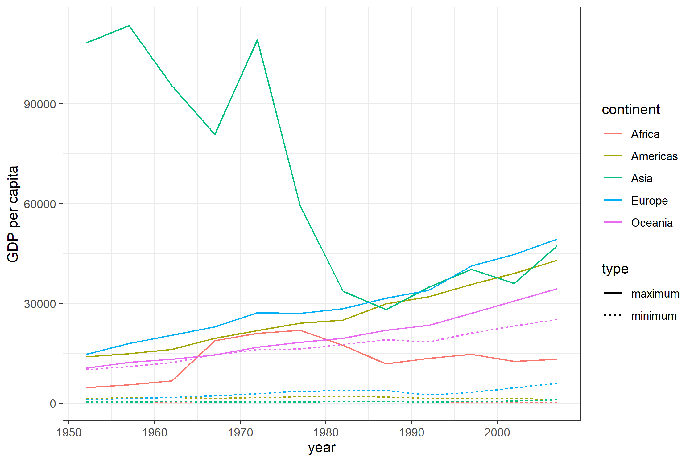

```{r setup, include=FALSE}
knitr::opts_chunk$set(echo = TRUE, fig.align="center", fig.height=5, fig.width=7.5)

```

```{r, include=FALSE}
library(tidyverse)
library(gapminder)
library(forcats)
library(ggridges)
```

<br>


## Exercise 1: Explain the value of the here::here package


<br>

*As default here::here package uses the directory of project as the root directory, in contrast to the default relative paths that are considered in R. When you run a .Rmd file in a subdirectory of the project, by using the directory of project as the root directory, here::here() function makes life easier if you want to access to other subdirectories of the project. Moreover if you run the script out of the project environment, you might find some difficulties using basic R functions. For example, in .R files, the relative path would change and that would make some troubles. However, here::here function still uses the directory of project as its root directory, since it is looking for .Rproj file.*

<br>


## Exercise 2: Factor management

<br>
 ````{r ref.label="2.1",eval=FALSE,echo=TRUE}
 ```
 ````{r ref.label="2.2",eval=FALSE,echo=TRUE}
 ```
<br>
 
```{r 2.1,results="asis",echo=FALSE}
gapminder_wo_Oceania <- gapminder %>% 
  filter(continent!="Oceania") %>% 
  droplevels()
nrow1 <- nrow(gapminder)
nlevels1 <- nlevels(gapminder$continent)
levels1 <- levels(gapminder$continent)
nrow2 <- nrow(gapminder_wo_Oceania)
nlevels2 <- nlevels(gapminder_wo_Oceania$continent)
levels2 <- levels(gapminder_wo_Oceania$continent)

gapminder_wo_Oceania_reordered <- gapminder_wo_Oceania %>%
  mutate(continent=fct_reorder(continent,lifeExp,(var)))
levels3=levels(gapminder_wo_Oceania_reordered$continent)
```
I have filtered out the rows with Oceania as their continent from the gapminder dataset and droped the respective level. The number of rows, the number of levels, and the levels before and after are shown bellow:

**Before:**

number of rows= `r nrow1`

number of levels= `r nlevels1`

levels: `r levels1`

**After:**

number of rows= `r nrow2`

number of levels= `r nlevels2`

levels: `r levels2`

Then I reordered the continent variable by the variance of life expectancy. After that I arranged the datasets and showed the effect of reordering on arranging the datasets by the continent variable. It can be observed that after reordering, arrange() function arranges the dataset based on the new order. Furthermore, the plots number of entries for each continent before and after of the reordering are shown.

The arrangement of levels after reordering is as follows:

levels: `r levels3`

```{r 2.2,results="asis",echo=FALSE}
cat(" \n")
  cat("**Before:**")
  cat(" \n")
gapminder_wo_Oceania %>% arrange(continent) %>% DT::datatable()
cat(" \n")
  cat("**After:**")
  cat(" \n")
gapminder_wo_Oceania_reordered %>% arrange(continent) %>% DT::datatable()

  cat(" <div style= \"float: left;width: 50%; \"> ")
gapminder_wo_Oceania %>%
  ggplot() +
  geom_bar(aes(continent)) +
  coord_flip()+
  theme_bw() +
  xlab("Continent")+ylab("Number of entries") +
  ggtitle("Before")
cat(" </div> ")
cat(" <div style= \"float: right;width: 50%; \"> ")
gapminder_wo_Oceania %>%
  ggplot() +
  geom_bar(aes(fct_reorder(continent, lifeExp, var))) +
  coord_flip()+
  theme_bw() +
  xlab("Continent")+ylab("Number of entries")  +
  ggtitle("After")
cat(" </div> ")
cat(" <div style= \"clear:both; \"></div> ")
```

<br>

## Exercise 3: File input/output (I/O)

<br>

```{r ref.label="2.1",eval=FALSE,echo=TRUE}
```
<br>
  
In this exercise, I used the gapminder data to show the difference between the minimum and maximum of gdp per capita for each continent for year 2007 and save it into variable gdpRange. After writing into csv file and reading it back, the class of variable continent as shown bellow has changed to "character". I changed it to factor and then reordered it by gdpRange. 

```{r 3,results="asis",echo=FALSE,message=FALSE}

gdpRange <- gapminder %>% filter(year=="2007") %>% group_by(continent) %>% summarise(gdpPercapRange=max(gdpPercap)-min(gdpPercap))
file_name <- "gdpRange.csv"
write_csv(gdpRange,here::here("hw05",file_name))
gdpRange2 <- read_csv(here::here("hw05",file_name)) 
cat(" \n")
  cat("**After reading back the file:**")
  cat(" \n")
gdpRange2 %>% knitr::kable()
cat(" \n")
cat("The class of continent variable after reading back the file is:",class(gdpRange2$continent))
  cat(" \n")

gdpRange2$continent <-  as.factor(gdpRange2$continent)
gdpRange2 <- gdpRange2 %>%  mutate(continent=fct_reorder(continent,gdpPercapRange)) 
cat(" \n")
  cat("**After changing the class of continent to factor and reordering it by the gdpRange:**")
  cat(" \n")
gdpRange2 %>% arrange(continent) %>% knitr::kable()


```

<br>

## Exercise 4: Visualization design

<br>

```{r ref.label="4.1",eval=FALSE,echo=TRUE}
```

```{r ref.label="4.2",eval=FALSE,echo=TRUE}
```
<br>

I take a plot from homework 3. The minimum and maximum of GDP per capita for all continents are shown in this graph. The old plot is shown on the left side. I tried to make it simpler by removing the x-axis and y-axis labels and adding a title. The new graph on the right side uses the plotly package to make the graph interactive.
 


```{r 4.1,results="asis",echo=FALSE}
cat(" <div style= \"float: left;width: 50%; \"> ")
gapminder %>% 
  group_by(year,continent) %>% 
  filter(gdpPercap %in% c(max(gdpPercap),min(gdpPercap))) %>% 
  mutate(type=ifelse(gdpPercap==min(gdpPercap),"minimum","maximum")) %>% 
  ggplot()+
  geom_line(aes(year,gdpPercap,color=continent,linetype=type))+
  scale_y_continuous(name="GDP per capita")+
  theme_bw()
cat(" </div> ")
```
```{r 4.2,results="asis",echo=FALSE,message=FALSE,warning=FALSE}
cat(" <div style= \"float: right;width: 50%; \"> ")
oldplot <- gapminder %>% 
  group_by(year,continent) %>% 
  filter(gdpPercap %in% c(max(gdpPercap),min(gdpPercap))) %>% 
  mutate(type=ifelse(gdpPercap==min(gdpPercap),"minimum","maximum")) %>% 
  ggplot()+
  geom_line(aes(year,gdpPercap,color=continent,linetype=type))+
  scale_y_continuous(name=" ")+
  scale_x_continuous(name=" ")+
  ggtitle("Range of GDP per capita ($) since 1950s")+
  theme_bw()+
  theme(legend.title = element_blank())
oldplot %>% plotly::ggplotly() %>% 
  plotly::layout(autosize = F, width = 515.625, height = 343.75)

cat(" </div> ")
cat(" <div style= \"clear:both; \"></div> ")
```
## Exercise 5: Writing figures to file

<br>

```{r, message=FALSE}
p <- gapminder %>% 
  group_by(year,continent) %>% 
  filter(gdpPercap %in% c(max(gdpPercap),min(gdpPercap))) %>% 
  mutate(type=ifelse(gdpPercap==min(gdpPercap),"minimum","maximum")) %>% 
  ggplot()+
  geom_line(aes(year,gdpPercap,color=continent,linetype=type))+
  scale_y_continuous(name="GDP per capita")+
  theme_bw()
figname <- "p.png"
ggsave(here::here("hw05",figname),plot=p,width=7.5,height=5,units = "in")
```

<br>

Here you can see the plot embeded in this HTML:



